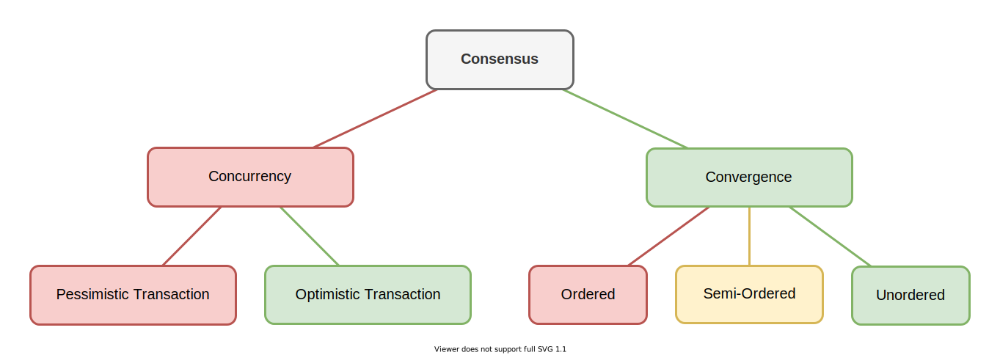
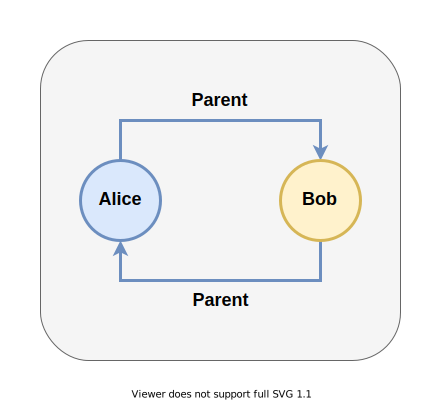
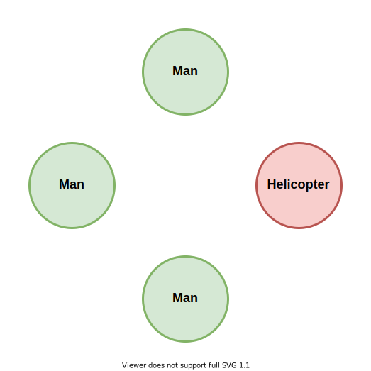
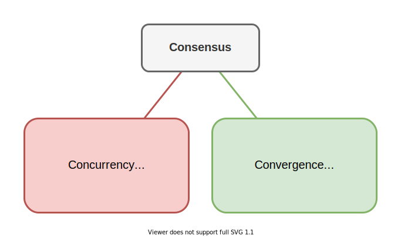
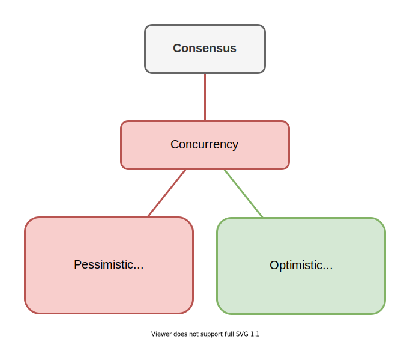
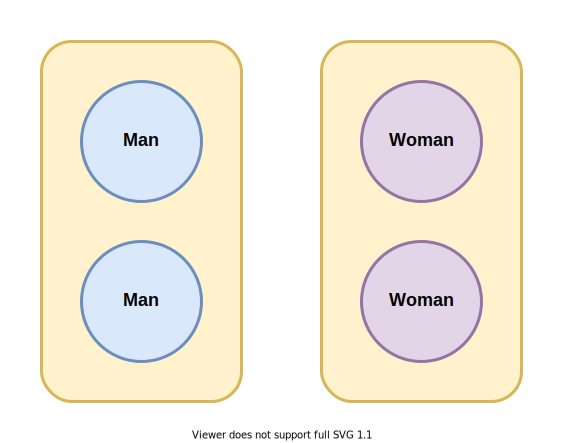
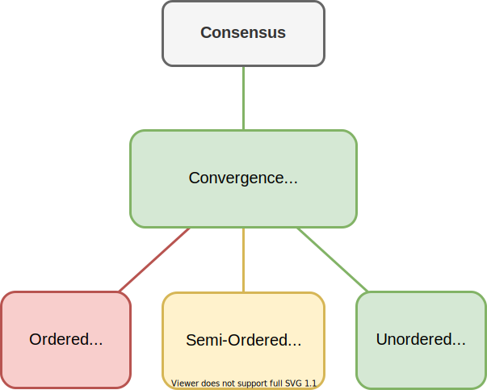
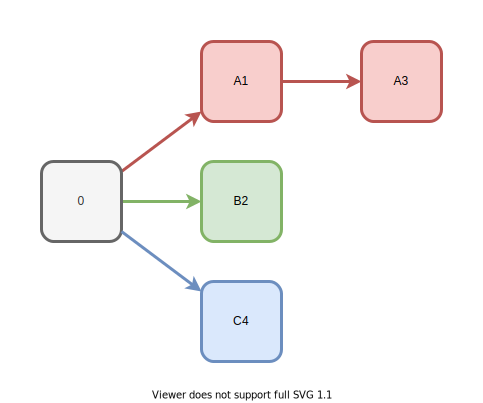
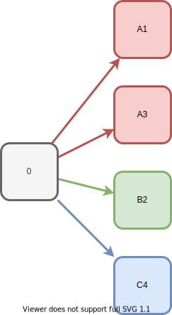
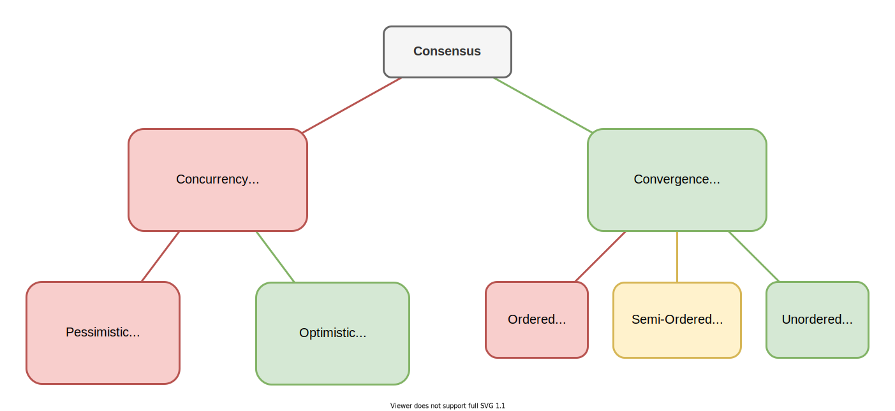

# Консистентно о Консенсусе

Здравствуйте, меня зовут Дмитрий Карловский. А вы на канале [Core Dump](https://www.youtube.com/channel/UC-qEImMrqSLZ9KLee1JTcuw), где мы берём разные темы из компьютерной науки и раскладываем их по полочкам.

И на этот раз мы постараемся прийти к согласию касательно согласованной классификации алгоритмов обеспечения консенсуса в системах со множеством участников. Разбрём различные виды блокировок и бесконфликтных алгоритмов. И попробуем выявить их фундаментальные особенности, проявляющиеся на разных масштабах: от ядер процессора, до серверных кластеров.

Вы можете [читать это как статью](https://github.com/nin-jin/slides/tree/master/consensus), либо [открыть в интерфейсе проведения презентаций](https://nin-jin.github.io/slides/consensus/).

## Согласованность данных

Начнём с консистентности. Она же согласованность. Это - логическая непротиворечивость хранимых данных.

Например, если у Алисы родителем значится Боб, а у Боба родителем значится Алиса, то это явно какая-то лажа. Не могут они быть родителями друг друга одновременно. Данные не консистентны!

Согласованность часто путают с консенсусом. Особенно, когда данные частично хранятся на одном сервере, а частично на другом, но при этом должны быть согласованы друг с другом. Однако, консенсус немного о другом..

## Согласие между участниками

Консенсус - это согласие группы участников касательно значения некоторого состояния. Например, если все считают Боба мужчиной, но сам он считает себя вертолётом, то согласия тут не наблюдается. Консенсус не достигнут!

Важно понимать, что даже если у каждого участника состояние само по себе консистентно, между участниками консенсуса при этом может и не быть. И наоборот, участники могут достигнуть согласия касательно состояния, но получить при этом несогласованные данные.

## Достижение согласия

Все подходы по достижению консенсуса можно разделить на две большие группы..

Первая - это конкуренция за единый источник истины. Участники толпятся вокруг него, толкаются локтями, и пытаются внести в него свои изменения. Транзакции в базах данных, атомарные операции в многопоточке, протоколы консенсуса в распределённых системах - это всё из этой оперы.

Совершенно иной подход - конвергенция. Она же сходимость. Это кода участники независимо друг от друга меняют каждый своё и только своё состояние. Но при этом они могут подглядывать к соседям и подливать их изменения к себе. А алгоритмы слияния изменений строятся так, чтобы состояния всех участников в конечном счёте сошлись к одному и тому же значению.

## Конкуренция за источник истины

Разберём подробнее конкуренцию за источник истины. Это может быть мастер-реклика в распределённой СУБД, основной поток приложения или просто общий участок памяти.

Читать из источника могут все участники одновременно. Но при попытке записать участник может быть заблокирован, пропуская вперёд более удачливых участников. 

Тут можно выделить два вида блокировок: пессимистичная и оптимистичная.

К первому относятся собственно пессимистичные блокировки в субд и распределённых системах, а так же мьютексы и критические секции во многопоточке.

Ко второму относятся собственно оптимистичные блокировки в субд, двухвазные коммиты в распределённых системах и lock-free алгоритмы в многопоточке.

## Пессимистичная блокировка

Идея пессимистичной блокировки простая: сначала участник запирает ресурс, затем производит его обновление, по завершении которого ресурс освобождается. Это если ему повезло прийти первым. Если же он пришёл, а ресурс уже кем-то заблокирован, то он сидит, ничего не делает, и ждёт освобождения.

Это самый простой и надёжный подход. Однако у него есть проблемы с производительностью. Либо из-за постоянных ожиданий, либо из-за холостых захватов, которые так-то весьма не бесплатны.

Кроме того, этот подход подвержен проблеме смертельного запирания или dead-lock. Это когда два участника успешно запирают два разных ресурса, а потом блокируются при попытке запереть ресурс уже запертый оппонентом. Получается, что при неосторожном обращении с запиранием, участники могут заблокировать друг дуга одновременно. И поэтому не смогут продолжить работу без вмешательства извне.

## Оптимистичная блокировка

Если конкуренция не слишком высока, оптимистичная блокировка может показать себя гораздо лучше. Тут участник сначала готовит новое состояние, а потом атомарно применяет его к источнику истины. Если повезёт. А если не повезёт, и кто-то успеет раньше него, то вся проделанная работа выкидывается, и начинается заново.

Висеть в таком цикле участник может неограниченно долго. Формально при этом он не заблокирован и продолжает работу. Однако, фактически он работает вхолостую и не продвигается вперёд по выполняемой им задаче. Что логически эквивалентно блокировке.

Более того, один из вариантов реализации, например, мьютекса - это spin-lock, то есть кручение в бесконечном цикле в ожидании отпирания ресурса.

Тут стоит обратить внимание на путаницу в терминах. lock-free алгоритмы раньше назывались неблокирующими, теперь считаются частным случаем неблокирующих. Но на самом деле это всё же механизм хоть и оптимистичной, но блокировки.

Преимуществами данного подхода является высокая производительность в условиях низкой конкуренции, и существенно более сложное достижение смертельного запирания. К недостаткам же можно отнести большой объём холостой работы при высокой конкуренции, и существенно более сложные алгоритмы, чувствительные к архитектурным особенностям.

## Терпение разделения

Отличительной особенностью источника истины является возможность гарантировать консенсус. Однако все участники должны при этом иметь постоянный доступ к этому источнику. Что в общем случае невозможно в распределённых системах, где соединение между частниками может временно пропадать.

Это - фундаментальная дилемма между консенсусом доступностью. Если мы выбираем консенсус, то участники, не имеющие доступа к источнику истины, не смогут изменить никакие данные. Если же им всё же позволить менять данные, то мы автоматически получаем ситуацию со множеством источников истины, которые могут друг другу противоречить.

И, как говорится, "Не можешь победить? Возглавь!". Так что давайте рассмотрим как можно жить без конкуренции за единый источник истины.

## Сходимость к согласию

Если вы работали с распределёнными системами, то скорее всего вы слышали термин "Eventual Cоnsistency" или "Согласованность в конечном счёте". Так вот, оно на самом деле не про консистентность, а именно про конвергенцию или сходимость.

Wait-free алгоритмы межпоточного взаимодействия основаны на той же идее - отсутствие конкуренции за общий ресурс. Поэтому именно они на самом деле являются неблокирующими.

Однако, важно понимать, что консистентность тут уже в общем случае не может быть гарантирована. Так как слияние консистентных по отдельности изменений может выдавать уже неконсистентное состояние. Но с этим можно жить, если правильно организовывать данные и уметь нормализовывать неконсистентное состояние.

Алгоритмы, обеспечивающие сходимость, можно разделить на 3 основных класса. Это: упорядоченные, полу-упорядоченные и.. беспорядочные.

## Упорядоченная сходимость

> OT: Operational Transformation

Алгоритмы операционных трансформаций основаны на идее, что все участники должны применить все изменения в одном и том же порядке. То есть после слияния всех изменений каждым участником, любой из них должен получить одну и ту же цепочку изменений, что даст им одно и то же финальное состояние. То есть конвергенцию.

Но как же так, Алиса ведь уже внесла своё красное изменение А3 после А1, сверху докинула С4, а тут прилетает В2 и его нужно как-то вставить задним числом?

В этом случае приходится отменять всю историю до точки А1, применять В2, а потом накатывать историю обратно. При этом, так как каждое изменение зависит от состояния, полученного от предыдущего изменения, то при накатывании истории может потребоваться её трансформация с учётом добавленных в её середину изменений.

Такое перебазирование истории - это алгоритмически сложная задача. Которая, к тому же, ещё и сильно медленная в случае сильного расхождения историй изменений разных участников. При этом всю эту историю от начала времён нужно хранить неограниченно долго. А каждый новый участник, чтобы получить актуальное состояние, должен загрузить и последователно применить всю эту историю, размер которой многократно превышает размер финалного состояния.

Разумеется в таком наивном виде эти алгоритмы не применимы на практике. Поэтому к ним добавляют дополнительные костыли и идут на множество компромисов. Например, обрезают старую историю, группируют изменения, делают периодические снепшоты состояния и тд.

## Полу-упорядоченная сходимость

А что если мы будем описывать наши изменения таким образом, что изменения други хучастников можно будет просто подклеивать в конец нашей истории без перебазирования? Так появились коммутативные бесконфликтные реплицируемые типы данных.

> CmRDT: Conflict-free Commutative Replicated Data Type

Они полагаются лишь на частичную упорядоченность изменений. То есть изменения от одного участника применяются лишь в том же порядке, что этот участник их вносил. А вот изменения разных участников можно переставлять друг относительно друга как угодно, но результат будет одинаковым.

Полу-упорядоченным алгоритмам уже не нужно хранить всю историю, а применение изменений получается крайне простым и быстрым. Однако, они сильно зависят от надёжности соединения: все изменения от одного участника должны без пропусков и без дублирования дойти до каждого участника в строго определённом порядке. Что порой не так-то просто обеспечить.

## Беспорядочная сходимость

Оказывается, можно пойти ещё дальше и вообще не полагаться на порядок применения изменений. Так появились конвергентные бесконфликтные реплицируемые типы данных.

> CvRDT: Conflict-free Convergent Replicated Data Type

Тут уже изменения могут приходить в произвольном порядке, могут дублироваться, а могут и вообще потеряться, но последующие изменения всё же обеспечат конвергенцию.

## CROWD - CvRDT нового поколения

Именно на конвергентные типы данных я и делаю свою ставку в своих проектах, используя уникальные CROWD алгоритмы для синхронизации распределённых состояний..

- Синхронизация дельтами.
- Цифровая подпись и шифрование каждого изменения.
- Слияние без дешифровки и инвалидации подписи.
- Динамическое изменение типа без потери возможности слияния.
- Компактно и быстро.

Но это уже совсем другая история, достойная отдельного разбора.

## Согласны?

Подведём итоги. Пройдя по всем ступеням эволюции алгоритмов обеспечения консенсуса, у нас получилась стройная, непротиворечивая классификация с чёткими границами между понятиями. Мы выявили общие подходы в самых разных областях компьютерной науки. А так же разобрали ряд популярных заблуждений.

## Что ещё почитать?

## Продолжение следует..

Если нам с вам удалось достингуть конвергенции, то дайтем не об этом знать посредством лайка. Если же нет - обязательно прилите мне дельту в комментарии. Но в любом случае подписывайтесь на канал, чтобы не пропустить обновления. И, конечно, делитесь ссылкой со знакомыми несогласными для синхронизации.

> ✅ Лайк
> ✅ Подписка
> ✅ Комментарий
> ✅ Поделись-ка

А на этом пока что всё. С вами был.. беспорядочный программер Дмитрий Карловский.