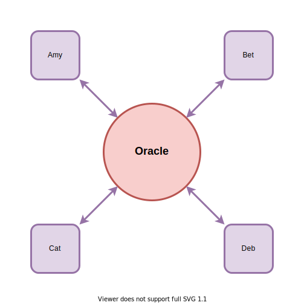
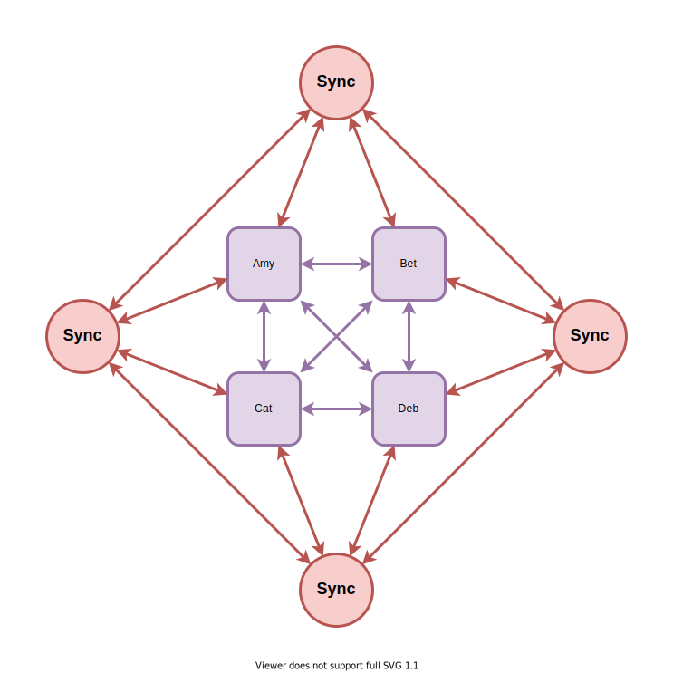
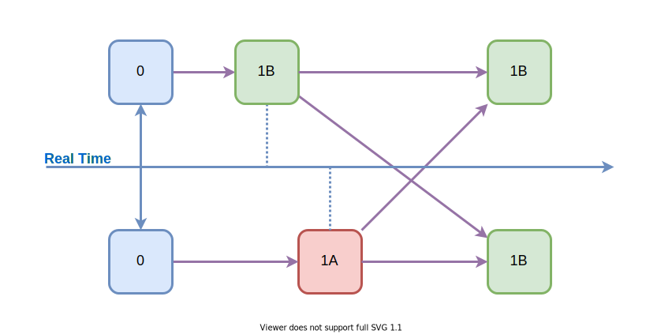
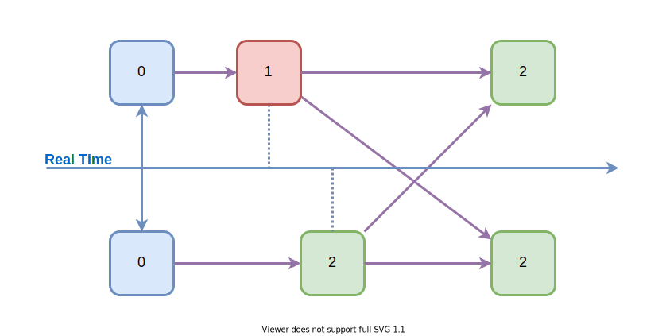
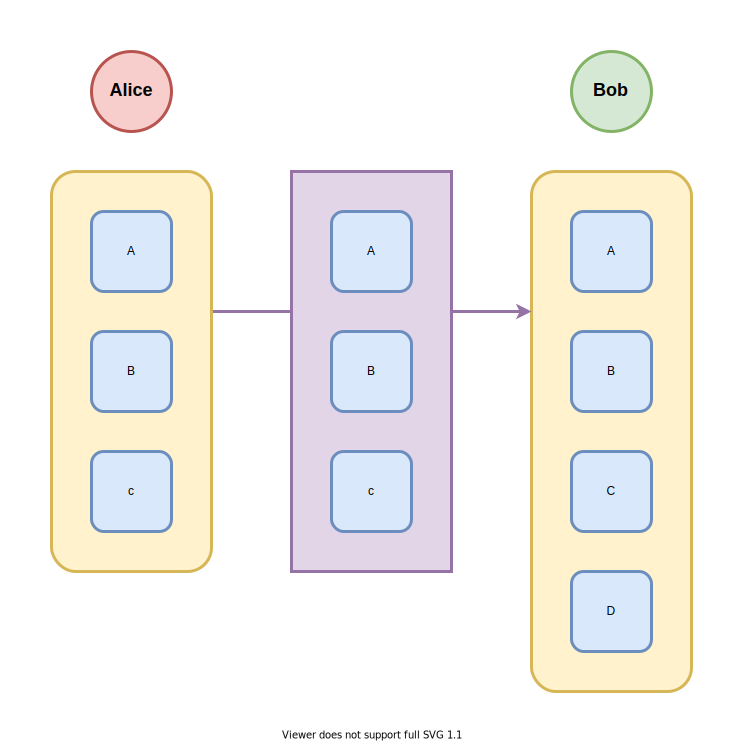
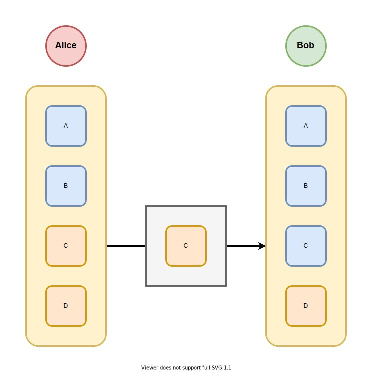
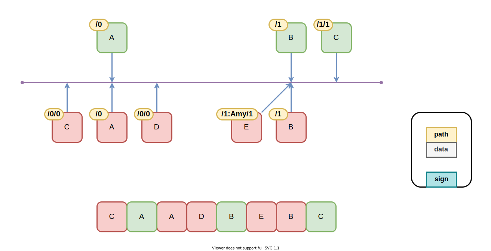
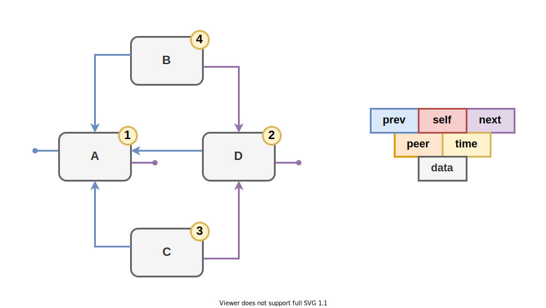
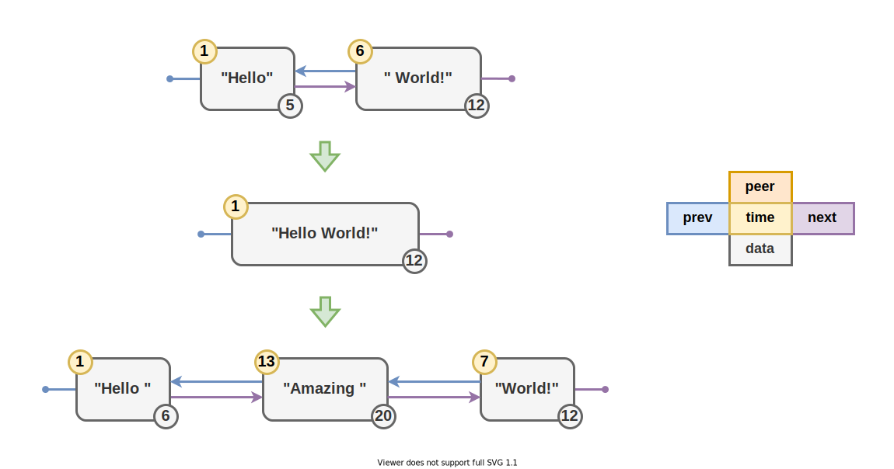

# Main Aspects of Convergent Data Types

Вы можете [читать это как статью](https://github.com/nin-jin/slides/tree/master/cvrdt), либо [открыть в интерфейсе проведения презентаций](https://nin-jin.github.io/slides/cvrdt/).

## Commutative Data Types

Этот рассказ не про них, но упомянуть стоит.

## 🧱 Basics

- Disjunction
- Versioning

### 🧱 Basics: Disjunction

Каждый пир владеет своим контейнером, где он царь и бог. В чужие он может только смотреть. Так работают счётчики и мультирегистры.

### 🧱 Basics: Versioning

У каждого значения есть монотонная версия, которая позволяет понять какое значение актуальное независимо от времени их прихода. Так работают регистры.

## ✨ Wishes

- Limited Memory
- Linear complexity
- Without Oracle
- Signing
- Encrypting
- Ready to changes

### ✨ Wish: Limited Memory

Потребление памяти не должно неограниченно расти. Речь как об оперативке, так и о хранилище, и о размере передаваемых сообщений.

### ✨ Wish: Linear complexity

Алгоритмическая сложность всех операций должна быть не более чем линейной. Алгоритмы недолжны замедляться по мере роста документа или времени редактирования.

### Oracle

### ✨ Wish: Without Oracle

Центральный источник истины может упорядочивать события, контролировать права доступа и тд. Но сбой или взлом центрального звена рушит всю систему.

### ✨ Wish: Signing

Ни один участник не должен иметь возможности подделывать изменения от имени других участников. Даже админ на сервере не должен иметь такой возможности. Это значит, что все изменения должны подписываться цифровой подписью и оставаться неизменными. То есть при слиянии чужих правок нельзя производить новые изменения, так как их невозможно будет подписать от имени авторов исходных изменений.

### ✨ Wish: Encrypting

Доступ к данным должны иметь лишь участники, владеющие секретом. Компрометация базы данных не должна раскрывать информацию. Даже у админа сервера не должно быть такой возможности. Это значит, что данные должны шифроваться и дешифровываться на машинах участников. А сервер, сливая изменения, не может их дешифровывать, ибо не обладает ключом. Следовательно слияние должно происходить без дешифровки изменений и без создания новых изменений, ибо их невозможно будет зашифровать секретным ключом, не известным серверу.

### ✨ Wish: Ready to changes

В процессе жизни системы неизбежно возникает необходимость менять схему данных. МИхрация на новую схему не должна терять вносимую по старой схеме информацию, даже внесённую после изменения схемы. Для этого нужен унифицированный механизм хранения информации с динамической типизацией.

## Aspects

- 🕒 Clock
- 📜 History
- 🔢 Order
- 🏠 Place
- ⏺ Atom
- 🤹‍♂️ Typing
- 💀 Dead
- 🚙 Move
- 🎭 Chunk

## 🕒 Clock

### 🕒 Clock: Logical 🚩

Злодей может задать максимальное значение счётчика и заблокировать тем самым изменение значения. Изменения из далёкого прошлого могут затереть недавние изменения только потому, что когда-то версия сильнее изменилась. Счётчик по началу имеет малые значения, которые могут занимать мало места.

### 🕒 Clock: Real ✅

Может быть рассинхронизация, в этом случае продуктивной работы не получится. У кого часы отстают не может изменить данные внесённые тем, у кого часы спешат (хотя, всегда можно прибавить единичку к его времени). Хранить реальное время всё равно нужно с прикладной точки зрения. Более поздние по времени изменения обычно более актуальные. Изменения злодея из далёкого будущего можно отсекать по времени.

## 📜 History

- Stored
- Washed

### 📜 History: Stored 🚩

Хранится дополнительаня информация позволяющая восстановить состояние на любой момент времени. Размер хранилища постоянно неограниченно растёт. Откаты на практике, конечно, нужны, но далеко не на любое состояние. Резать историю опасно, так как могут возникнуть проблемы со слиянием.

### 📜 History: Washed ✅

Хранится лишь информаци необходимая для восстановления текущего состояния и их слияния. Невозможно откатывать изменения. Для откатов периодически делаются снепшоты. Старые снепшоты можно просто удалять.

## 🔢 Order

- Absolute
- Relative

### 🔢 Order: Absolute 🚩

Параллельное перемещение соседей не влияет на положение элемента в списке. Есть проблема интерливинга (перемешивание параллеьных вставок в одну точку). 

### 🔢 Order: Relative ✅

Параллельное перемещение соседей влияет на положение элемента в списке. Но есть проблема с выбором за каким соседом следовать, что делать при удалении соседа, как обеспечивать конвергенцию.

## 🏠 Place

- Weak
- Strong

### 🏠 Place: Weak 🚩

Контейнер решает, кто и в какой позиции будет в нём находиться. Любое изменение состава элементов - это конфликт, который необходимо разрешать. Один элемент может находиться во множестве контейнеров и даже в нескольких местах одного контейнера. Перемещение элемента - это изменение двух контейнеров. Слияния теряют криптографию. При конкурентном переносе одного и того же элемента он дублируется.

### 🏠 Place: Strong ✅

Элемент решает в каком месте какого контейнера он будет находиться. Изменения состава элементов контейнера принципиально не конфликтуют. Один элемент может находиться только в одном месте одного контейнера. Перемещение элемента - это изменение только его самого. Можно мёржить без потери криптографии.

## ⏺ Atom

- Letter
- Token
- Sequence

### ⏺ Atom: Letter 🚩

Почимвольное слияние может давать невозможные слова, которые не возможно ни понять, ни прочитать. Слишком большое соотношение объёма информации к мета-информации. Сложно эффективно хранить и обрабатывать посимволное представление.

### ⏺ Atom: Token ✅

Токен языка - минимальная осмысленная единица текста. После слияния возможны только те токены, что были до слияния. Объём мета информации всё же больше, но сопоставим со средним размером токена.

### ⏺ Atom: Sequence 🚩

Последовательно введённые данные объединяются в группу. Правки в середине группы разрывают её. Копипаст больших текстов весьма экономен. Активная правка текста сводит экономию на нет. Изменение данных приводит к потере цифровых подписей. Результат слияния может порождать невозможные слова.

## 🤹‍♂️ Typing

- Static
- Dynamic

### 🤹‍♂️ Typing: Static 🚩

Вводится множество разных типов данных, которые не совместимы между собой. Изменение схемы данных приводит к потере правок сделанных для старой схемы, но не учтённых при миграции нановую.

### 🤹‍♂️ Typing: Dynamic ✅

Данные хранятся в универсальном виде и могут быть интерпретированы как разные типы данных. Это позволяет сливать без потерь изменения, внесённые через различные представления, динамически менять схему данных и тд.

## 💀 Dead

### 💀 Dead: Forget 🚩

Передаётся актуальное состояние. Если в нём чего-то нет, но было, значит оно было удалено.

Удаления невозможно подписать цифровой подписью. Результат слияния теряет цифровые подписи авторов. При синхронизации необходимо пересылать весь актуальный список, что дорого на больших списках.

### 💀 Dead: Tombstone ✅

Удалённые элементы сохраняются в виде легковесных записей, свидетельствующих об удалении.

Каждое удаление может быть подписано цифровой подписью. Размер дельт не зависит от размера списка - только от числа изменений в нём.

## 🚙 Move

Как реализуется изменение порядка узлов.

### 🚙 Move: Remake 🚩

Старый узел удаляется - добавляется новый.

### 🚙 Move: Change ✅

Существующий узел обновляется, чтобы занимать новую позицию.

## 🎭 Chunk

Как идёт работа с кусочками данных.

### 🎭 Chunk: Mutable 🚩

Чанки меняются в процессе обработки. Это не позволяет криптографически подписывать их. Для слияния необходима дешифровка.

### 🎭 Chunk: Constant ✅

Чанки не меняются, только заменяются на новые. Каждый чанк можно криптографически зашифровать и подписать. Для слияния дешифровка не требуется.

## Algorithms

Расписать вкратце суть алгоритмов, чтобы хватило для анализа по аспектам.

- LWW-Register
- MV-Register
- Counter
- Map
- Set

- [LSEQ](https://hal.archives-ouvertes.fr/hal-00921633/document)
- [Logoot](https://hal.inria.fr/inria-00432368/document)
- [TreeDoc](https://hal.inria.fr/inria-00445975/document)
- [RGA](http://csl.skku.edu/papers/jpdc11.pdf)
- [CausalTrees](http://citeseerx.ist.psu.edu/viewdoc/download?doi=10.1.1.627.5286&rep=rep1&type=pdf)
- [WOOT](https://hal.inria.fr/inria-00071240/document)
- [YATA](https://files.gitter.im/y-js/yjs/yCYx/GROUP2016-_6_.pdf)
- [CROWD](https://github.com/hyoo-ru/crowd.hyoo.ru)

### LWW-Register

Регистр, где побеждает последний записавшший.

### MV-Register

Регистр со множеством значений.

### Counter

Распределённый счётчик.

### Map

Распределённый словарь.

### Set

Распределённое множество.

### LSEQ

Каждый элемент списка идентифицируется кортежем абсолютных координат.

### Logoot

Похоже на переусложнённый LSEQ. Пока не понятно в чём суть.

### TreeDoc

Похоже на хранение списка в виде бинарного дерева. Каждая позиция идентифицируется последовательностью бит.

### RGA

Связный список из элементов. Каждый элемент указывает на следующий элемент. Удаление происходит очисткой узла без его удаления.

### CausalTrees

Каждый узел - это операция вставки/удаления, имеющая свой идентификатор и идентификатор предыдущей операции. Операция удаления, добавленная после операции вставки, скрывает вставленные данные.

### WOOT

Для каждой вставки передаётся идентификатор следующего и предыдущего элемента. При удалении остаётся надгробие. Переносы через удаление и вставку.

### YATA

Двусвязный список элементов, идентифицируемых логическими часами, которые растут пропорционально размеру вставляемого контента. Это позволяет последовательные вставки объединять в один узел и потом разъединять в любой момент. Иерархия обеспечивается открывающими и закрывающими тегами.

### CROWD

Каждый узел имеет ссылку на родителя, лидера внутри родителя, а так же предпочтительный номер позиции в родителе.

## Algorithms Comparison

| Algorithm   | 🕒 Clock   | 📜 History | 🔢 Order    | 🏠 Place  | ⏺ Atom     | 🤹‍♂️ Typing  | 💀 Dead      | 🚙 Move   | 🎭 Chunk
|-------------|------------|-------------|-------------|------------|-------------|-------------|--------------|------------|---------
| CROWD       | ✅ Real    | ✅ Washed  | ✅ Relative | ✅ Strong | ✅ Token    | ✅ Dynamic | ✅ Tombstone | ✅ Change | ✅ Constant
| CasualTrees |            |             | ✅ Relative |           |              |            |
| RGA         |            |             | ✅ Relative |           |              |            |
| WOOT        | ✅ Any     | 🚩 Stored  | ✅ Relative | ✅ Strong | 🚩 Letter   | 🚩 Static  | ✅ Tombstone | 🚩 Remake | ✅ Constant
| YATA        | 🚩 Counter | ✅ Washed  | ✅ Relative | ✅ Strong | 🚩 Sequence | 🚩 Static  | ✅ Tombstone | 🚩 Remake | 🚩 Mutable
| TreeDoc     | ➖         | ✅ Washed  | 🚩 Absolute | ✅ Strong | 🚩 Letter   | 🚩 Static  | ✅ Tombstone | 🚩 Remake | ✅ Constant
| LSEQ        |            |             | 🚩 Absolute |           |              |            |
| Logoot      |            |             | 🚩 Absolute |           |              |            |

## More about CRDT

- https://crdt.tech/
- https://github.com/alangibson/awesome-crdt
- https://github.com/pfrazee/crdt_notes
- https://martin.kleppmann.com/2020/07/06/crdt-hard-parts-hydra.html
- https://hal.inria.fr/hal-01351512/document
