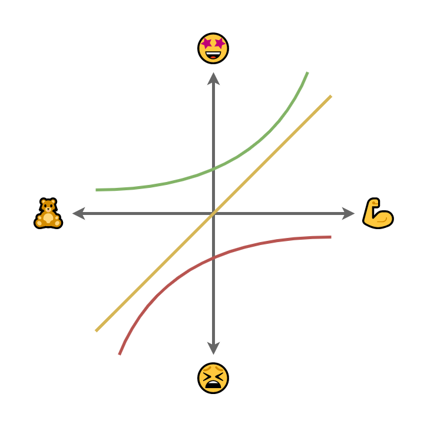
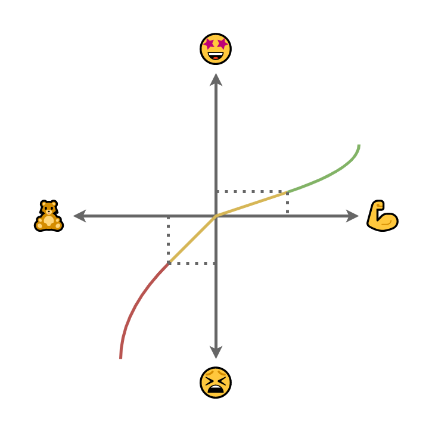

# Выбор из двух зол

Как принимать наименее фатальные решения в условиях противоречивых требований.
Не интуитивно наобум, а рационально и прагматично.
При этом учитывая субъективные впечатления пользователей.
Поговорим о фундаментальных принципах простым языком.
Так что и продвинутый словит пару инсайтов, и новичок не растеряется.

# todo

- тезис через весь доклад (уменьшение негатива превыше увеличения позитива)
- Менее спорные примеры для тезисов
- Негатив: уменьшение, подслащение, перенаправление
- wsjf

## Кто здесь?

- Я тут случайно
- Вообще, я программист
- Поделюсь взглядом со своей перспективы
- Пруфов не будет

## Дима, сделай нам редактор

- Поспрашивай людей, узнай, что им надо
- Нарисуй красивый роадмап
- Сделай, чтобы всё было заечно
- И только попробуй проемелить сроки

## Все хотя разного

- Противоречивые требования
- Скрытые требования
- Фальшивые требования

## Каждому по продукту?

- Нужно много рук
- Нужно много времени
- На 90% они будут похожи

## Универсальный продукт?

- Совмещение ужа и ежа
- Нужно хорошо всё продумать
- Легко кастомизировать

## Модель Кано

## Модель НеКано

## Приоритеты по Кано

- Базовые
- Линейные
- Восхищающие

# Деконструкция Кано

- Сначала минимизация негатива
- Потом максимизация позитива

# Частота использования

- Базовые должны быть даже если редко используются
- Редкий негатив бьёт сильнее, чем частый позитив

## Умный против глупого

- Все любят умные системы
- Но только пока они не умнее самого пользователя

## Кейс с лентами новостей

- Пользователь не понимает как строится лента
- Видит много нерелевантного
- Перестаёт пользоваться лентой
- Вводятся всё более "интеллектуальные" алгоритмы
- Всё более не понятно
- Обострение реакции на нерелевантное
- Пропускает важные для него записи
- Подписки -> Колокольчики -> ...

## Противоречащие фичи

Всё это, конечно, хорошо, но фичи нередко взаимосвязаны.

## Взаимозаменяющие фичи

- Одна включает другую
- Одна заменяет другую
- Одна исключает другую

## Оптимум Парето

Улучшить нельзя не ухудшив другого.

## Деградация позитива

Восхищающая -> Желаемое -> Базовое

## Обострение негатива

Терпимо -> Отвращающее -> Зашквар

## Закон больших чисел

- Постоянно кто-то будет вляпываться в негатив
- Каждый постояннный пользователь неизбежно столкнётся с негативом

## Направление негатива

- На систему
- На другого пользователя

Непрозрачная система создаёт впечатление глючной, даже если предельно корректна.

## Фальшивые ожидания

- Спрашиваешь - пользователю надо
- Наблюдаешь - пользователь не пользуется

## Изменение ожиданий

- Лояльность пользователей
- Уверенность в решении
- Отсутствие выбора
- Минимизация негатива от изменения привычек

Хорошее решение вирусно распространяется на конкурентов, но вы уже лидер.

## Ожидание и реальность

Приятный сюрприз лучше неприятного.
