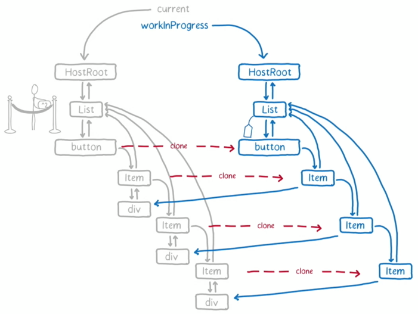
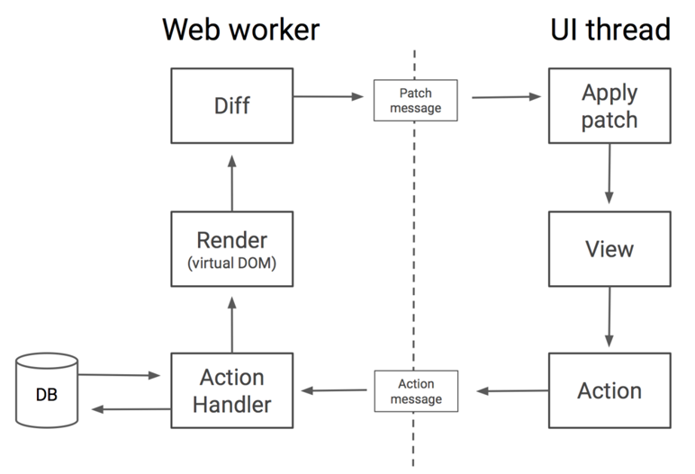
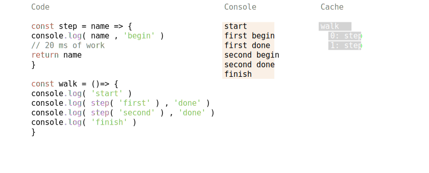
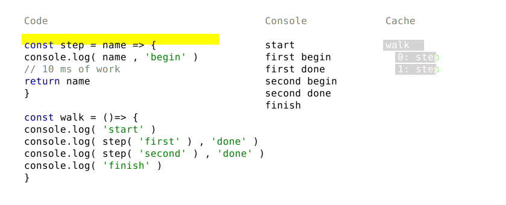
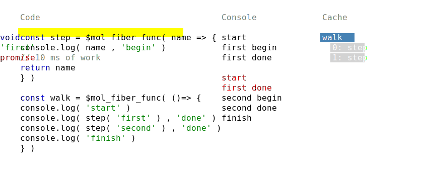
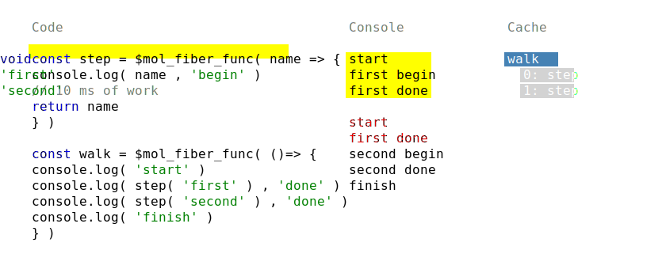
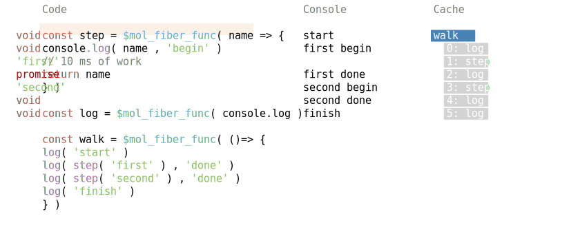
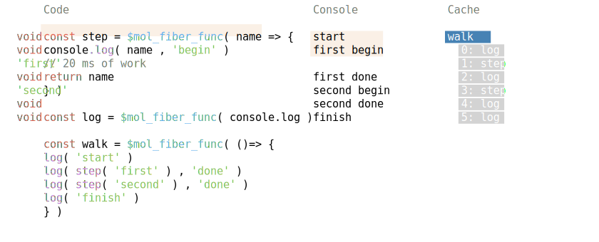
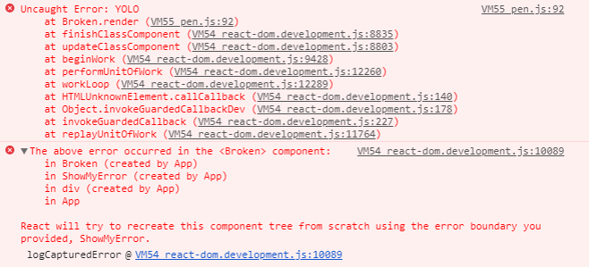
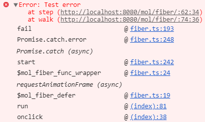

# Quantum Mechanics of Calculations

Dmitriy Karlovskiy @ HolyJS 2018 Piter

# Issue: Low responsiveness

1 s / 60 fps ~= 16.(6) ms


# Issue: No escape


# Issue: No concurrency


# Solution: React Fiber



# React Fiber: React required


# React Fiber: Only rendering


# React Fiber: Quantization is disabled


# React Fiber: Debug is pain


# Solution: Workers



# Workers: Issues

- (De)Serialization
- Asynchronous
- Limited API’s
- Can’t cancel

# Solution: quantization


# Concurrency: fibers – stackfull coroutines

```typescript
Future.task( one ).detach()

const one = ()=> two() + 1
const two = ()=> three() + 1
const three = ()=> four() + 1

const four = ()=> new Future( future => setTimeout( future.return )
```

> Properties: Runtime support required
> Examples: node-fibers, Python, Go, D

# Concurrency: FSM – stackless coroutines

```typescript
one()

const one = async ()=> ( await two() ) + 1
const two = async ()=> ( await three() ) + 1
const three = async ()=> ( await four() ) + 1

const four = ()=> new Promise( done => setTimeout( done ) )
```

> Properties: Async/await virus
> Examples: C#, Python, JavaScript

# Concurrency: semi-fibers - restarts

```typescript
$mol_fiber_start( one )

const one = ()=> two() + 1
const two = ()=> three() + 1
const three = ()=> four() + 1

const four = ()=> $mol_fiber_async( back => setTimeout( back ) )
```

> Properties: Idempotent calculations, Runtime support is not required

> Examples: Future-fetcher, $mol_atom, $mol_fiber

# Figures



# $mol_fiber: no quantization



# $mol_fiber: cache first



# $mol_fiber: cache second



# $mol_fiber: idempotence first



# $mol_fiber: idempotence second



# $mol_fiber: break

```typescript
const now = date.now()
if( now <= $mol_fiber.deadline ) return

if( !$mol_fiber.current && $mol_fiber.queue.length === 0 ) {
	$mol_fiber.deadline = now + $mol_fiber.quant
	return
}

throw new Promise( done => {
	$mol_fiber.queue.push( done )
	$mol_fiber.schedule()
} )
```

# Debug: try/catch

```typescript
function foo() {
	throw new Error( 'Something wrong' ) // [1]
}

try {
	foo()
} catch( error ) {
	handle( error )
	throw error // [2]
} 
```

# Debug: unhandled events

```typescript
function foo() {
	throw new Error( 'Something wrong' )
}

window.addEventListener( 'error' , event => handle( event.error ) )
window.addEventListener( 'unhandledRejection' , event => handle( event.reason ) )

foo()
```

# Debug: Promise

```typescript
function foo() {
	throw new Error( 'Something wrong' )
}

new Promise( ()=> {
	foo()
} ).catch( error => handle( error ) ) 
```

# Stack trace: React Fiber



# Stack trace: $mol_fiber



# $mol_fiber: handle 

```typescript
if( error instanceof Promise ) {

	const self = this
	
	const listener = function $mol_fiber_listener() {
		return self.start()
	}
	
	return error.then( listener , listener )

}
```

# $mol_fiber: functions

```typescript
import { $mol_fiber_func as fiberize } from 'mol_fiber/web'

const log = fiberize( console.log )

export const main = fiber( ()=> {
	log( getData( 'goo.gl' ).data )
} ) 
```

# $mol_fiber: promises

```typescript
import { $mol_fiber_sync as sync } from 'mol_fiber/web'

export const getData = sync( fetch )
```

# $mol_fiber: methods

```typescript
import { $mol_fiber_method as action } from 'mol_fiber/web'

export class Mover {

	@action
	move() {
		sendData( 'ya.ru' , getData( 'goo.gl' ) )
	}

} 
```

# $mol_fiber: cancel request

```typescript
import { $mol_fiber_async as async } from 'mol_fiber/web'

function getData( uri : string ) : XMLHttpRequest {
	return async( back => {
		const xhr = new XMLHttpRequest()

		xhr.onload = back( event => {
			if( Math.floor( xhr.status / 100 ) === 2 ) return xhr
			throw new Error( xhr.statusText )
		} )

		xhr.open( 'GET', uri )
		xhr.send()
		
		return ()=> xhr.abort()
	} )
}
```

# $mol_fiber: cancel response

```typescript
import { $mol_fiber_func as fiberize , $mol_fiber_make as Fiber } from 'mol_fiber'

const hash = fiberize( longHashFunc )

const middle_fiber = middleware => ( req , res ) => {
	const fiber = Fiber( ()=> middleware( req , res ) )
	req.on( 'close' , ()=> fiber.destructor() )
	fiber.start()
}

app.get( '/hash/:data/:count' , middle_fiber( ( req , res ) => {
	let data = req.params.data
	for( let i = 0 ; i < req.params.count ; ++ i ) data = hash( data )
	res.end( data )
} ) )
```

# $mol_fiber: concurrency


# $mol_fiber: properties

Pros:
- Runtime support isn’t required
- Can be cancelled at any time
- High FPS
- Concurrent execution
- Usefull stack trace
- ~ 10kb not minified

Cons:
- Required instrumentation
- All code should be idempotent
- Longer total execution
