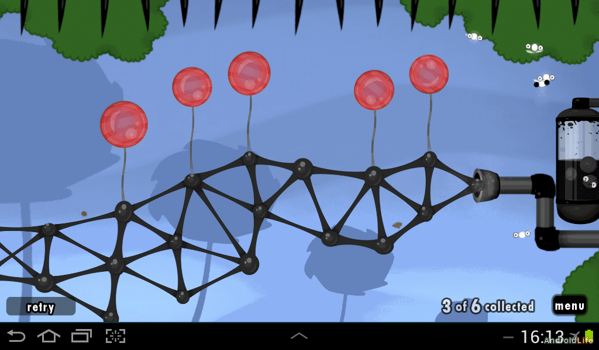
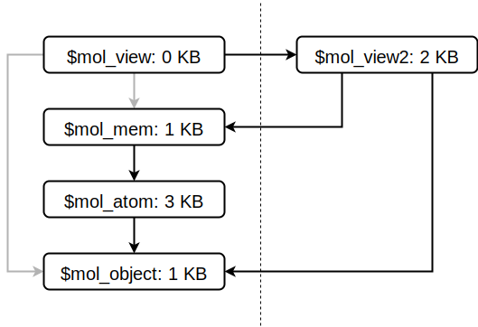

# $mol - лучшее средство от геморроя

> Вы можете открыть эти слайды в [интерфейсе проведения презентаций](https://nin-jin.github.io/slides/mol/) или [читать их как статью](https://github.com/nin-jin/slides/blob/master/mol/).

> Всем привет, меня зовут Дмитрий Карловский и я.. хочу причинить вам боль. Много боли. Я напомню вам обо всех страданиях, что вы испытваете находясь в плену своего любимого фреймворка. Я опущу вас на самое дно самой глубокой безысходности. А потом, когда вы совсем отчаетесь и потеряете веру в комьюнити, я подам вам руку помощи и покажу светлое будущее.


# Высокоуровневые фреймворки

> Вот выбрали вы фреймворк. Как вы представляете себе работу с ним? Ну, это должен быть богатый набор готовых решений, из которых можно легко и быстро собрать приложение любой сложности.


> Примеры таких фреймворков: ExtJS, SAPUI5, VCL.JS, $mol - они предоставляют вам кучу готовых виджетов, от банальных кнопочек, до сложных гридов с сортировками, фильтрацией и прочими прекрасными дамами.

> **Но могие ли слышали про них? А многие ли используют их в повседневной работе?**

> Не многие. Что странно, не находите?

# Низкоуровневые фреймворки

> К сожалению, более популярны сейчас низкоуровневые фреймворки, дающие только самые базовые абстракции над платформой, а всё остальное приходится реализовывать уже руками или искать на просторах интернета, и прикручивать синей изолентой, получая в результате уникальный высокоуровневый фреймворк для каждого проекта.


> Примеры таких фреймворков у всех на слуху. Это: Angular, VueJS, Ember и многие другие.

# Библиотеки с замашками фреймворка

> В последнее время вновь набрал популярность тренд строить экосистему вокруг отдельных узкоспециализированных библиотек. Тут всё ещё хуже - в каждом проекте приходится сначала собрать из кучи библиотек низкоуровневый фреймворк по своему вкусу, а поверх него уже велосипедить компоненты, которые зачастую не отличаются переиспользуемостью за пределами разрабатываемого проекта.


> Наиболее известные примеры: React, Backbone, jQuery

# $mol - высокоуровневый, но гибкий

> Почему же высокоуровневые фреймворки так не популярны и из проекта в проект мы пилим одни и те же велосипеды? Дело в том, что большинство из них имеют крайне низкое качество. Они огромные, тормозные, сложные в изучении, а главное - очень дубовые, из-за чего кастомизация их компонент под проект сравнима по трудоёмкости с написанием этих компонент с нуля.



> Но из общего ряда монстров выбивается фреймворк $mol. Он легковесней и шустрее многих низкоуровневых фреймворков, но при этом он идет с богатым набором батареек в комплекте, позволяющих собрать сложное приложение буквално несколькими строками кода. И это богатство совсем не отягощает конечное приложение, ведь включается в него лишь тот код, что реально необходим.

# Сравним размеры

> Итак, возьмём наиболее ярких представителей из трёх разных уровней: библиотеку React, низкоуровневый фреймворк Angular и высокоуровневый $mol. Создадим каждым из них по тривиальному статичному приложению и посмотрим какие накладные расходны дают разные инструменты.

|             | **Level** | **Proj create** (s) | **Proj size** (KB) | **Deps** | **App size** (KB) | **App start** (ms)
|-------------|-----------|---------------------|--------------------|----------|-------------------|-------------------
| **React**   | Lib       |                  70 |            120 000 |      892 |            **45** |                230
| **Angular** | Low       |                  50 |            160 000 |      752 |            **80** |                350
| **$mol**    | High      |                   0 |                200 |        0 |            **15** |                150

> Вручную создавать проекты на Реакте и Ангуляре - задача не тривиальная, поэтому используем стандартные кодогенераторы (create-react-app и @angular/cli). Они около минуты генерируют кучу файлов, после чего вы уже можете удалить лишние и добавить нужные.

> В $mol же новое приложение создаётся просто созданием директории и расположением в ней нужных вам файлов, без установки восьми сотен зависимостей. Как видите высокоуровневый фреймворк $mol даёт в 3 раза меньшую прибавку к размеру страницы чем одна только библиотека React.

# Использование сторонних компонент

> Что обычно нужно для того, чтобы воспользоваться сторонним компонентом?

1. Найти в интернете и выбрать из альтернатив.
2. Установить совместимую версию.
3. Импортировать и зарегистрировать.
4. Воспользоваться.

> Не очень удобно, правда?

# Использование сторонних $mol компонент

> Основной принцип $mol - атоматизация, так что воспользоваться сторонним компонентом крайне просто. 

1. Выбрать компонент из [каталога](http://mol.js.org/).
2. Воспользоваться.

> Сборщик сам позаботится о скачивании его исходников и включении их в правильные места результирующих бандлов.

# Удаление сторонних компонент

> А что обычно приходится делать, когда компонент больше не нужен?

1. Перестать использовать.
2. Не забыть удалить импорт и регистрацию.
3. Не забыть удалить зависимость от него.

> Столько всего нужно не забыть, чтобы в вашем приложении не было лишнего кода.

# Удаление сторонних $mol компонент

> А что делать, когда вам больше не нужен какой-либо $mol компонент?

1. Перестать использовать.

> Другой основной принцип $mol - не платить за то, что не используешь. А это значит, что достаточно перестать использовать компонент, чтобы он перестал включаться в бандл. Всё крайне просто и надёжно, ведь человеческий фактор исключён полностью.

# Версионирование

> Допустим, вы нашли два замечательных компонента: красивый datepicker и продвинутый datagrid. Но вот беда, один во всю использует возможности новой версии фреймворка, а другой с ней ещё не совместим. Что же делать, если отказываться от одного из них не хочется, а хочется уже и самим использовать новые возможности, но переписывание всех старых компонент может занять не один месяц?


# Несколько версий разом

> Вы можете попытаться включить в бандл обе версии фреймворка, но это мало того, что существенно раздует объём приложения, так ещё и скорее всего не заведётся. Хотя бы даже потому, что пакетный менеджер не позволит вам установить одновременно две версии одного фреймворка. А если это даже и удастся, то драки между версиями будет не избежать. Поэтому...


# Версионирование в $mol

> А в $mol модули не имеют версий. Вместо этого они разрабатываются в соответствии с принципом "открытости/закрытости".

1. Любой модуль открыт для расширения интерфейса.
2. Любой модуль закрыт для изменения интерфейса.

> Это значит, что вы можете безопасно обновлять все модули до последних ревизий, не беспокоясь о том, что у них изменился API.

# Обновление API в $mol

> Но что же делать, когда нужно ввести более удобное API не совместимое с уже существующим? А всё просто - если API не совместимо, то это уже другой модуль с другим именем. Имя может быть и похожее. Например, с увеличенным числом в конце. А раз это будут два разных модуля, то и сосуществовать в проекте они смогут одновременно. При этом у них может быть много общего кода, вплоть до: один - это не более чем легковесный фасад для другого.



> На диаграмме вы видите, что гипотетическая новая версия движка рендеринга $mol компонент, при сосуществовании с предыдущей, лишь незначительно увеличит общий объём бандла. Могли ли вы себе представить такое в каком-либо другом фреймворке?

> Кстати, не удивляйтесь тому, что модули в $mol такие маленькие, ведь при автоматизации работы с зависимостями, создавать и использовать микроскопические модули - одно удовольствие.

# Потоки данных

> Вручную рулить потоками данных - настоящий ад. Вы вроде бы продумали все варианты, учли все события, но стоит отдать результат тестировщикам, как на вас потоком начинает валиться куча баг-репортов, являющихся следствием противоречивой логики. Для совладания с оной у вас есть два пути.

1. Стримы событий (streams)
2. Реактивные ячейки (cells)

# Стримы событий

> В Angular ставку сделали на концепцию стримов, где вы статически настраиваете потоки событий и реакции на них. К сожалению, любое нетривиальное приложение имеет много динамики, а значит составить для него эффективную конфигурацию потоков - настоящая головоломка. Посмотрите только как на стримах выглядит правильное условное ветвление по двум переменным.

```typescript
const Result = Rx.Observable.combineLatest( Pos , Start )
.select( ([ pos , start ])=> {
	return pos < start ? Left : Rx.Observable.of( null )
} )
.switch()
.distinctUntilChanged()
.debounce( 0 )
```

> И это ещё довольно простой пример. 

# Реактивные ячейки

> Реактивные ячейки же являются просто контейнерами, которые сами отслеживают зависимости между собой, динамически выстраивая потоки данных наиболее оптимальным образом.

```typescript
@ $mol_mem
result() {
	return this.pos() < this.start() ? this.left() : null
}
```

> Тут мы просто объявляем свойство, которое является функцией от других свойств, при изменении которых наше тоже будет обновлено наиболее эффективным образом.

# Ячейки в $mol

> Уверен вы слышали про VueJS или MobX - они как раз основаны на концепции ячеек. Но реализация в $mol - самая продвинутая. Вот, что умеет $mol, чего не умеет ни один другой фреймворк.

1. Синхронный код, но без блокировки потока.
2. Двустороннее непротиворечивое движение данных.
3. Автоматическая установка и сброс индикатора ожидания.
4. Автоматическое распараллеливание неблокирующиих задач.
5. Падение и восстановление частей страницы, без падения приложения целиком.
6. Контроль времени жизни объектов.

> Всё это - наглядный пример того, как грамотная архитектура позволяет писать гибкий, умный и эффективный код, не теряя при этом в наглядности и не раздувая его размеры.

# Очепятки

> Наверняка каждый, съевший JavaScript собаку, может припомнить в своей практике не одну увлекательную историю, когда из-за одной маленькой опечатки он пол дня бился с каким-нибудь невозможным багом. Проблема в том, что человек - существо по природе своей невнимательное. Он легко допускает самые глупые ошибки, а потом может не видеть их, смотря на них в упор.


> Решением этой пробемы является статическая типизация, позволяющая компьютеру автоматически и за конечное время проверить корректность кода, разгружая мозг программиста от кучи мелочей и позволяя ему концентрироваться на действительно важных вещах.

> **Но много ли вы знаете фреймвоков, написанных на TypeSript?**

> Я знаю всего 4. Это низкоуровневые Angular и CycleJS, а также высокоуровневые VCL.JS,  и... $mol. Все остальные попросту непригодны для разработки более-менее крупных проектов. Ну как не пригодны.. вам просто нужно каждый год удваивать число разработчиков, чтобы только лишь сохранять прежный темп разработки. 

# Стилизация сторонних компонент

> Ок, прикрутили мы datepicker, и он даже работает. Да вот беда, выглядит он как белая ворона в чёрном квартале.

> Если разработчик компонента во имя великой инкапсуляции изолировал стили с помощью css-in-js, css-modules или даже web-components, то можно вас только поздравить с необходимостью стилизовать сторонний компонент через вязанку костылей. Например, такого рода селекторы у вас могут появиться при необходимости стилизовать дни в выпадающем календарике в datepicker-е.

```css
/* No isolation */
.my_date .acme_calendar_day { ... }

/* Angular default isolation */
:host ::ng-deep .calendar ::ng-deep .day { ... }

/* CSSModules isolation */
.date [class*="calendar"] [class*="day"] { ... }
```

# Инкапсуляция и изоляция

> Важно понимать разницу между инкасуляцией и изоляцией. 

- Инкапсуляция - возможность работать не зная внутренностей
- Изоляция - невозможность работать со внутренностями

> Инкапсуляция позволяет работать со сложной штукой через простой интерфейс, но не мешает и погрузиться во внутренности, когда это действительно необходимо. Изоляция же - гораздо более сильное ограничение, которое связывает нас по рукам и ногам, и заставляет форкать сторонний компонент, чтобы органично вписать его в наше приложение.

# Стилизяция $mol компонент

> $mol пронизан инкапсуляцией с ног до головы. Но изоляции в нём нет. Вообще. Никакой. Даже в скриптах. Зато в $mol есть глобальные уникальные человекопонятные имена и единые правила стилизации, что своих, что сторонних компонент.

```css
/* ( $mol_view as "Day" ) from $mol_calendar */
[mol_calendar_day] { ... }

/* Day from ( $mol_calendar as "Calendar" ) from $mol_date */
[mol_date_calendar_day] { ... }

/* Day from Calendar from $my_date that inherits $mol_date */
[my_date_calendar_day] { ... }
```

> В приведённом примере, имя "my_date_calendar_day" формируется автоматически по следующему принципу.. Сперва берётся глобальное имя компонента ("my_date"), потом к нему приклеивается локальное имя календарика в контексте владельца ("calendar") и так далее до нужного компонента, как бы глубоко в иерархии он ни находился.

# Генерируемый DOM в $mol

> Cамое приятное в стилизации $mol компонент - программисту не надо вручную прописывать портянку классов каждому дом-элементу - они генерируются автоматически исходя из сформированного дерева компонент.

```html
<mol_view my_date_calendar_day mol_date_calendar_day mol_calendar_day>
	01
</mol_view>
```

> Вы только представьте: можно разрабатывать компонент совершенно не думая о его стилизации, но при этом иметь полный контроль за визуализацией любого дом-элемента. Без костылей, гор копипасты, увеличения специфичности селекторов и прочих гадких штук.

# Жёсткие шаблоны

> Возьмём первый попавшийся шаблон на Angular из документации.

```html
<h1>{{title}}</h1>
<h2>My Heroes</h2>
<ul class="heroes">
	<li *ngFor="let hero of heroes"
	[class.selected]="hero === selectedHero"
	(click)="onSelect(hero)">
		<span class="badge">{{hero.id}}</span> {{hero.name}}
	</li>
</ul>
```

> **Что не так с этим кодом?**

> С точки зрения поддержки у него две беды: отсутствие уникального класса у каждого элемента и его неимоверная дубовость. Что мы будем делать, если на одной странице из 20 нам потребуется убрать подзаголовок, на другой добавить после него параграф с описанием, а на третьей выводить имена героев до идентификатора, а не после? Вариантов тут не очень много...

# Копипаста

> Самое простое - скопипастить шаблон несколько раз и поправить его по месту.

```html
<h1>{{title}}</h1>

<ul class="heroes">
	<li *ngFor="let hero of heroes"
	[class.selected]="hero === selectedHero"
	(click)="onSelect(hero)">
		<span class="badge">{{hero.id}}</span> {{hero.name}}
	</li>
</ul>
```

> Но тогда мы получаем очень много дублирования и необходимость эти похожие, но разные дубликаты синхронно рефакторить. Эта мартышкина работа - тот ещё рассадник багов.

# Логика в шаблоне

> Другая крайность - это научить компонент любым выкрутасам, которые от него могут где-либо потребоваться. И каждый раз когда кому-то потребуется что-то ещё - расширять компонент новыми возможностями.

```html
<h1>{{title}}</h1>
<h2 *ngIf="subTitleVisible">My Heroes</h2>
<p *ngIf="description">{{ description }}<p>
<ul class="heroes">
	<li *ngFor="let hero of heroes"
	[class.selected]="hero === selectedHero"
	(click)="onSelect(hero)">

		<ng-template [ngIf]="badgeFirst; else badgeLast">
			<span class="badge">{{hero.id}}</span> {{hero.name}}
		</ng-template>
		
		<ng-template #badgeLast>
			{{hero.name}} <span class="badge">{{hero.id}}</span>
		</ng-template>

	</li>
</ul>
```

> С таким подходом компонент очень быстро превращается в большой тяжёлый швейцарский нож, который неудобно использовать и очень сложно поддерживать.

> И всё-равно в нём появляется копипаста, когда требуется переставлять элементы местами, добавлять обёртки и другим образом изменять структуру в зависимости от состояния.

> Любая динамика в шаблонах - это боль и страдания от программирования на HTML.

# Что не так с HTML?

> Размышление над проблемами шаблонов неизбежно приводят к мысли, что они.. вообще не нужны. Если программист оперирует компонентами, а браузер JS и DOM объектами, то зачем нам эта мимикрия под HTML, не обладающего выразительной мощью для описания компонент? У HTML очень ограниченная модель.

- Словарь атрибутов может быть только один.
- Значения атрибутов - только строки.
- Вложенное дерево может быть только одно.
- Внутри может быть много одноимённых элементов.

> Это помимо его крайней многословности. А для компонент нужны: строки, числа, флаги, словари, массивы, пользовательские типы данных, двустороннее и одностороннее связывания свойств, уникальное имя каждого подкомпонента, наследование, смешивание, частичное переопределение и, наконец, програмная логика написанная на полноценном языке программирования. Всё это с очень тугим скрипом натягивается на стержень HTML. Поэтому..

# Композиция во view.tree

> В $mol вообще нет шаблонов. Никакого больше подражания HTML-у - только компоненты и их взаимоотношения. В $mol есть простой и наглядный язык для композиции компонент, который позволяет в декларативной форме описать какой компонент в каком лежит, какое имя в нём имеет и как с ним связан. Он настолько прост, что я научу вас его основам всего за 5 минут.

# Простейший $mol компонент на view.tree

```tree
$my_heroes $mol_view
```

> Вот, мы создали компонент $my_heroes, который наследует свойства от самого базового компонента $mol_view. Одна строчка кода из двух имён. Что может быть проще? В том же Angular вам потребуется минимум 5, плюс ещё 2 на импорт и регистрацию.

# Объявление свойств во view.tree

> Чтобы объявить новое или переопределить существующее свойство - просто пишем его имя с отступом, а через пробел - значение по умолчанию.

```tree
$my_heroes $mol_view
	sub /
```

> Тут мы переопределили свойство "sub", которое будет возвращать список.

# Вложенные компоненты во view.tree

> Вложенные компоненты обявляются также как и любые другие свойства, но в качестве значения указывается имя компонента.

```tree
$my_heroes $mol_view
	sub /
	Title $mol_view
	Title_sub $mol_view
	Rows $mol_list
```

> Обратите внимание, что именя свойств обязаны быть уникальными, иначе код просто не скомпилируется, ведь view.tree описание транслируется в TypeScript класс с соответствующими бонусами от статической типизации.

# Одностороннее связывание во view.tree

> Вы можете совместить объявление свойства и получение его значения для другого свойства.

```tree
$my_heroes $mol_view
	sub /
		<= Title $mol_view
		<= Title_sub $mol_view
		<= Rows $mol_list
```

> Тут мы задекларировали, что внутри у нас будет находиться три тут же объявленных вложенных компонента.

# Глубокая иерархия во view.tree

> Вводя всё новые и новые свойства мы можем построить наглядную иерархию нужной нам глубины.

```tree
$my_heroes $mol_view
	sub /
		<= Title $mol_view
			sub /
				<= title \
		<= Title_sub $mol_view
			sub /
				<= title_sub @ \My Heroes
		<= Rows $mol_list
			rows <= rows /
```

> Тут например, сразу видно, что заголовок мы выводим во вложенный компонент по имени Title, подзаголовок - в Title_sub, а строчки с героями в Row.

> Обратная косая черта предваряет сырые данные, которые могут содержать любые символы, кроме перевода строки. Мечтали ли вы о таком счастье в html или json?

> Собачка обозначает локализуемую строку. Текст после неё будет вынесен в отдельный файл с переводами, а в коде будет лишь обращение по человекопонятному ключу.

# Фабрики компонент во view.tree

> Свойства, возвращающе компоненты, по сути являются фабриками. Обычные фабрики всегда возвращают один и тот же объект. Но можно объявить и фабрики, возвращающие разные объекты в зависимости от ключа.

```tree
$my_heroes $mol_view
	sub /
		<= Title $mol_view
			sub /
				<= title -
		<= Title_sub $mol_view
			sub /
				<= title_sub @ \My Heroes
		<= Rows $mol_list
			rows <= rows /
	-
	Row!index $mol_row
		sub <= item_content!index /
			<= Badge!index $my_badge
				title <= hero_id!index \
			<= hero_name!index \
```

> В данном случае ключём для строк у нас будет их порядковый индекс и все вложенные свойства тоже в зависимости от ключа могут возвращать разные значения.

# Удаляем подзаголовок из $my_heroes

> Итак, зачем нам свя эта свистопласка с кучей свойств? Дело в том, что каждое такое свойство - это точка расширения. Мы можем изменить в компоненте любой аспект поведения, просто переопределив соответствующее свойство.

```tree
$my_top_heroes $my_heroes
	Title_sub null
```

> Тут мы создали новый компонент на основе базового, но вместо вложенного компонента просто возвращаем null, что приводит к полному исключению его из рендеринга.

# Добавляем описание в $my_heroes

> Переопределяя списки мы можем добавлять новые компоненты между уже существующих.

```tree
$my_new_heroes $my_heroes
	sub /
		<= Title -
		<= Title_sub -
		<= Description $mol_text
			text <= description \
		<= Rows -
```

> Тут мы объявляем компонент который является точь в точь компонентом $my_heroes, но после заголовков имеет доволнительный тут же объявленный блок с описанием.

# Меняем местами блоки в $my_heroes

> И разумеется мы можем легко и просто переставлять местами компоненты, где-нибудь в глубине. Например, имя и идентификатор героя.

```tree
$my_reflect_heroes $my_heroes
	item_content!index /
		<= hero_name!index -
		<= Badge!index -
```

> Язык view.tree настолько удобен для описаня компонент, что его так и тянет использовать для описания вообще любых классов. И это на самом деле возможно, но только осторожно.

# Логика компонент в $mol

> Но иногда ведь нужна нетривиальная логика для вычисления свойств. А логику лучше всего описывать на языке для этого предназначенном. Просто наследуемся от компонента и переопределяем его свойства, реализуя любую хитрость.

```
namespace $.$$ {

	export $my_heroes extends $.$my_heroes {

		heroes() {
			return $mol_http.resource( '/heroes' ).json()
		}

		rows() {
			return Object.keys( this.heroes() ).map( index => this.Row( index ) )
		}

		hero_name( id : string ) {
			return this.heroes()[ id ].name
		}

	}

}
```

> Тут мы загрузили json массив с данными героев с сервера и для каждого героя создали по строке отображения, объявленной во view.tree. Как-то лишком просто, не находите?

# Асинхронность

> Сейчас я покажу вам настоящую боль - асинхронные запросы.

# Абстракция от асинхронности

> В $mol вы пишете простой и ясный код, один в один по бизнес-требованиям, а всю рутину берут на себя расторопные стандартные модули.

# Хайп

> А теперь о грустном - проблеме петуха и яиц.

- Если он такой классный, то почему его нигде не используют?

> Современная разработка слишком тенденциозна. Вместо трезвой оценки практичности инструмента, часто выбирается тот, о котором больше говорят. Разгаботчики не горят желанием изучать инструмент по которому мало вакансий. А компании - завязываться на инструмент по которому мало специалистов. Так и получается, что светлые идеи упрощающие разработку помирают в тени более крупных, но менее функциональных бибилиотек, вынуждающих писать кучу однотипного кода с кучей велосипедов.

# Ожидания и реальность

> Примечателен [опыт Тинькофф банка](https://habrahabr.ru/company/tinkoff/blog/303580/), где команда из лучших чем я специалистов долго разрабатывала новую версию интернет-банка на модном Реакте. Получился довольно тормозной монстр с меньшей функциональностью, который потом ещё очень долго оптимизировали. Но результат всё ещё далёк от совершенства.

> На $mol меньшей командой за меньший срок можно было бы достигнуть куда большей отзывчивости интерфейса. Причём сразу, а не после жалоб пользвателей.

# Суровая правда

> Или пример с конференции РИТ'17, где ребята рассказывали про React и Agular. Слайды они показывали через специально написанное для выступления приложение, позволяющее аудитории голосовать за один из фреймворков. 

> **Как вы думаете, на каком же фреймворке они его реализовали?**

> На jQuery. Потому что на нём оказалось это сделать проще. Кстати, мне оказалось проще запилить приложение на $mol. Делайте выводы.

# Фактор автобуса

> Есть более существенный недостаток малого сообщества...

- Кто будет его развивать, когда тебе надоест?

> Когда мейнтейнер обессиленно падает оземь, его флаг приходится подхватывать тому, кому это больше всего нужно. Понимая это, я разрабатывал $mol таким, чтобы поддерживать его было не более трудоёмко, чем конечное приложение на нём. В нём не более 10 тысяч строк кода, сгруппированных в небольшие узкоспециализированные заменяемые модули, имеющие весьма плоскую структуру. Это капля в море по сравнению с любым более-менее крупным приложением.

# Сообщество $mol

# Продолжение следует

> Надеюсь мне удалось заразить вас идеями $mol. Предлагайте свои. Или просто расскажите о своей боли, а вместе мы что-нибудь придумаем, чтобы её не стало.

- [nin-jin.github.io/slides/mol](https://nin-jin.github.io/slides/mol/) - эти самые слайды
- [nin-jin.github.io/slides/orp](https://nin-jin.github.io/slides/orp) - чудеса реактивности и недостатки React
- [mol.js.org](http://mol.js.org/) - каталог $mol компонент
- [t.me/mam_mol](https://t.me/mam_mol) - уютный $mol чатик
