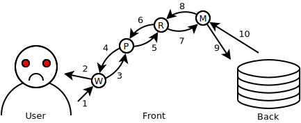
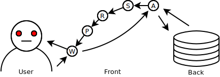

# Объектное Реактивное Программирование

* Автор: **[Дмитрий Карловский](https://github.com/nin-jin/)**
* Компания: **SAPRUN**


* Слайды: **[//nin-jin.github.io/slides/orp/](https://nin-jin.github.io/slides/orp/)**

> Привет всем землянам, меня зовут Дмитрий Карловский и я.. не буду строить из себя успешного разработчика и, прикрываясь крупной команией за плечами, продавать вам модную технологию, которая "решит все ваши проблемы". Доклад мой будет о незаслуженно непопулярной, но весьма элегантной парадигме и её удивительных возможностях.

# Термины

> **Итак, что такое Объектное Программирование?** Основной его чертой является объединение данных и функций для работы с ними в рамках одной абстракции с относительно простым интерфейсом - объекте.

> **А что такое Функциональное Программирование?** Тут вся программа описывается в виде кучи чистых функций, которые не зависят от изменяемого состояния и сами не изменяют никаких состояний.

> **Наконец, что такое Реактивное Программирование?** Здесь вы описываете правила получения одних состояний из других таким образом, что изменение одного состояния приводит к каскадному изменению зависимых.

|    | FP  | OP
|----|-----|----
| RP | FRP | ORP

> У многих Реактивное Программирование прочно ассоциируется с Функциональным, однако, оно куда ближе к Объектному, так как основные действующие лица в Реактивном Программировании - изменяемые состояния. И, хотя зависимости между состояниями зачастую описываются в виде функций, они вовсе не обязаны быть чистыми, но они должны быть идемпотентными, чтобы программа не крутилась в бесконечном цикле как белка в колесе.

# Каталог товаров

> Давайте представим, что мы решили открыть интернет-магазин по продаже игрушек. Причём сделать мы хотим всё не абы как, а стильно, модно, молодёжно, быстро, гибко и надёжно..

*Каталог различных игрушек*

> Допустим, игрушек у нас порядка десяти тысяч. Мы можем загрузить данные по всем игрушкам на клиентское устройство и без сетевых задержек, в реальном времени отображать пользователю доступное для заказа число тех или иных типов игрушек, их рейтинги и прочую информацию.

# Фильтрация

> Листать этот огромный каталог, конечно, интересно, но пользователю хотелось бы ограничить его лишь теми игрушками, что особенно интересуют его в данный момент. Поэтому мы добавляем фильтрацию. Отфильтровать игрушки можно по самым разным параметрам: по размеру, по цене, по рейтингу, по тексту в описании, да много по чему.

*Каталог с фильтром*

> Сложный фильтр на большие объёмы данных может накладываться довольно продолжительное время, поэтому нам бы не хотелось, чтобы фильтрация повторялась лишний раз, ведь это приводит к снижению отзывчивости приложения, увеличению энергопотребления и вообще не круто.

# Сложная фильтрация

> Например, если мы отфильтровали по тексту в описании, то нет смысла перефильтровывать каталог, когда меняется рейтинг какой-либо игрушки. Но если мы отфильтровали по рейтингу, то перефильтрацию в этом случае мы сделать уже обязаны.

*Каталог со сложным фильтром*

> Фильтры могут быть и более хитроумными, затрагивания разные свойства разных товаров, так что вручную следить за всеми подобными зависимостями довольно сложно: кода получается много, а что-то обязательно будет не учтено. Поэтому важно знать от каких конкретно свойств каких конкретно товаров зависит результат фильтрации, чтобы перезапускать его только при изменении тех состояний, что реально влияют на результат.

# Сортировка

> Пользователь обычно хочет просматривать задачиигрушки не в произвольном порядке, а в каком-то конкретном. Например: в порядке увеличения цены или уменьшения релевантности. Поэтому он должен иметь возможность указать критерий сортировки, который опять же может затрагивать различные свойства товаров и быть достаточно тяжёлыми на больших списках.

*Каталог со сложным фильтром и сложной сортировкой*

> Очевидно, повторную сортировку нужно будет произвести лишь при изменении критерия сортировки... или тех свойств товаров, от которых зависит сортировка. Но не любых товаров, а лишь тех, что соответствуют критерию фильтрации. И, соответственно, при изменении самого этого критерия. И...

# Учёт всех зависимостей

> Если вы попытаетесь описать в коде все зависимости между всеми состояниями, то это приведёт к **комбинаторному взрыву** и вам оторвёт руки. 

*Диаграмма всех зависимостей между состояниями*

> Поэтому без Реактивного Программирования мы не сможем сделать сколь-нибудь сложное приложение **быстрым**, **надёжным** и **компактным** одновременно.

# Всё ли рендерить?

> Если вы будете отображать все данные, что подготовили, то алгоритмическая сложность рендеринга будет пропорциональная объёму этих данных. 10 товаров рендерятся мгновенно, 1000 рендерится с задержкой, а 10000 рендерятся уже несколько секунд. Если у пользователя такой экран, что одновременно в него влезает не более 10 игрушек, то визуально для него не будет никакой разницы - будете ли вы рендерить всю 1000 или только 10 из них. Поэтому, каким бы быстрым ни был у вас ~~React~~ шаблонизатор, он всегда будет проигрывать по отзывчивости ленивой архитектуре, которая в гораздо меньшей мере зависит от объёмов данных.

*График с логарифмической и линейной прогрессией*

# Отображение лишь видимого

> Если высота каждой строки нам известна заранее, то, зная высоту окна, легко понять какие товары точно не видны, а какие может хоть краешком, но влезают в видимую область. Вырезать из огромного списка элементы с первого по десятый - плёвая операция. Но только, если этот список у нас хранится где-то в закешированном виде. Если же мы при скроллинге будем на каждый фрейм пересортировывать список, а то ещё и перефильтровывать его, то ни о какой плавности скроллинга не может идти и речи.

# Примерение изменений к DOM

> Ок, данные мы подготовили, осталось показать их пользователю. Решение в лоб - удалить старое дерево и вставить новое. Именно так работают почти все HTML-шаблонизаторы.


> К сожалению это слишком медленно. Кроме того, это сбрасывает динамические состояния узлов. Такие как: "позиция скроллинга", "позиция каретки" и другие. Реальность упорно не хочет быть чистой функцией - для повышения отзывчивости нужно по возможности изменять существующее состояние, а не просто создавать новое. А если не можешь победить - возглавь!

# Виртуальный DOM

> Как подружить ужа с ежом? Правильно, давайте генерировать новый DOM всего приложения, а потом ~~React~~ специальная библиотека будет сравнивать его новую и старую версию и применять различия к тому DOM-у что видит пользователь.

*Диаграмма реконциляции*

> Звучит как костыль, не правда ли? Посмотрите на схему - сколько работы приходится выполнять только лишь для того, чтобы, изменить значение текстового узла, когда в одной из моделей поменялось строковое свойство.

# Прямые зависимости

> Как могла бы выглядеть работа наиболее эффективного решения?


> Всё просто - между исходными данными и их отображением устанавливаются прямые связи. При изменении одного состояния, изменяется и зависимое от него. Причём действует это не только между так называемыми "моделью" и "отображением", а между любыми зависимыми состояниями, начиная с базы данных на сервере, через кучу промежуточных состояний и заканчивая дом-узлом в браузере. Именно в этом и заключается суть Реактивного Программирования, а не в шаблонизаторе с созвучным названием, который продают нам на каждой конференции.

# Так ли это всё важно?

> Вы можете сказать, что я сгущаю краски, а конкретно в вашем проекте никогда не будет столько данных, и тяжёлой их обработки, и открывать ваше приложение будут лишь на мощных рабочих станциях, а не на хилом китайском тапке в режиме энергосбережения.

*Мем "и так сойдёт"*

# Треугольник серпинского на ReactJS@15

> Но на это у меня есть простое соображение. Для обеспечения плавности работы вашему приложению необходимо работать со скоростью в 60 кадров в секунду, что даёт всего 16 миллисекунд на все операции начиная с подготовки данных, и заканчивая пересылкой отрисованных областей в видеопамять. И превысить эти 16 миллисекунд очень просто даже в довольно простом приложении на довольно мощном компьютере.


# Треугольник серпинского на $mol_view


# Пробуем толкать

> Есть два принципиально разных способа реализации реактивности.

> Первый - это всякие беконы, RX-ы и прочий стрим-панк, так же известный как Функциональное Реактивное Программирование. Суть его в том, что вы явным образом получаете так называемые стримы, от которых зависит ваше состояние и добавляете к ним функцию вычисления нового значения. Каждый стрим как бы проталкивает вычисленное им значение во все зависимые стримы, а что с этим значением делать или не делать они уже решают сами.

```typescript
// **FRP** (RxJS)
const ToysSource = new Rx.BehaviorSubject( [] )
const Toys = ToysSource.distinctUntilChanged().debounce( 0 )

const FilterSource = new Rx.BehaviorSubject( toy => toy.count > 0 )
const Filter = FilterSource.distinctUntilChanged().debounce( 0 )

const ToysFiltered = Filter
.select( filter => {
	if( !filter ) return Toys
	return Toys.map( toys => toys.filter( filter ) )
} )
.switch()
.distinctUntilChanged()
.debounce( 0 )
```

> Посмотрите на этот FRP-ребус и попробуйте сходу сказать, что и зачем он делает. А делает он простую штуку: создаёт стрим отфильтрованных задач таким образом, что если функция фильтрации не задана, то собственно фильтрации и не происходит. Тут уже применено несколько типовых оптимизаций, тем не менее работает этот код очень не эффективно: список игрушек перефильтровывается всякий раз при любом изменении данных любой игрушки. Чтобы побороть эту проблему нужно ещё на порядок усложнить код, но на это уже мало у кого хватит уситчивости.

> Данный подход приводит к сложному, трудноподдерживаемому коду. Его трудно читать. Его сложно писать. Его лень писать правильно. В нём легко допустить ошибку, если вы, конечно, не финалист специальной олимпиады по информатике.

# Нет, давайте тянуть!

> Куда проще и эффективней использовать другой подход, где вычисления начинаются не от источника данных, а от их потребителя.

```typescript
// **ORP** (MobX)
class $my_toys {

	@ $mol_mem()
	toys( next = [] ){ return next }

	@ $mol_mem()
	filter( next = toy => toy.count() > 0 ){ return next }

	@ $mol_mem()
	toys_filtered() {
		if( !this.filter() ) return this.toys()
		return this.toys().filter( this.filter() )
	}
}
```

> Не правда ли ORP код куда проще, и понятнее? Это тот же код, который мы бы написали безо всякого реактивного программирования, но мы добавили декоратор, который динамически отслеживает зависимости по факту обращения к ним, кеширует результат исполнения функции и сбрасывает кеш, когда зависимости изменяются.

> Правильная реализация логики этих декораторов позволяет производить вычисления наиболее оптимальным образом, не перекладывая головную боль по контролю потоков данных на прикладного программиста.

# Добавляем сортировку

> Далее у нас идёт отсортированный список задач, зависящий от функции сортировки, которая по умолчанию сортирует по сроку заверения задачи, а значит при изменения срока у какой-либо задачи из отфильтрованного списка, будет произведена пересортировка.

```typescript
@ $mol_mem()
sorter( next = ( a , b )=> b.due() - a.due() ) { return next }

@ $moL-mem()
toys_sorted() {
	return this.toys_filtered().slice().sort( this.sorter() )
}
```

# Отображаем лишь видимое

> Ну и под конец, мы вырезаем лишь видимые сейчас на экране задачи. При этом перемещение скроллинга приводит лишь к незначительному по времени повторному вырезанию видимых задач, без бессмысленных перефильтраций и пересоровок.

```
@ $mol_mem()
toys_visible() {
	return this.toys_sorted().slice( ... this.view_window() )
}

@ $moL_mem()
render() {
	return <div>{ this.toys_visible().map( toy => <$my_toys_card toy={ toy } /> ) }</div>
}
```

> Для примера рендеринга тут используется JSX, но это может быть совершенно любой способ рендеринга. При этом нам вовсе не обязательно генерировать новый DOM целиком - при изменении имени игрушки перезапущен будет лишь рендеринг карточки этой игрушки, а при изменении позиции скроллинга будут отрендерины появившиеся карточки, а ушедшие из области видимости - по тихому уничтожены.

# Отслеживаем зависимости

> Динамическое отслеживание зависимостей реализуется крайне просто.

```
class Atom {
	get() {
		const slave = Atom.current
		if( slave ) {
			this.slaves.add( slave )
			slave.masters.add( this )
		}
		
		if( this.value !== undefined ) return this.value
		
		try {
			Atom.current = this
			return this.value = this.pull()
		} finally {
			Atom = slave
		}
	}
}
```

> *Описание, что делает этот код*

# Синхронное обновление зависимостей

> Ок, с построением графа зависимостей разобрались. Осталось решить когда обновлять зависимые состояния.

> Решение в лоб: как только состояние изменилось - последовательно идём по зависимым состояниям и обновляем их. А по мере их обновления обновляем и зависимые от них и так далее, так далее, так далее. Именно так работает по умолчанию ORP библиотека [KnockOut](http://knockoutjs.com) и все FRP библиотеки, что я видел.

> К сожалению, не всё так просто и, действуя так, мы можем получить дичайшие тормоза в некоторых случаях.

*Диаграмма зависимостей: отфильтрованнный список зависит от свойств каждой задачи*

> На этой диаграмме вы видите зависимости между отфильтрованным списком товаров и данными самих товаров. Пока мы обновляем каждый товар по отдельности - всё хорошо, но стоит нам массово изменить какие-либо состояния, то на каждое изменение у нас будет происходить полный набор вычислений впроть до рендеринга. Поэтому-то и приходится вставлять везде всякие debounc-ы и trottl-инги, чтобы распространение обновлений происходило не сразу, а откладывалось на ближайшее время.

# По мере увеличения глубины?

> Решение, реализованое в моей библиотеке [$jin.atom](https://habrahabr.ru/post/235121/), заключалось в том, чтобы для каждого состояния поддерживать актуальным значение его максимальной глубины зависимостей. Таким образом все состояния раскладывались в отдельные слои, а обновление происходило от менее глубокого слоя к более глубокому, что гарантировало, что к моменту вычисления определённого состояния все его зависимости точно приняли актуальное значение.

*Диаграмма зависимостей: отфильтрованный по "популярности выше среднего" список зависит как от данных самих товаров, так и от "среднего значения", которое само зависит от данных товаров*

# По мере увеличения глубины? Пропажа зависимостей

> Пока зависимости не меняются всё работает отлично и эффективно, но в динамике появляются проблемы. Например, когда мы переходим с одной страницы на другую. Так как корень нашего приложения зависит от того что за страница у нас отображена, то он попадает в самый глубокий слой.

*Диаграмма зависимостей: ссылка, две страницы и корень приложения*

> Поэтому прежде чем старая страница будет уничтожена она будет обновлена. Это мало того, что медленно, так ещё и может приводить к ошибкам. Например, если в ссылке указан идентификатор, то показывается страница с подробностями по этому идентификатору. Когда же идентификатор пропадает из ссылки, то страница просто должна быть закрута, но попытка её обновить приведёт лишь к падению.

# В порядке создания?

> [VueJS](http://vuejs.org) использует под капотом свою реализацию ОРП. Там обновление состояний происходит в порядке увеличения порядкового номера, задаваемого при создании переменной. Сначала это работает хорошо, но чем дольше работает ваше приложение тем в более случайном порядке происходит обновление состояний, порождая всё те же проблемы лишних пересчётов.

> *Также стоит разобрать: MobX, CellX, ReSelect* 

# Правильный алгоритм: Каскадная инвалидация

> *Все зависимые узлы помечаются устаревшими, а косвенно зависимые - возможно устаревшими. Узел, от которого никто не зависит откладывается для последующего обновления.*

# Правильный алгоритм: Отложенный пересчёт

> *Перед обновлением каждый узел убеждается в актуальности зависимостей в том же порядке, в котором они вычислялись ранее. И если хоть одна из них изменилась - обновляется и сам.* 

# Обработка ошибок

> *Обычно исключения безвозвратно ломают приложение. Однако, исключение - такой же результат вычисления, как и собственно возвращаемое значение. Устранение причины исключения должно восстанавливать работу приложения.* 

# Загрузка: Синхронная блокирующая

> Давайте поговорим о загрузке данных. Взгляните на пример кода, который вычисляет сообщение о числе тёзок текущего пользователя. 

```
namesakes_message() {
	const user = this.user()
	const count = this.name_count( user.name )
	
	return this.texts().namesakes_message
	.replace( /\{count\}/g , count )
}
```

> Метод ```user``` делает запрос к серверу за информацией о пользователе, откуда берётся его имя и оно передаётся в метод ```names_count```, который запрашивает у другого сервера число пользователей с данным именем. Потом мы дёргаем метод ```texts```, чтобы получить тексты для текущей локали, берём оттуда нужный текст и подставляем в него полученное ранее число.

> Код простой и понятный, не правда ли? Но тут есть одна беда: пока выполняется каждый из этих трёх запросов всё приложение встаёт колом, так как виртуальная машина javascript однопоточная, а эти запросы блокируют поток до своего завершения.

# Загрузка: Асинхронная неблокирующая на Promise

> Чтобы решить проблему блокировки потока на время выполнения запроса в яваскрипте принято присать код на колбэках, в котором сам чёрт ногу сломит.

```
namesakes_message() {
	
	return Promise.all([
		this.user() ,
		this.texts() ,
	])
	.then( ([ texts , user ])=> {
		
		return this.name_count( user.name )
		.then( count => {
			
			return texts.namesakes_message
			.replace( /\{count\}/g , count )
			
		} )
		
	} )
	
}
```

> Обратите внимание, что тут мы грузим информацию о пользователе и тексты паралельно, так как они не зависят друг от друга. Это ускоряет общую загрузку всех ресурсов. Но поддерживать такой код - смерти подобно.

# Загрузка: Синхронная неблокирующая на async/await

> Недавно в яваскрипте появились средства синхронизации, но действуют они лишь в пределах одной функции, а не всего стека вызовов.

```
async namesakes_message() {
	
	const [ texts , user ] = await Promise.all([
		this.texts() ,
		this.user() ,
	])
	
	const count = await this.name_count( user.name )
	
	return texts.namesakes_message
	.replace( /\{count\}/g , count )
}
```

> Если мы пометили функцию как "асинхронную", то мы можем приостанавливать её до появления определённого события. Код снова становится простым и понятным, разве что для распараллеливания запросов нам всё ещё нужно кастовать специальные заклинания.

# Загрузка: Синхронная неблокирующая на атомах

> А что если я скажу вам, что следующий код не смотря всю на свою синхронность может быть не только неблокирующим, но и грузить информацию о пользователе и тексты параллельно? 

```
@ $mol_mem()
namesakes_message() {
	const texts = this.texts()
	const user = this.user()
	const count = this.namesakes_count( user.name )
	
	return texts.namesakes_message
	.replace( /\{count\}/g , count )
}
```

> Не без ограничений, но ОРП позволяет вам писать предельно простой и понятный код, при этом по максимуму используя возможности неблокирующих запросов. Вся магия в адекватной обработке исключительных ситуаций. Когда мы синхронно запрашиваем данные, а их нет - это самая натуральная исключительная ситуация для синхронного кода. Поэтому, кидается специальное исключение, которое останавливает текущий стек вызовов. Когда же данные придут, исполнение будет перезапущено и на этот раз данные уже будут возвращены. А чтобы добиться распараллеливания, реактивные свойства не пробрасывают исключение сразу, а возвращают прокси объект, который можно положить в переменную, куда-то передать, но при  попытке доступа к его содержимому - будет брошено сохранённое исключение. В данном примере, прерывание произойдёт при доступе к ```user.name```, ```texts.namesakes_message``` и ```count```, если они ещё не загружены.

# Загрузка: Игрушки

> *Давайте добавим неблокирующую загрузку списка игрушек, вместо локального его хранения. Для этого нам потребуется изменить всего один метод.*

```
// **Before**
@ $mol_mem()
toys(){ return [] }
```

```
// **After**
@ $mol_mem()
toys() {
	const data = $mol_request.json( 'toys.json' )
	return data.map( id => this.toy( id ) )
}
```

> Как видите, нам не потребовалось менять интерфейс метода - мы просто взяли содержимое файла, как если бы оно было у нас локально, и обработали его.

# Движение данных

> Пока что мы говорили лишь про движение данных от сервера к пользователю. Однако, стоит обратить внимание и на обратный поток данных.


> На диаграмме, каждое звено - это некоторое состояние, выраженное в различных моделях. На бэкенде, например, дата у нас выражена числом в таблице. На фронтенде она уже представляется виджетом "календарик" в соответствующем состоянии. Ну а в голове у пользователя это просто "тот день, когда я выступал на конференции".

> Если опустить посредников, то можно заметить, что источником истины о том, что видит пользователь является бэкенд, а источником истины о том, что следует изменить на бэкенде, является пользователь. Но самое интересное происходит, когда мы добавляем посредников. Пример такого посредника - пользовательский интерфейс, состояние которого зависит и от сервера и от пользователя. Как же реализовать его так, чтобы работал он чётко и предсказуемо?

# Двунаправленные зависимости

> Что если пользователь будет менять то состояние, значение которого было сформировано на основе выдачи сервера? Получается у этого состояния будет два источника истины - пользователь и сервер. Поэтому вскоре мы обнаружим конфликт состояний вида "с одной стороны пришло 3 июня, а с другой - 4".



> На диаграмме вы можете заметить структуру связей в типичном приложении на Ангуляре. Цепочка состояний обычно длиннее, но для понимания проблемы хватит и 4. Когда пользователь меняет состояние, начинают срабатывать watcher-ы, которые итеративно синхонизируют состояния между собой, что приводит ко временной неконсистентности состояния приложения вцелом. Эта логика работы не эффективна и требует очень аккуратного написания кода, иначе всё будет скакать и прыгать. 

# "Однонаправленный" поток данных

> Facebook подумал-подумал и придумал FLUX, где поток от сервера к пользователю идёт через компоненты, а обратно - через глобальные процедуры - так называемые "Экшены". 



> Написание компонент стало относительно простой задачей, но только до тех пока, пока они лишь выводят информацию. Как только вы заходите, чтобы пользовател мог не только смотреть в ваше приложение, но что-то в нём изменять, у вас появляется обратный поток, идущий в обход компонентной иерархии, что создаёт проблемы с созданием переиспользуемых компонент. Проще говоря, вы не можете просто взять и использовать такой компонент, не реализовав для каждого места его использования набор отдельных глобальных процедур. Пол века назад эта проблема уже была решена за счёт абстракции и инкапсуляции, но до сих пор мы ходим по одним и тем же граблям.

# Двусторонние каналы

> Проблема двустороннего связывания Агнуляра была не в том, что оно двустороннее, а в том, что состояние сначало изменялось, а потом отложенно синхронизировалось. Именно в этом был корень всех проблем. Как же его выкорчавать? 

> Решение в Объектном Программировании существует уже не один десяток лет - не давать напрямую изменять состояние. Вместо этого доступ к состоянию реализуется через специальные функции - так зазываемые "акцессоры". Пользователь объекта может лишь изъявить желание поменять значение определённого свойства, а что с этим значением делать - объект уже решает сам.


> На диаграмме можно видеть, как новое значение передаётся от объекта к объекту не меняя их состояний. И только когда приходит ответ от сервера с актуальным значением, оно спускается по иерархии компонент. У этой архитектуры нет проблем Ангуляра с неконсистентностью, ведь прямой и обратный поток данных не перемешиваются. Но нет и проблем FLUX-а, так как каждый компонент взаимодействует лишь со своим непосредственным владельцем и непосредственным имуществом. Всё, что нужно, чтобы повторно использовать какой-либо компонент - это создать экземпляр и настроить его под себя, предоставив ему так называемые "свойства" - это своего рода двусторонние каналы, из которых можно затянуть актуальные данные и предложить новые.

# Композиция компонент: Абстракции

> В простейшем случае компонент - это экземпляр определённого класса. Интерфейс этого класса состоит из методов-акцессоров, они могут работать как с локальным состоянием, так и делегировать получение и изменение значения методам другого объекта.

```
class Input {
	
	@ $mol_mem()
	value( next = '' ) { return next }
	
	placeholder() { return '' }
	
	// ...
}
```

> Данный пример - строковое поле ввода. Для иллюстрации приведено два свойства: ```placeholder``` - это текст показываемый, если значение поля не задано; и ```value``` - это текущее значение. Когда пользователь вводит новое значение оно передаётся в value. Соответственно тут мы можем это значение как-то нормализовать, провалидировать, куда-то сохранить. В данном случае мы используем декоратор, чтобы значение ```value``` кешировалось локально в текущем объекте.

# Композиция компонент: Переопределение

> Чтобы настроить поведение компонента мы можем просто переопределить его свойства своими функциями. Например, можем сделать, чтобы ```placholder``` был известным персонажем комиксов.

```
const Name = new Input

Name.placeholder = ()=> 'Batman'
```

> Или можем попросить компонент в качестве ```value``` брать не своё локальное состояние, а нашу локальную переменную.

```
let name = 'Jin'

Name.value = ( next = name )=> {
	return name = next
}
```

> Тут мы просто говорим, что при "затягивании" нужно вернуть значение переменной ```name```, а при "проталкивании" - записывать в ```name``` и возвращать актуальное значение.

> Вам может показаться, что это дурнопахнущий код, так как мы берём и переопределяем любой метод, но на практике это всё отлично работает и не доставляет проблем. Мы не можем записать левый метод или изменить сигнатуру метода извне, иначе тайпчекер настучит нам по рукам. Единственное оганичение: компонент не должен ничего делать в своём конструкторе, а переопределять методы можно лишь один раз при создании объекта.

# Композиция компонент: Связывание

> Лучше всего, не создавать объекты в воздухе и не разбрасываться локальными переменными. Давайте реализуем компонент, который будет владеть нашим полем ввода и контролировать его жизненный цикл.

```
class Greeter extends $mol_view {
	
	@ $mol_mem()
	name( next = 'Annon' ) { return next }
	
	@ $mol_mem()
	hint( next = 'User name' ) { return next }
	
	@ $mol_mem()
	Name() {
		const next = new Input
		next.value = next => this.name( value )
		next.placeholder = ()=> this.hint()
		return next
	}
	
	// ...
}
```

> Тут мы используем реактивное свойство ```Name``` в качестве фаблики, которая лениво создаёт и настраивает компонент. Созданный компонент кешируется и при последующх обращениях к фабрике сразу возвращается. Кроме того, как только визуализация перестанет зависеть от этого компонента, кеш будет уничтожен вместе с компонентом ```Input```, что гарантирует нам правильное и своевременное освобождение занятых им ресурсов.

> Также, стоит обратить внимание, что интерфейс нашего компонента по преждему состоит из свойств, но при настройке вложенного компонента мы связываем наши свойства со свойствам поля ввода. Свойство ```placeholder``` фактически имеет односторонню связь со свойством ```hint```. Мы сможем его изменять, а поле ввода его изменить не сможет при всём желании. А вот ```value``` с ```name``` связаны двусторонне, так что поле ввода может и читать и писать в наше свойство ```name```.

# Композиция компонент: Прямая коммуникация

> Допустим у нас есть два компонента, которые знают друг о друге чуть менее, чем ничего. Например: поле ввода строки и поле вывода текста.

```
class Input extends $mol_view {
	
	@ $mol_mem()
	value( next = '' ) {
		return next
	}
	
	// ...
}

class Output extends $mol_view {
	
	text() {
		return ''
	}
	
	// ...
}
```

> Используя технику переопределния свойств мы можем провязать их друг с другом таким образом, что изменение текста в поле ввода будет тут же отражаться в изменении приветствия в поле вывода.

```
class Greeter extends $mol_view {
	
	@ $mol_mem()
	Name() {
		return new Input
	}
	
	@ $mol_mem()
	Message() {
		const next = new Output
		next.text = ()=> {
			return `Hello, ${ this.Name().value() }`
		}
		return next
	}
	
	// ...
}
```

> Но полученный нами компонент ```Greeter```, теперь стал вещью в себе, которую толком и не настроишь. Например, чтобы изменить приветствие, нужно будет переопределить всю фаблику ```Name```, скопипастив весь её код с минимальными изменениями. Поэтому стоит избегать создания сложных замыканий, предпочитая ему связывание свойств.

# Композиция компонент: Управляемая коммуникация

```
	@ $mol_mem()
	name( next ) {
		return next || 'Annon'
	}
	
	@ $mol_mem()
	Name() {
		const next = new Input
		next.value = next => this.name( value )
		return next
	}
```

```
	message() {
		return `Hello, ${ this.name() }`
	}
	
	@ $mol_mem()
	Message() {
		const next = new Output
		next.text = ()=> this.message()
		return next
	}
```

> В данном примере мы создаём в нашем компоненте два дополнительных свойства ```name``` и ```message```, которые уже тривиально связываем со свойствами вложенных компонент и друг с другом. Таким образом, тот, кто будет использовать наш ```Greeter``` сможет легко и просто настроить, например, значение имени по умолчанию или алгоритм формирования приветственного сообщения. Кода стало чуть больше, но он упростился по структуре, а использование этого компонента потребует меньше копипасты.

# Реактивный рендеринг

> *Состояние dom-узла зависит от свойств компонента и от dom-узлов вложенных компонентов. Эта простая схема позволяет точечно обновлять DOM не производя лишних вычислений.*

# Реактивный рендеринг: Исключительные ситуации

> *Ошибки, ожидание загрузки и тп автоматически перехватываются и визуализируются. Это позволяет частям приложения падать и восстанавливать свою работу, не ломая других частей.* 

# Реактивный рендеринг: Индикатор ожидания

> *Временное отсутствие данных, пока они не загружены, - такая же исключительная ситуация, а раз мы не боимся исключаений, а умеем восстанавливать работу после устранения их причины, то это можно использовать для индикации ожидания данных.*

# Ложка дёгтя: Изменение собственной зависимости

```
@ $mol_mem()
increment() {
	this.value( this.value() + 1 )
}
```

> *Когда вам нужно изменить значение от которого вы зависите. Например - увеличить на 1. Красивого решения пока нет. Есть такое: для изменения запускать отдельную независимую реактивную задачу (самоуничтожающийся по завершении вычисления атом).*

```
increment() {
	$mol_atom_task( `${ this }.increment():1` , ()=> {
		
		const next = this.value() + 1
		
		$mol_atom_task( `${ this }.increment():2` , ()=> {
			this.value( next )
		}
		
	} )
}
```

```
increment() {
	$mol_atom_task( `${ this }.increment()` , ()=> {
		return this.value() + 1
	} ).then( next => {
		this.value( next )
	} )
}
```

# Резюме

> Не гонитесь за хайпом. Мода переменчива и часто тащит нас в болото. Разумеется большой компанией выбираться из жопы интересней. Но если вы хотите вырваться вперёд, пока остальные буксуют, нужно учиться трезво и рационально оценивать технологии, выбирая те, что уменьшают сложность разработки, а не увеличивают её. Если ваш единственный аргумент - число разработчиков "знающих" технологию, то готовьтесь к тому, что через пару лет никто из них уже не захочет с ней связываться, а через 5 - вы не найдёте никого, кто смог бы разобраться в коде проекта.

# Вопросы?
