# Объектное Реактивное Программирование

**[Дмитрий Карловский](https://github.com/nin-jin/)** из **[SAPRUN](http://www.saprun.com)** представляет... ммм...

> Это - текстовая версия выступления на [FrontendConf'17](http://frontendconf.ru/2017). Вы можете [читать её как статью](https://github.com/nin-jin/slides/tree/master/orp), либо [открыть в интерфейсе проведения презентаций](https://nin-jin.github.io/slides/orp/).

| Надоело.. | Чем поможет ОРП? |
|-----------|------------------|
| .. писать много, а делать мало? | Пиши мало, делай много!
| .. часами дебажить простую логику? | Реактивные правила обеспечат консистентность!
| .. асинхронщина? | Синхронный код тоже может быть неблокирующим!
| .. что всё по умолчанию тупит? | ОРП оптимизирует потоки данных автоматом!
| .. функциональные головоломки? | Объекты со свойствами - проще некуда!
| .. что приложение падает целиком? | Позволь упасть его части - само поднимется!
| .. жонглировать индикаторами ожидания? | Индикаторы ожидания пусть сами появляются, где надо!
| .. двустороннее связывание? | Двустороннее связывание нужно правильно готовить!
| .. пилить переиспользуемые компоненты? | Пусть компоненты будут переиспользуемыми по умолчанию!
| .. вечно догонять? | Вырывайся вперёд и лидируй!

# Рекламная пауза


> Всем привет, меня зовут **Дмитрий Карловский**. Я - **руководитель группы веб-разработки** компании САПРАН. Компания наша является **крупнейшим интегратором САП-а** в России, но в последнее время мы активно смотрим в сторону разработки **собственных программных продуктов**.

# $mol - реактивный до мозга костей


> Один из них - кроссплатформенный open source веб фреймворк быстрого построения отзывчивых интерфейсов с говорящим названием **"$mol"**. В нём мы по максимуму применяем возможности **Объектного Реактивного Программирования**, о которых я и расскажу далее...

# Что будем делать вечером? Попробуем завоевать ритейл!

> Давайте представим, что мы решили **открыть интернет-магазин** по продаже игрушек. Причём сделать мы хотим всё не абы как, а **стильно, модно, молодёжно, быстро, гибко и надёжно**..


# Каталог товаров

> **Игрушек у нас много**, а начать продажи надо было ещё вчера. Поэтому мы хотим сделать всё как можно быстрее, но не про.. теряв user experience.

> Мы можем загрузить основные данные всех игрушек на клиентское устройство и позволить пользователю просматривать каталог **быстро, без сетевых задержек**.


# Фильтрация

> Листать наш каталог, **конечно, увлекательное занятие**, но пользователь хотел бы ограничить выбор лишь теми игрушками, что **особенно интересуют его в данный момент**. Поэтому мы добавляем фильтрацию.

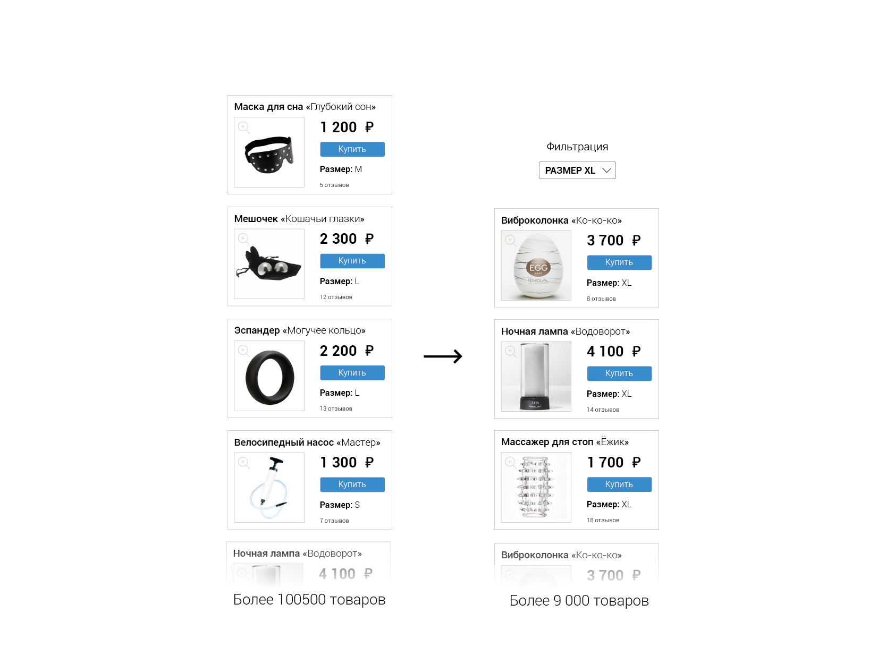

> На больших объёмах данных сложный фильтр может **накладываться продолжительное время**, поэтому для обеспечения отзывчивости нам бы не хотелось, чтобы фильтрация повторялась лишний раз, когда в ней нет необходимости.

> **Например**, если мы отфильтровали по размеру, то при изменении числа отзывов нет смысла выполнять повторную фильтраци. А вот если отфильтровали по числу отзывов.. ну вы поняи, да?

> Нам важно знать **от каких конкретно свойств каких конкретно товаров** зависит результат фильтрации, чтобы перезапускать её при изменении лишь тех состояний, что **реально влияют** на результат.

# Сортировка

> Пользователь обычно хочет просматривать игрушки **не в произвольном порядке**, а в каком-то конкретном. Например: в порядке увеличения цены или в порядке уменьшения релевантности. Поэтому мы добавляем сортировку. Она опять же может затрагивать разные свойства товаров и быть довольно **тяжёлой на больших объёмах данных**.

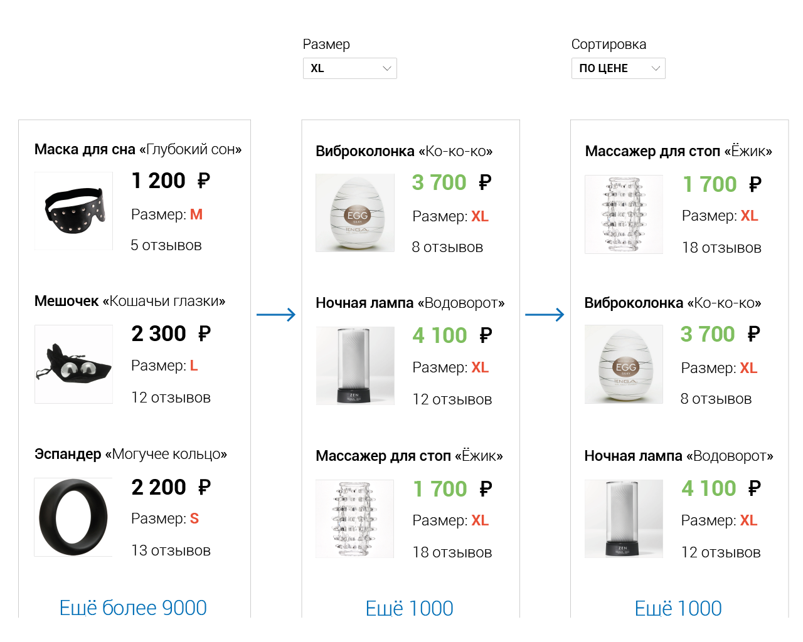

> Очевидно, тут **повторную сортировку нужно будет произвести** лишь при изменении критерия сортировки... или тех свойств товаров, по которым мы сортировали. **Но не любых товаров**, а лишь тех, что соответствуют критерию фильтрации. И, соответственно, при изменении этого самого критерия. А также, при изменении свойств товаров, по которым мы фильтровали. И...

# Учёт всех зависимостей

> Если вы попытаетесь **описать в коде** все зависимости между всеми состояниями, то произойдёт **комбинаторный взрыв** и вам оторвёт руки. 

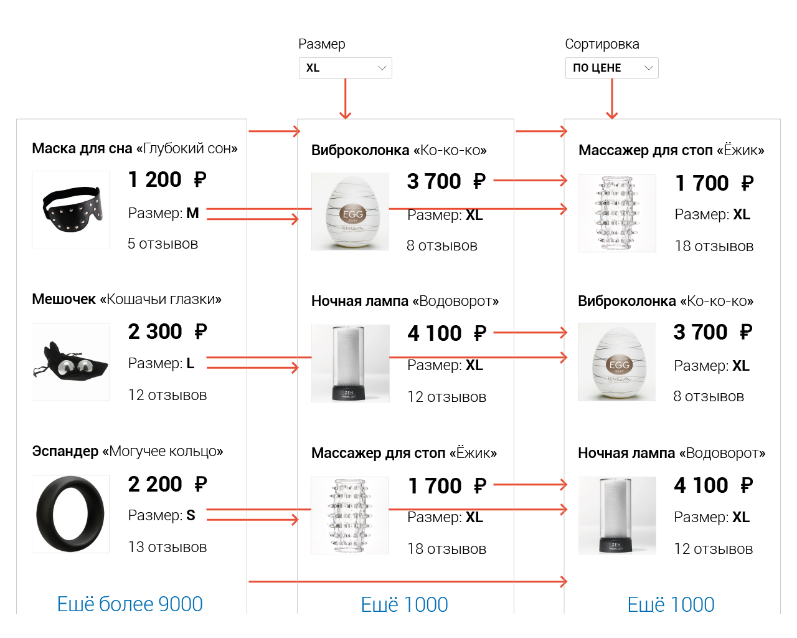

> Тут мы описали **лишь 2 шага преобразований**, но в реальном приложении их может более десятка.

> **Чтобы обуздать** эту экспоненциально растущую сложность, и было придумано Реактивное Программирование. Без него вы не сможете сделать сколь-нибудь сложное приложение **быстрым**, **стабильным** и **компактным** одновременно.

# Всё ли рендерить?

> Если вы будете **отображать все данные**, что подготовили, то алгоритмическая сложность рендеринга будет **пропорциональна объёму этих данных**. 10 товаров рендерятся мгновенно, 1000 - с задержкой, а если 10000, то пользователь успеет сходить попить чайку.

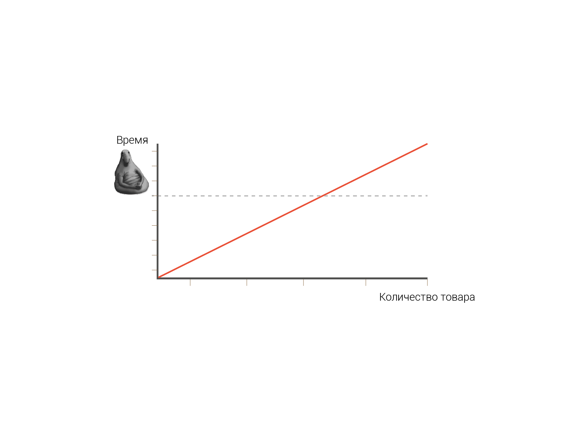

# Или не всё?

> Если у пользователя такой экран, что одновременно в него **влезает не более 10 товаров**, то визуально для него не будет никакой разницы - будете ли вы рендерить всю 1000 или только 10 из них, а по мере скроллинга дорендеривать недостающее. Поэтому, каким бы быстрым ни был у вас ~~React~~ шаблонизатор, он всегда будет **проигрывать по отзывчивости ленивой архитектуре**, которая в гораздо меньшей мере зависит от объёмов данных.

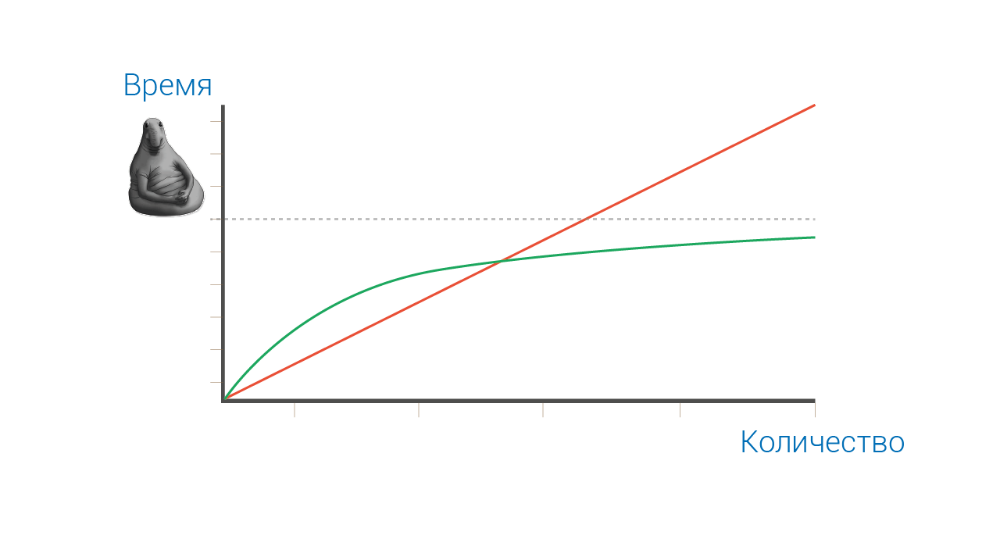

# Отображение лишь видимого

> Если **размеры карточек товаров нам примерно известны**, то, зная высоту окна, легко понять какие товары точно не видны, а какие может хоть краешком, но влезают в видимую область. 


> **Вырезать** из огромного списка элементы с первого по десятый - **плёвая операция**. Но только, если этот список у нас хранится где-то в закешированном виде. Если же в каждом кадре мы будем получать его из исходных данных путём фильтрации и сортировки, то ни о какой плавности скроллинга не может идти и речи.

# Примерение изменений к DOM

> Ок, данные мы подготовили, осталось показать их пользователю. Решение в лоб - **удалить старое DOM-дерево и вырастить новое**. Именно так работают **все HTML-шаблонизаторы**.

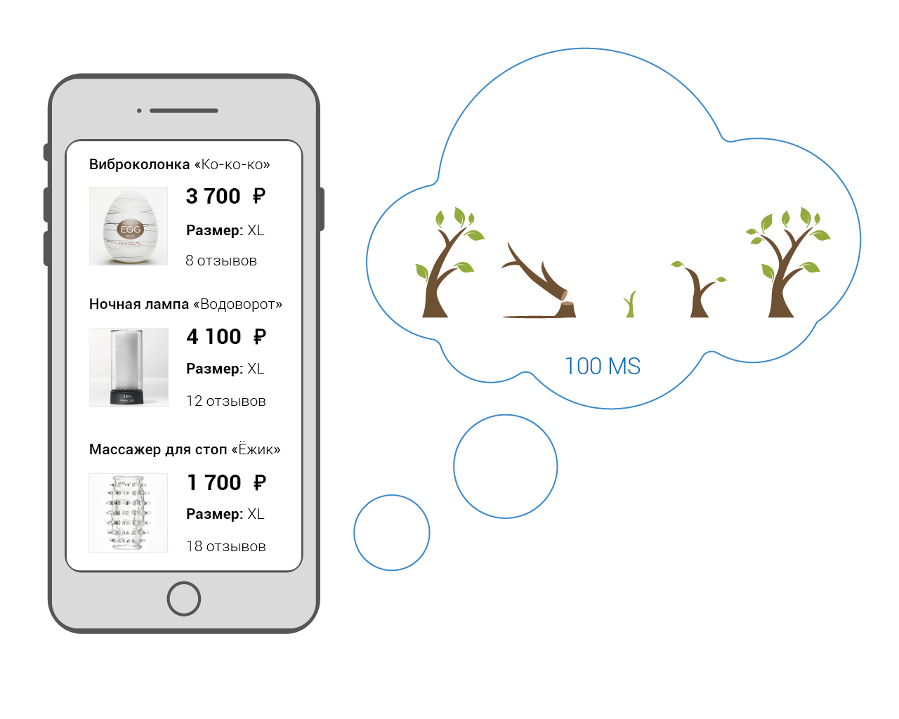

> Оно **мало того, что медленное**, так ещё и приводит к **сбросу динамического состояния** узлов. Например: позиция скроллинга и флаг открытости селекта. Некоторые из них потом можно восстановить программно, но далеко не все.

> Короче говоря, **реальность упорно не хочет быть чистой функцией**. Чтобы приложение работало как следует, **нужно по возможности изменять существующее** состояние, а не просто создавать новое. А **если не можешь победить - возглавь!**

# Виртуальный DOM

> **Как натянуть ужа на ежа?** Правильно, давайте генерировать новое DOM дерево всего приложения, а потом ~~React~~ специальная библиотека будет сравнивать его новую и старую версию, и **применять различия к тому DOM дереву**, что реально видит пользователь.

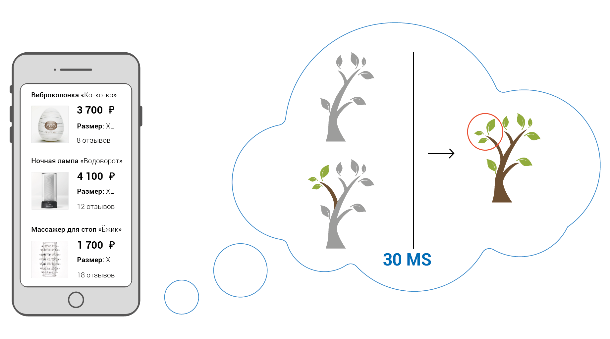

> **Звучит как костыль, не правда ли?** Сколько работы приходится выполнять только лишь для того, чтобы, изменить значение **текстового узла**, когда в одной из моделей поменялось **строковое свойство**.

# Прямые зависимости

> А как могла бы выглядеть работа **наиболее эффективного** решения?

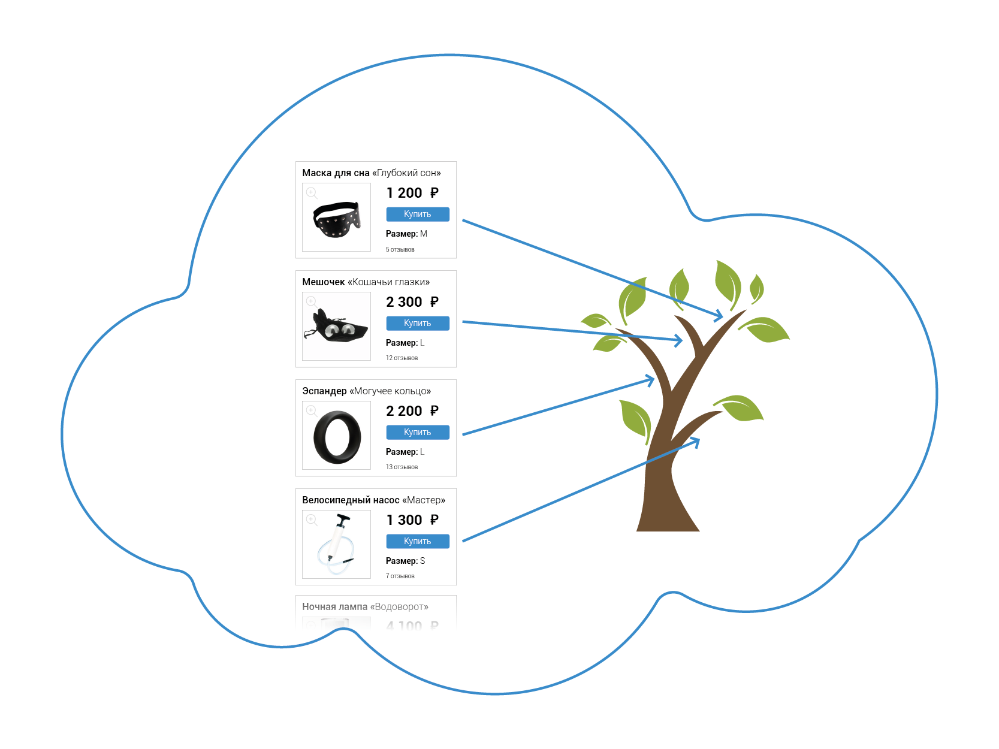

> Всё просто - между исходными данными и их отображением устанавливаются **прямые связи**. При изменении одного состояния, изменяются **лишь зависимые от него**. Причём действует это не только между так называемыми "моделью" и "отображением", а **между любыми зависимыми состояниями**, начиная с записи в базе данных на сервере, через кучу промежуточных состояний и заканчивая дом-узлом в браузере. Именно в этом и заключается **суть Реактивного Программирования**, а не в шаблонизаторе с созвучным названием, который продают нам на каждой конференции.

# И так сойдёт!


> Вы можете сказать, что я сгущаю краски, а конкретно в вашем проекте никогда не будет **столько данных**, и **тяжёлой их обработки**, и запускать ваше приложение будут лишь на мощных рабочих станциях, а не на **хилом китайском тапке** в режиме энергосбережения.

# Треугольник серпинского на ReactJS

> Но на это у меня есть простое соображение. Чтобы выше приложение работало со скоростью в **60 кадров в секунду**, то оно должно успевать выполнить все операции, начиная с подготовки данных и заканчивая их отрисовкой, **всего за 16 миллисекунд**. И превысить их очень легко даже в тривиальном приложении на мощном компьютере.

[](http://nin-jin.github.io/sierpinski/stack.html)

> Перед вами известное демо созданное **ребятами из Facebook**, показывающее как сильно тупят сложные приложения на Реакте. Они это сейчас пытаются решить **размазыванием вычислений по нескольким кадрам**, что даёт заветные 60 кадров в секунду, но приводит к визуальным артефактам. **Фундаментальная же проблема** у них остаётся неизменной - виртуальный DOM требует **кучи лишних вычислений** на каждый чих.

# Треугольник серпинского с использованием ОРП

> ОРП, напротив, позволяет минимизировать объём вычислений, **автоматически оптимизируя потоки данных** от их источника до их потребителя.

[](http://mol.js.org/perf/sierp/)

> Как вы можете видеть, эквивалентная реализация с применением реактивного программирования показывает **гораздо большую производительность**, даже без размазывания вычислений по кадрам.

# Парадигмы

> Давайте, наконец, добавим немного теории..

> Что такое **Объектное Программирование?** Основной его чертой является объединение данных и функций для работы с ними в рамках одной абстракции с относительно простым интерфейсом - объекте.

> А что такое **Функциональное Программирование?** Тут вся программа описывается в виде кучи чистых функций, которые не зависят от изменяемого состояния и сами не изменяют никаких состояний.

> Наконец, что такое **Реактивное Программирование?** Здесь вы описываете правила получения одних состояний из других таким образом, что изменение одного состояния приводит к каскадному изменению зависимых.

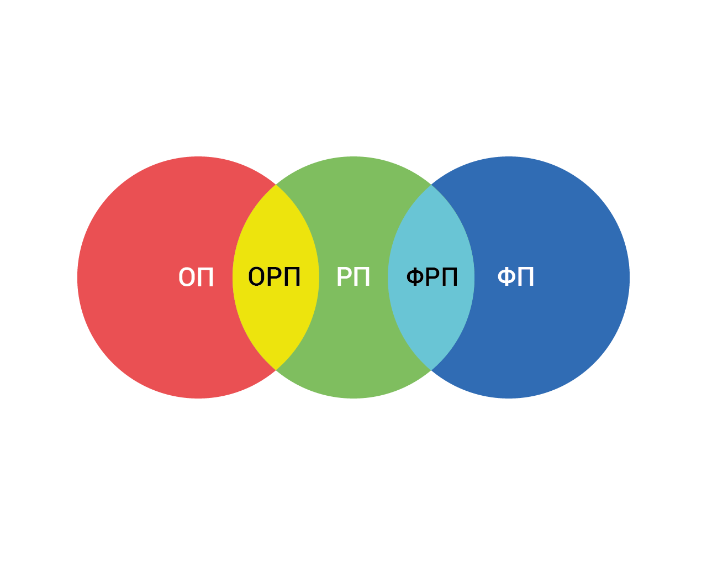

> У многих **Реактивное Программирование прочно ассоциируется с Функциональным**, однако, оно куда ближе к Объектному, так как основные **действующие лица** в Реактивном Программировании - изменяемые состояния.

# Проталкиваем (ФРП)

> Есть два принципиально разных способа реализации реактивности.

> Первый - это всякие беконы, RX-ы и прочий стрим-панк, так же известный как **Функциональное Реактивное Программирование**. Суть его в том, что вы **явным образом** получаете так называемые стримы, от которых зависит ваше состояние, добавляете к ним **функцию вычисления** нового значения. И полученное таким образом значение уже **проталкивается** во все зависимые стримы, а что с этим значением делать или не делать они уже **решают сами**.

```typescript
const FilterSource = new Rx.BehaviorSubject( toy => toy.count > 0 )
const Filter = FilterSource.distinctUntilChanged().debounce( 0 )

const ToysSource = new Rx.BehaviorSubject( [] )
const Toys = ToysSource.distinctUntilChanged().debounce( 0 )

const ToysFiltered = Filter
.select( filter => {
	if( !filter ) return Toys
	return Toys.map( toys => toys.filter( filter ) )
} )
.switch()
.distinctUntilChanged()
.debounce( 0 )
```

> Посмотрите на этот **ФРП-ребус** и попробуйте сходу сказать, что и зачем он делает. А **делает он простую штуку**: создаёт стрим для товаров, стрим для критерия фильтрации и получает из них стрим отфильтрованного списка товаров.

> Тут уже применено несколько типовых оптимизаций. Тем не менее **работает этот код очень не эффективно**: список игрушек перефильтровывается даже если в товаре поменялись те данные, от которых результат фильтрации не зависит. Чтобы побороть эту проблему, **придётся ещё на порядок усложнить** код, но мало кто это осилит.

> Данный подход приводит к **сложному, трудноподдерживаемому коду**. Его трудно читать. Его сложно писать. Его лень писать правильно. И в нём легко допустить ошибку, если вы, конечно, не финалист специальной олимпиады по информатике.

# Затягиваем (ОРП)

> Куда проще и эффективней использовать другой подход, где вычисления начинаются **не от источника данных, а от их потребителя**. Возьмём, например, самую продвинутую реализацию ОРП - **[$mol_mem](https://github.com/eigenmethod/mol/tree/master/mem)**.

```typescript
class $my_toys {

	@ $mol_mem()
	filter( next ) {
		if( next === undefined ) return toy => toy.count() > 0
	
		return next
	}
	
	@ $mol_mem()
	toys( next = [] ){ return next }
	
	@ $mol_mem()
	toys_filtered() {
		if( !this.filter() ) return this.toys()
		
		return this.toys().filter( this.filter() )
	}
}
```

> Не правда ли ORP код куда проще, и понятнее? Это **тот же код, который мы бы написали безо всякого реактивного программирования**, но мы добавили специальный декоратор, который динамически отслеживает зависимости по факту обращения к ним, кеширует результат исполнения функции и сбрасывает кеш, когда зависимости изменяются.

> Правильная реализация логики этих декораторов позволяет производить вычисления наиболее оптимальным образом, не перекладывая **головную боль по контролю потоков данных** на прикладного программиста.

# Добавляем сортировку

> Аналогичным образом мы можем добавить и **отсортированный список** товаров, зависящий от функции сортировки и отфильтрованного списка.

```typescript
@ $mol_mem()
sorter( next ) {
	if( next === undefined ) return ( a , b )=> b.price() - a.price()
	
	return next
}

@ $mol_mem()
toys_sorted() {
	if( !this.sorter() ) return this.toys_filtered()
	
	return this.toys_filtered().slice().sort( this.sorter() )
}
```

> **По умолчанию тут идёт сортировка по цене**, а значит сортировка будет произведена вновь лишь при изменении цены какой-либо игрушки из отфильтрованного списка, самого этого отфильтрованного списка или критерия сортировки.

# Отображаем лишь видимое

> Ну и под конец, мы **вырезаем лишь видимые сейчас на экране товары**. При этом перемещение скроллинга будет приводить лишь к незначительному по времени повторному вырезанию видимых задач, без бессмысленных перефильтраций и пересоровок.

```typescript
@ $mol_mem()
toys_visible() {
	return this.toys_sorted().slice( ... this.view_window() )
}
```

> Сразу же введём свойство ```children```, которое будет возвращать **компоненты, которые мы хотим отрендерить внутри нашего**. А рендерить мы хотим лишь попадающие в видимую область.

```typescript
children() {
	return this.toys_visible()
}
```

# Реактивный рендеринг

> Простейший обобщённый рендеринг компонента может производиться в рамках вычисления свойства ```render```, знакомого всем реактоводам.

```typescript
@ $mol_mem()
render() {
	let node = document.getElementById( this.id() )
	
	if( !node ) {
		node = document.createElement( 'div' )
		node.id = this.id()
	}
	
	/// **Node updating here**
	
	return node
}
```

> Зная идентификатор компонента, мы ищем соответствующий узел в реальном DOM-дереве. А если не нашли, то создаём его. После этого **актуализируем его состояние и возвращаем**.

> Обратите внимание на реактивныый кеширующий декоратор. Благодаря ему, **рендеринг конкретно этого узла будет перезапущен** лишь, когда изменится любое из свойств, к которому нам потребовалось обратиться в процессе обновления состояния нашего DOM-узла.

# А если исключение?

> **Часто исключения безвозвратно ломают приложение.** Оно может начать глючить, недорисовывать страницу или вообще перестать реагировать на действия пользователя. Однако, исключение - такой же результат вычисления, как и собственно возвращаемое значение.


> **Если при рендеринге какого-то блока на странице произошло исключение**, то именно этот блок и должен перестать работать, не затронув всё остальное приложение. Но устранение причины исключения в последующем должно восстанавливать работу этого блока, как если бы он и не падал. 

# Защищаем приложение от падения компонента

> Поэтому давайте **завернём рендеринг DOM-узла в блок ```try-catch```** и в случае возникновения ошибки, записывать имя исключения в специальный атрибут. А если рендеринг пройдёт без эксцессов - стирать его.

```typescript
try {
	
	/// **Node updating here**
	
	node.removeAttribute( 'mol_view_error' )
	
} catch( error ) {
	
	console.error( error )
	
	node.setAttribute( 'mol_view_error' , error.name )
}
```

# Индикация ошибки

> Зачем нам этот атрибут? Да чтобы через CSS стилизовать сломанный блок, **показывая пользователю, что он сейчас не работает**. Например, мы можем сделать его полупрозрачным и запретить пользователю с ним взаимодействовать.

```css
[mol_view_error] {
	opacity: .5 !important;
	pointer-events: none !important;
}
```

# Загрузка: Синхронная блокирующая

> **Давайте сделаем шаг в сторону** и поговорим о загрузке данных. Взгляните на пример кода, который вычисляет **сообщение о числе тёзок** текущего пользователя. 

```typescript
namesakes_message() {

	/// **Serial**
	const user = this.user()
	const count = this.name_count( user.name )
	
	return this.texts().namesakes_message
	.replace( /\{count\}/g , count )
}
```

> Сначала мы загружаем информацию о текущем пользователе, потом получаем число пользователей с тем же именем, а под конец загружаем строковые константы иодставляем туда число.

> Код простой и понятный, не правда ли? Но тут есть одна беда: **пока выполняется каждый из этих трёх запросов всё приложение встаёт колом**, так как виртуальная машина javascript однопоточна, а эти запросы блокируют поток до своего завершения.

# Загрузка: Асинхронная неблокирующая

> Чтобы решить эту проблему в яваскрипте принято присать код на колбэках.

```typescript
namesakes_message() {
	
	/// **Parallel**
	return Promise.all([
		
		/// **Serial**
		this.user().then( user => this.name_count( user.name ) ,
		
		this.texts() ,
	
	])
	.then( ([ count , texts ])=> {
		return texts.namesakes_message.replace( /\{count\}/g , count )
	} )
	
}
```

> Обратите внимание, что тут мы **грузим информацию** о числе пользователей и тексты **паралельно**, так как они не зависят друг от друга. Это ускоряет общую загрузку всех ресурсов, но **код стал похож на тарелку макарошек**.

# Загрузка: Синхронная неблокирующая с ручной параллельностью

> Недавно в яваскрипте появились средства синхронизации, но действуют они лишь **в пределах одной функции, а не всего стека вызовов**.

```typescript
/// **Serial**
async namesakes_count() {
	const user = await this.user()
	return await this.name_count( user.name )
}

async namesakes_message() {
	
	/// **Parallel**
	const [ count, texts ] = await Promise.all([
		this.namesakes_count() ,
		this.texts() ,
	])
	
	return texts.namesakes_message.replace( /\{count\}/g , count )
}
```

> Если мы пометили функцию как "асинхронную", то мы можем приостанавливать её до появления определённого события.

> Как видно, это не сильно спасает, так как для распараллеливания запросов **всё равно приходится кастовать специальные заклинания**.

# Загрузка: Синхронная неблокирующая без лишнего шума

> **А что если я скажу вам**, что следующий код не смотря на всю свою синхронность может быть не только неблокирующим, но и грузить информацию о пользователе и тексты параллельно? 

```typescript
@ $mol_mem()
namesakes_message() {

	/// **Parallel**
	const texts = this.texts()
	const user = this.user()

	/// **Serial**
	const count = this.namesakes_count( user.name )
	
	return texts.namesakes_message.replace( /\{count\}/g , count )
}
```

> Вся магия в **адекватной обработке исключительных ситуаций**. Когда мы синхронно запрашиваем данные, а их нет - это самая натуральная исключительная ситуация для синхронного кода. Поэтому, в этом случае **кидается специальное исключение**, которое останавливает текущий стек вызовов. Когда же данные придут, то **благодаря реактивности исполнение будет перезапущено** и на этот раз данные уже будут возвращены, как ни в чём ни бывало.

# Загрузка: Автоматическое распараллелливание

> А чтобы добиться распараллеливания, **реактивные свойства не пробрасывают исключение сразу**, а возвращают прокси объект, который можно положить в переменную, куда-то передать, но при попытке доступа к его содержимому - будет брошено сохранённое исключение.

> В данном примере, **первое прерывание произойдёт лишь при доступе к ```user.name```**, а значит загрузка текстов и информации о пользователе пойдёт параллельно.

```typescript
@ $mol_mem()
namesakes_message() {

	/// **Parallel**
	const texts = this.texts()
	const user = this.user()

	/// **Serial**
	const count = this.namesakes_count( user.name ) /// **<-- first yield**
	
	return texts.namesakes_message.replace( /\{count\}/g , count )
}
```

# Загрузка: Игрушки

> Давайте наконец **добавим загрузку списка игрушек**, вместо локального его хранения. Для этого нам потребуется изменить **всего один метод**.

```typescript
/// **Before**
@ $mol_mem()
toys(){ return [] }


/// **After**
toys_data() {
	return $mol_http.resource( '/toys.json' ).json()
}

@ $mol_mem()
toys() {
	return Object.keys( this.toys_data() ).map( id => this.toy( id ) )
}
```

> Как видите, нам не потребовалось менять его интерфейс - мы просто **взяли содержимое файла, как если бы оно было у нас локально**, обработали его и вернули результат.

# Индикация ожидания

> Остался последний штрих. **Пока данные не загружены у нас бросается исключение**, а имя исключения у нас автоматом прописывается в атрибуте DOM-элемента, который не смог отрендериться. А значит мы можем добавить этому блоку специальные стили, которые нарисуют для него **анимированный индикатор ожидания**. Что избавляет программиста и от этой назойливой ручной работы.

```css
[mol_view_error="$mol_atom_wait"] {
	animation: my_waiting .25s steps(6) infinite;
}
```

# Движение данных

> Пока что мы говорили лишь про движение данных от сервера к пользователю. Однако, **стоит обратить внимание и на обратный поток данных**.

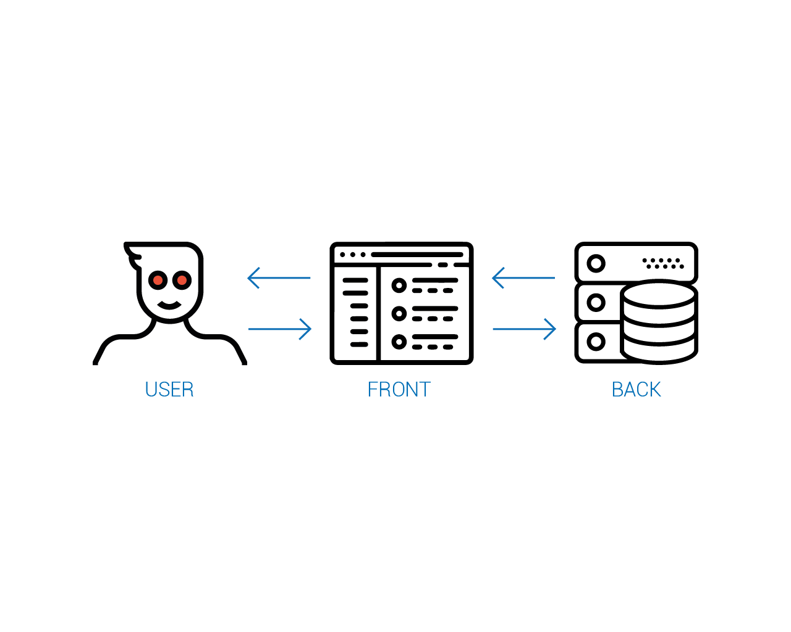

> На диаграмме, **каждое звено - некоторое состояние, выраженное в различных моделях**. На бэкенде, например, дата у нас выражена числом в таблице. На фронтенде она уже представляется виджетом "календарик". Ну а в голове у пользователя это просто "тот день, когда я выступал на конференции".

> Если опустить посредников, то можно заметить, что **источником истины** о том, что видит пользователь является бэкенд, а источником истины о том, что следует изменить на бэкенде, является пользователь.

> Но самое интересное происходит, когда мы **добавляем посредников**. Например, пользовательский интерфейс, состояние которого зависит и от сервера и от пользователя. Как же реализовать его так, чтобы работал он чётко и предсказуемо?

# Двунаправленные зависимости

> Что если пользователь будет **менять не исходные данные**, а непосредственно то состояние, которое он видит в **виджете, на который смотрит**?

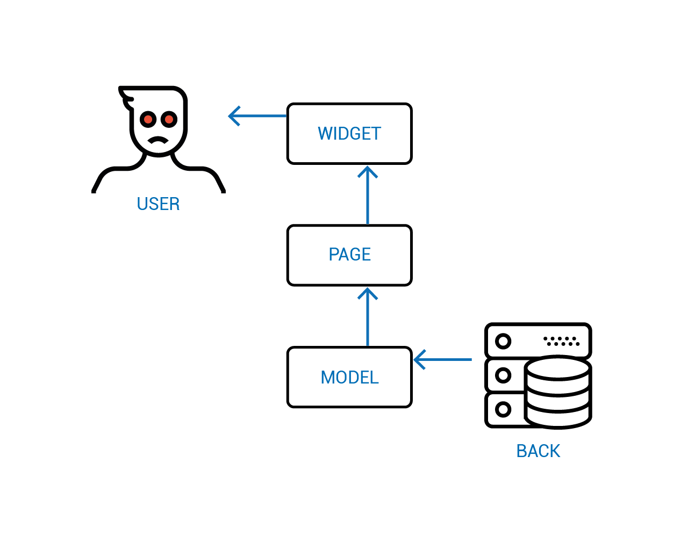

# Двунаправленные зависимости: Меняем состояние виджета

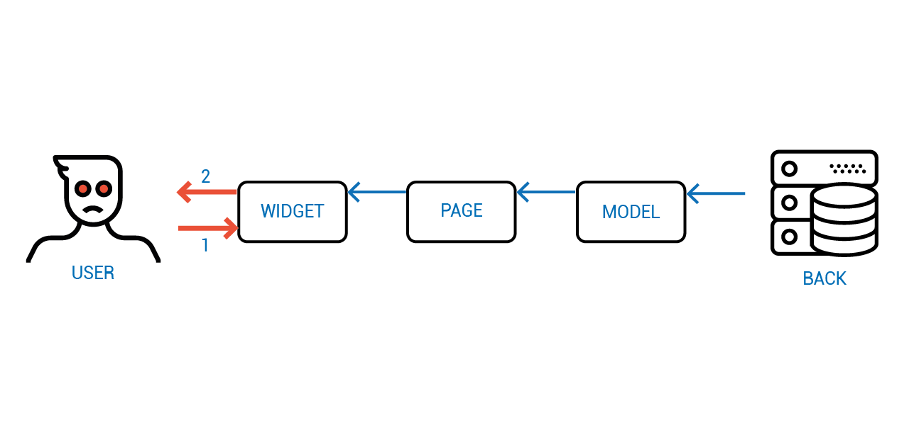

# Двунаправленные зависимости: Меняем состояние страницы

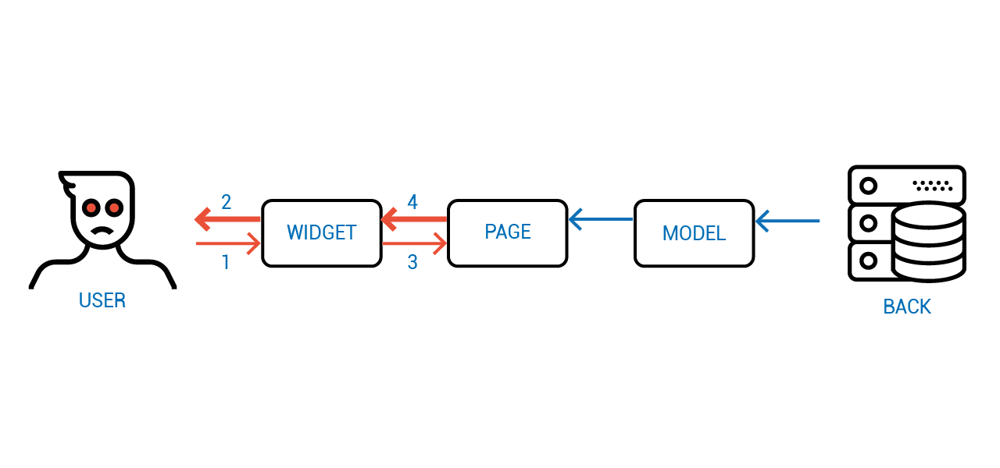

# Двунаправленные зависимости: Меняем состояние модели

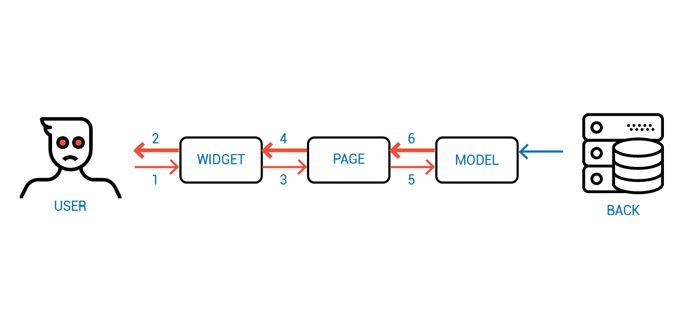

# Двунаправленные зависимости: Пришёл ответ от сервера

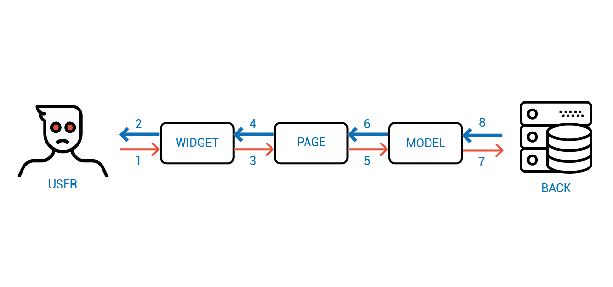

> **Как думаете, что за фреймворк тут использован?**

> Это типичное приложение на Angular. Когда пользователь меняет состояние, начинают срабатывать **watcher-ы, которые итеративно синхонизируют** состояния между собой, что приводит ко **временной неконсистентности** состояния клиент-серверной системы вцелом.

> Эта логика работы мало того, что **не эффективна**, так ещё и требует **очень аккуратного написания** кода с **точно подогнанными костылями** вида "подождать пока всё синхронизируется, а потом вызвать обработчик".

# Однонаправленный поток данных

> **А как называется архитектура со следующей диаграммы?**

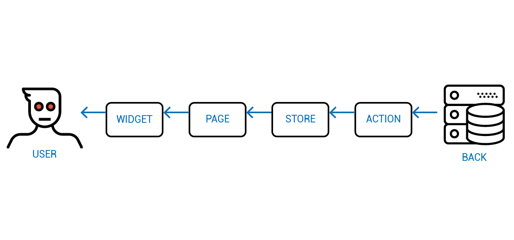

# Однона... что это у нас?

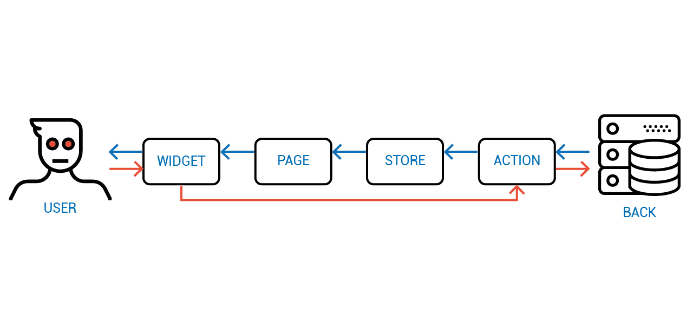

# Потока хоть и два, но не пересекаются

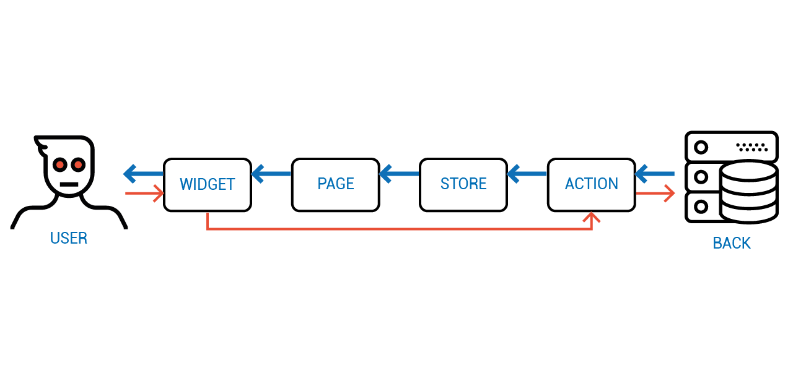

> Facebook подумал-подумал и придумал [FLUX](https://facebook.github.io/flux/), где поток от сервера к пользователю идёт через компоненты, а **обратно - через глобальные процедуры** - так называемые "Экшены". 

> Проблему с консистентностью мы побороли, но вылезла другая - **компоненты взаимодействующие с пользователем получаются не переиспользуемыми**. Вы не можете просто взять и использовать такой компонент, не реализовав для каждого места его использования набор отдельных глобальных процедур.

> Пол века назад эта проблема уже **была решена за счёт абстракции и инкапсуляции**, но до сих пор мы **ходим по одним и тем же граблям**.

# Двусторонние каналы: Прямой поток

> Проблема двустороннего связывания Агнуляра была **не в том, что оно двустороннее, а в том, что состояние сначало изменялось, а потом отложенно синхронизировалось**. Причём меняться оно могло **как пользователем, так и сервером**, что закономерно приводило к конфликтам состояний. **Именно в этом был корень всех проблем. Как же его выкорчавать?**

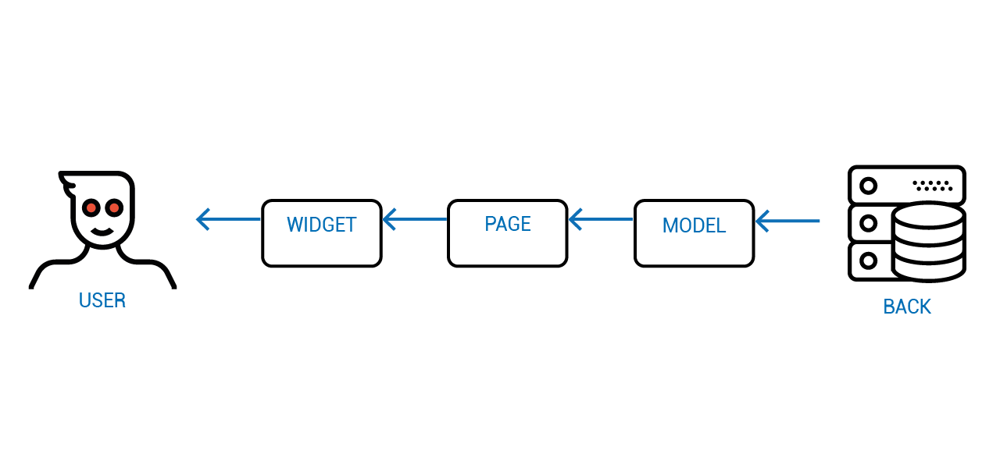

# Двусторонние каналы: Обратный поток

> Решение в Объектном Программировании опять же существует не один десяток лет - **не давать напрямую изменять состояние**. Вместо этого доступ к состоянию реализуется через специальные функции - так называемые "акцессоры". **Пользователь объекта может лишь изъявить желание** поменять значение определённого свойства, а что с этим значением делать или не делать - объект уже решает сам.

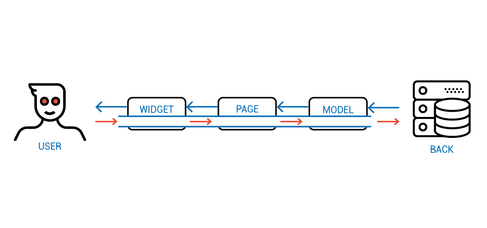

> На диаграмме можно видеть, как новое значение передаётся от объекта к объекту не меняя их состояний. 

# Двусторонние каналы: Обратный поток

> И только когда **приходит ответ от сервера с актуальным значением**, оно спускается по иерархии компонент, меняя их состояние.

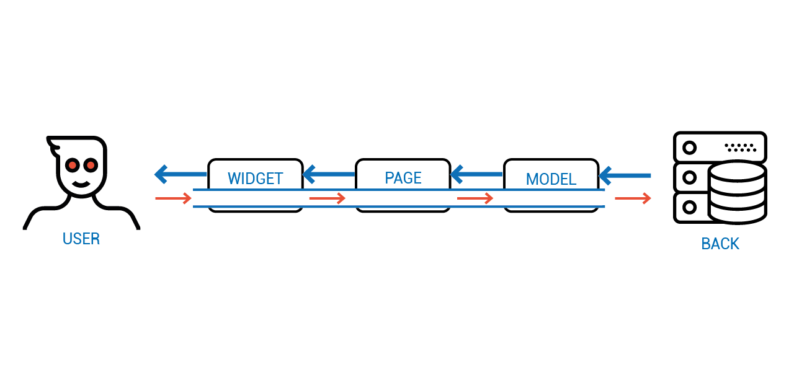

> У этой архитектуры нет проблем Ангуляра с неконсистентностью, ведь **прямой и обратный потоки данных не перемешиваются**. Но нет и проблем FLUX-а, так как каждый компонент взаимодействует **лишь со своим непосредственным владельцем и непосредственным имуществом**.

# Абстракции

```typescript
class $mol_string {
	
	hint() { return '' }
	
	@ $mol_mem()
	value( next = '' ) { return next }
	
	// ...
}
```

> Данный пример - **компонент строкового поля ввода**. Для иллюстрации приведено два свойства: ```hint``` - это текст показываемый, если значение поля не задано; и ```value``` - это текущее значение. Когда пользователь вводит новое значение оно передаётся в value. А благодаря декоратору, **результат работы метода кешируется** в внутри объекта.

# Одностороннее переопределение

> Чтобы **настроить поведение компонента** мы можем просто переопределить его свойства своими функциями. Например, можем сделать, чтобы **```hint``` возвращал известного персонажа комиксов**.

```typescript
const Name = new $mol_string

Name.hint = ()=> 'Batman'
```

# Двустороннее переопределение

> Или можем попросить компонент в качестве ```value``` брать не своё локальное состояние, а нашу локальную переменную.

```typescript
let name = 'Jin'

Name.value = ( next = name )=> {
	return name = next
}
```

> Тут мы просто говорим, что **при затягивании из ```value``` нужно вернуть значение переменной ```name```**, а при проталкивании - записывать в ```name``` и возвращать актуальное значение.

# Это вообще законно?

> Вам может показаться, что это дурнопахнущий код, так как мы берём и переопределяем любой метод стороннего объекта, и так делать нельзя.


> Но **на практике это всё отлично работает** и не доставляет проблем.

> Мы **не можем записать левый метод** или изменить сигнатуру существующего, иначе тайпчекер настучит нам по башке.

> Есть **только два оганичения, которых очень просто придерживаться**: переопределять методы можно лишь один раз при создании объекта и конструкто рне должен обращаться к свойствам объекта так как они могут быть переопределены вдальнейшем.

# Связывание владельца с имуществом

> Лучше, конечно, не создавать объекты в воздухе и не разбрасываться локальными переменными, а **хранить все объекты в свойствах других объектов**. Например, мы можем создать локальную фабрику, которая **единожды создаёт и настраивает объект**.

> А благодаря реактивному декоратору, этот объект кешируются, пока он кому-нибудь нужен, после чего будет автоматически уничтожен. Что обеспечивает **своевременное освобождение занятых им ресурсов**.

```typescript
	@ $mol_mem()
	Name() {
		const next = new $mol_string

		next.hint = ()=> this.name_hint() /// **One way binding**
		next.value = next => this.name( value ) /// **Two way binding**

		return next
	}
```

> Как видите одностороннее и двустороннее **связывание свойств объектов реализуется предельно просто** - через тривиальные замыкания. При этом оба объекта фактически **работают с одним и тем же состоянием** владельца, что избавляет от необходимости синхронизировать несколько состояний.

> Такая архитектура позволяет создавать самодостаточные компоненты, которые **не знают о внешнем мире ровным счётом ничего**. Но владелец нескольких компонент, через свои собственные свойства, может **провязать их друг с другом**, чтобы они работали сообща.

# Резюме

Реактивное программирование - **каскадное изменение** состояний по нашим правилам.

ОРП провоцирует **простой**, **понятный**, но **эффективный** код.

Ленивая архитектура **минимизирует объём** вычислений.

**Потока** данных **всегда два** и они не должны пересекаться.

**Синхронный** код - **добро**.

**Ручное** управление потоками данных - **зло**.

> Напоследок хотелось бы дать совет: **не гонитесь за хайпом**. Мода переменчива и часто тащит нас в болото. Если ваш **единственный аргумент - число разработчиков "знающих" технологию**, то готовьтесь к тому, что через пару лет никто из них уже не захочет с ней связываться, а ещё через пару - вы не найдёте никого, кто смог бы разобраться в коде проекта.

> Разумеется **большой компанией выбираться из жопы интересней**. Но если вы хотите вырваться вперёд, пока остальные буксуют, нужно трезво и рационально выбирать технологии, которые позволят писать простой, ясный и эффективный код. Которые **возьмут на себя как можно больше рутины**, позволяя программисту сконцентрироваться на бизнес логике. Именно такой технологией и является Объектное Реактивное Программирование.

# Вопросы?

> На этом у меня всё. Если у вас возникли какие-либо вопросы, я с радостью на них отвечу.

Реализации ОРП: [$mol_mem](https://github.com/eigenmethod/mol/tree/master/mem), [VueJS](http://vuejs.org), [MobX](https://mobx.js.org), [CellX](https://github.com/Riim/cellx), [KnockOut](http://knockoutjs.com)

Получившийся магазин: [toys.hyoo.ru](http://toys.hyoo.ru)

Исходники магазина: [github.com/nin-jin/toys.hyoo.ru](http://github.com/nin-jin/toys.hyoo.ru)

Эти слайды: [nin-jin.github.io/slides/orp](https://nin-jin.github.io/slides/orp/)

Треугольники Срепинского: [github.com/nin-jin/sierpinski](https://github.com/nin-jin/sierpinski)