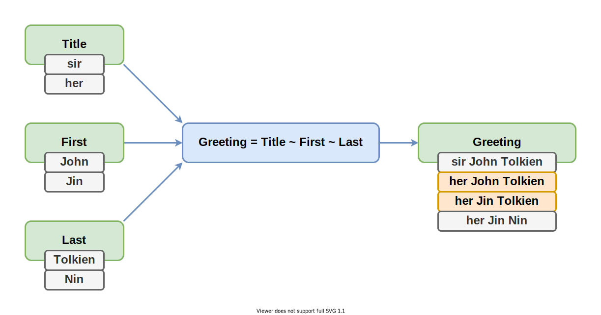

# Разбираемся в сортах реактивности

Сравним различные подходы к реактивному программированию. Вытащим на поверхность их подводные камни. И разберём как реактивность решает или наоборот усугубляет проблемы.

Это - текстовая расшифровка выступления на [SECON.Weekend Frontend](https://secon.ru/projects/seconweekend). Вы можете [прочитать как статью](https://github.com/nin-jin/slides/tree/master/reactivity), либо [открыть в интерфейсе проведения презентаций](https://nin-jin.github.io/slides/reactivity/).

# Виды активностей

- Интерактивность
- Реактивность

## Интерактивность

- Система выполнила только то, что просили.
- И ждёт дальнейших команд.

## Реактивность

- Система выполнила то, что просили.
- Плюс сама обновила всё приложение.

# Что нужно для реактивности?

- Состояния
- Акции
- Реакции
- Инварианты
- Каскад
- Рантайм

## Состояния


## Акции


## Реакции


## Инварианты


## Каскад


## Рантайм


# Style: Стилистика кода

- 🧐 Procedural: Процедурный
- 🤓 Objectional: Объектный
- 🤯 Functional: Функциональный

## 🧐 Procedural: Процедурный стиль

Эпизодически запускается процедура обновления, которая что-то читает, что-то пишет. Простейшая рализация..

```javascript
let Name = 'Jin'
let Count
let Short

setInterval( ()=> { Count = Name.length } )
setInterval( ()=> { Short = Count < 5 } )
```

## 🤓 Objectional: Объектный стиль

Программа состоит из множества объектов, обладающих состояниями, связанных инвариантами в единый граф. Типичная реализация..

```javascript
class State {
	
	@mem get Name() { return 'Jin' }
	
	@mem get Count() { return this.Name.length }
	
	@mem get Short() { return this.Count < 5 }
	
}
```

## 🤯 Functional: Функциональный стиль

Инварианты описываются в виде чистых функций. Каноничная реализация..

```javascript
const Name = new BehaviorSubject( 'Jin' )

const Count = Name.pipe( map( Name => Name.length ) )

const Short = Count.pipe( map( Count => Count < 5 ) )
```

# Origin: Кто инициатор обновления?

- 📮 Push: Зависимость проталкивает
- 🚂 Pull: Зависимый затягивает

## 📮 Push: Зависимость проталкивает

При изменении зависимости срабатывают реакции, которые пишут в зависимые состояния новые значения.


## 🚂 Pull: Зависимый затягивает

При обращении зависимому состоянию срабатываются реакции, которые вытягивают из зависимостей актуальные значения.


# Observing: Наблюдение за изменениями

- 🔎 Polling: Периодическая сверка
- 🎇 Events: Возникновение события
- 🤝 Observers: Список подписчиков

## 🔎 Polling: Периодическая сверка

Состяния хранят лишь значения и всё. Рантайм периодически сверяет текущее значение с предыдущим. И если они отличаются - пушит в зависимые состояния новые значения. Так работает Angular.

```javascript
if( state !== state_prev ) reactions()
```

## 🎇 Events: Возникновение события

Каждое состояние хранит список функций обработчиков изменения. Больше ничего оно про другие состояния не знает.

```javascript
for( const reaction of this.reactions ) {
	reaction()
}
```

## 🤝 Observers: Список подписчиков

Состояния хранят прямые ссылки друг на друга, образуя глобальный граф.

```javascript
for( const slave of this.slaves ) {
	slave.obsolete()
}

for( const master of this.masters ) {
	master.finalize()
}
```

# Energetic: Энергичность реакций

- 🍔 Instant: Мгновенные
- ⏰ Defer: Отложенные
- 🦥 Lazy: Ленивые

## 🍔 Instant: Мгновенные реакции

Пересчёт зависимых состояний происходит сразу же при изменении зависимости.

```javascript
value = next
invariants()

value = next
invariants()
```

## ⏰ Defer: Отложенные реакции

Пересчёт зависимых состояний откладывается на потом, но происходит в любом случае.

```javascript
value = next
if( !scheduled ) schedule( invariants )

value = next
if( !scheduled ) schedule( invariants )
```

## 🦥 Lazy: Ленивые реакции

Пересчёт зависимого состояния происходит лишь в момент обращения к нему.

```javascript
if( dirty ) invariants()
return value
```

# Order: Порядок реакций

- ⌚ Subscribe: По времени подписки
- 🧨 Event: По времени возникновения события
- 👨‍💻 Code: По положению в программе

## ⌚ Subscribe: Реагирование по времени подписки

Какая реакция появилась раньше, та и срабатывает раньше.

```javascript
let foo
let bar

on_change( 'bar', ()=> console.log( 'bar' ) ) // 1
on_change( 'foo', ()=> console.log( 'foo' ) ) // 2

foo = 'foo'
bar = 'bar'
```

## 🧨 Event: Реагирование по времени возникновения события

Чем раньше изменилось состояние, тем раньше сработают реакции на его изменение.

```javascript
let foo
let bar

on_change( 'foo', ()=> console.log( 'foo' ) ) // 2
on_change( 'bar', ()=> console.log( 'bar' ) ) // 1

bar = 'bar'
foo = 'foo'
```

## 👨‍💻 Code: Реагирование по положению в программе

Чем раньше в заданном кодом потоке исполнения находится реакция, тем раньше она сработает.

```javascript
let foo
let bar

on_change( 'bar', ()=> console.log( 'bar' ) ) // 2
on_change( 'foo', ()=> console.log( 'foo' ) ) // 1

bar = 'bar'
foo = 'foo'
```

# Consistency: Согласованность состояния

- 💪 Strong: Гарантированнная
- 🙏 Eventual: В конечном счёте
- 💩 Relaxed: Не гарантированна

## 💪 Strong: Гарантированнная согласованность

Видимые состояния в любой момент соответствуют инвариантам. Даже в процессе работы реакций.

## 🙏 Eventual: Согласованность в конечном счёте

Временно состояние может наблюдаться не соответствующим инвариантам. Обычно в процессе отработки реакций. Но по её завершению состояние вновь возвращается к согласованному виду.

## 💩 Relaxed: Не гарантированная согласованность

В какой-то момент инварианты могут быть нарушены. Например, при возникновении исключительной ситуации.

# Error: Поведение в исключительных ситуациях

- 🎲 Unstable: Нестабильная работа
- ⛔ Stop: Прекращение работы
- 🦺 Store: Индикация ошибки и ожидание восстановления
- ⏮ Rollback: Откат к стабильному состоянию

## 🎲 Unstable: Нестабильная работа при ошибке

Обычно следствие неконсистентного состояния.

## ⛔ Stop: Прекращение работы при ошибке

Требуется перезапуск всего приложения или отдельной его части.

## 🦺 Store: Индикация ошибки и ожидание восстановления

Приложение частично помечается невалидным. Устранение причины исключительной ситуации восстанавливает нормальную работу.

## ⏮ Rollback: Откат к стабильному состоянию при ошибке

Возможна ситуация, когда из-за ошибки в далёкой реакции невозможно изменить первичное состояние.

# DataFlow: Конфигурация потоков данных

- 👷‍♂️ Manual: Ручная
- 🚕 Auto: Автоматическа

## 👷‍♂️ Manual: Ручная конфигурация потоков данных

Движение информации по состояниям задаётся в коде и без явного указания не меняется в процессе работы программы.

## 🚕 Auto: Автоматическая конфигуация потоков данных

Движение информации происходит наиболее оптимальным образом для текущего состояния. При изменений состояния, информационные потоки перестраиваются автоматически.

# Реактивные библиотеки

| Lib        | Style          | Origin    | Observing    | Energetic    | Order         | Consistency | Error        | DataFlow
|------------|----------------|-----------|--------------|--------------|---------------|-------------|--------------|----------
| RxJS       | 🤯 Functional  | 📮 Push  | 🤝 Observers | 🍔 Instant   | ⌚ Subscribe | 🙏 Eventual | ⛔ Stop     | 👷‍♂️ Manual
| MobX       | 🤓 Objectional | 🚂 Pull  | 🎇 Events    | 🦥 Lazy      | 👨‍💻 Code      | 💪 Strong  | 🦺 Store     | 🚕 Auto
| $mol_atom2 | 🤓 Objectional | 🚂 Pull  | 🤝 Observers | 🦥 Lazy      | 👨‍💻 Code      | 💪 Strong  | 🦺 Store     | 🚕 Auto
| CellX      | 🤓 Objectional | 🚂 Pull  | 🎇 Events    |              |               |            |               | 🚕 Auto
| Reatom     |                |           |              | 🦥 Lazy      |               | 💪 Strong  | ⏮ Rollback  | 👷‍♂️ Manual
| Effector   | 🤯 Functional  | 📮 Push  | 🤝 Observers | 🍔 Instant   | ⌚ Subscribe |             | 🎲 Unstable  | 👷‍♂️ Manual

# Реактивные фреймворки

| Lib        | Style          | Origin    | Observing       | Energetic    | Order         | Consistency | Error        | DataFlow
|------------|----------------|-----------|-----------------|--------------|---------------|-------------|--------------|----------
| React      | 🧐 Procedural  | 📮 Push   | 🔎 Polling      | ⏰ Defer    | 👨‍💻 Code      |             |              | 👷‍♂️ Manual
| Angular    | 🧐 Procedural  | 📮 Push   | 🔎 Polling      | ⏰ Defer    | 👨‍💻 *Code*    | 💩 Relaxed  | 🎲 Unstable | 🚕 Auto
| Vue        | 🤓 Objectional | 🚂 Pull   | 🤝 *Observers* | 🦥 Lazy     |               |             |              | 🚕 Auto
| Svelte     | 🧐 Procedural  | 📮 Push   | 🔎 Polling      | ⏰ Defer    |               |             |              | 🚕 Auto

# Конфигурации зависимостей

## Последовательность

## Много зависимостей

> ❌ Bad: 🍔 Instant



## Много зависимых

## Переключение зависимостей

> ❌ Bad: 👷‍♂️ Manual


## Переключение зависимых

## Recursion: Циклические зависимости

- 🔁 Allow: Допустимы
- ⛔ Fail: Приводят к ошибкея
- 🚫 Impossible: Невозможны

# Паразитные вычисления

## Нерелевантные вычисления

## Серия обновлений одного состояния

## Одновременное обновление разных состояний

## Обновление на эквивалентные данные

## Отсутствие изменений

# Нелинейная деградация

# Паразитные побочные эффекты

## Временный откат

## Множественная реакция на одно действие

## Непредсказуемый порядок реакций

## Ошибки доступа

# Эпичная битва

*большая табличка*

## Награждение победителя

## Что ещё глянуть

https://github.com/artalar/state-management-specification
