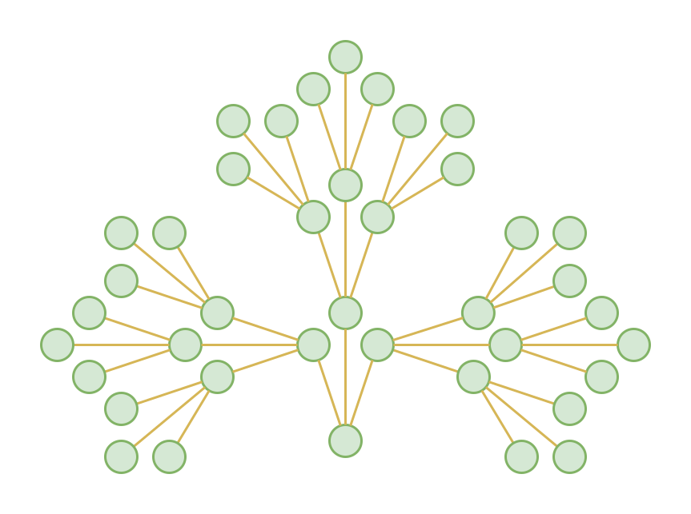
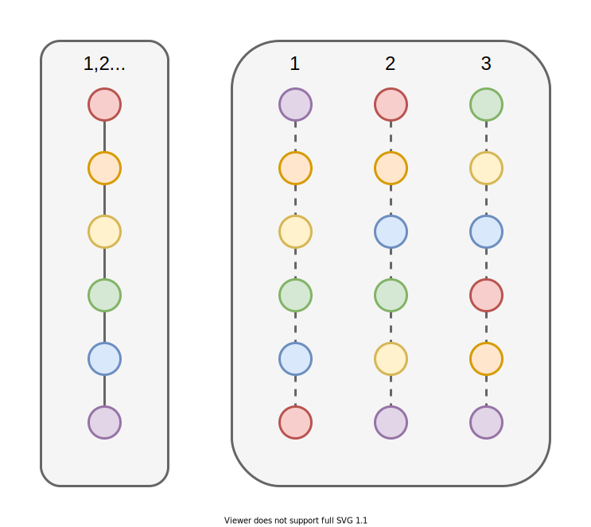
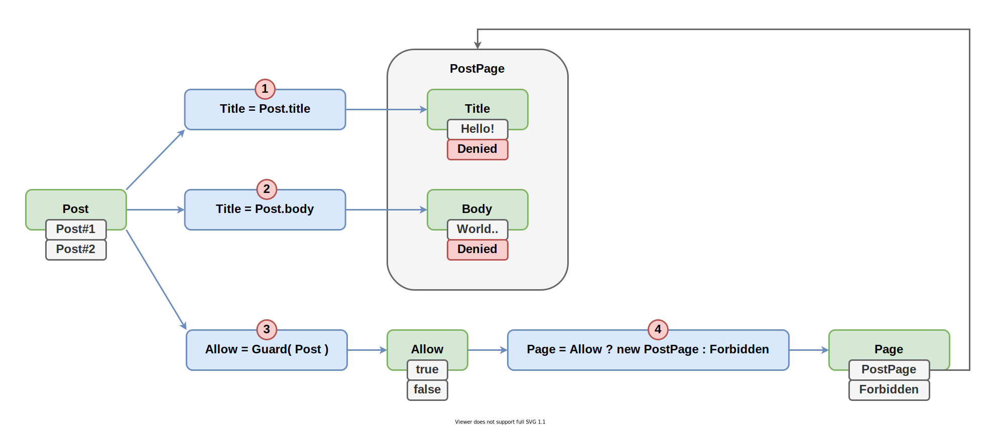

# Разбираемся в сортах реактивности

Здравствуйте, меня зовут Дмитрий Карловский и я.. прилетел к вам на турбо-реактивном самолёте. Основная суть реактивного двигателя изображена на картинке..


Тут, казалось бы, хаотичное взаимодействие между молекулами, приводит к тому, что улетающие молекулы опосредованно передают имульс корпусу двигателя. Чтож, давайте подумаем, как реактивные принципы решают или наоборот усугубляют проблемы в программировании. Сравним различные подходы к реактивному программированию. И вытащим на поверхность все их подводные камни.

Это - текстовая расшифровка выступления на [SECON.Weekend Frontend](https://secon.ru/projects/seconweekend). Вы можете [посмотреть видео запись](https://youtu.be/__iGudoQUN8), [прочитать как статью](https://github.com/nin-jin/slides/tree/master/reactivity), либо [открыть в интерфейсе проведения презентаций](https://nin-jin.github.io/slides/reactivity/).

# Человек-реактив

Сперва вкратце о себе..

- 🎶 15 лет во фронтенде
- 🧪 6 лет с реактивами
- 😭 Пилил на Angular, RXJS и MobX
- ✨ Свои реактивные либы с уникальными фичами
- 💞 Целый фреймворк на их основе ($mol)

Реактивность я крутил вдоль и поперёк, словил на этой почве кучу инсайтов, котрыми с вами далее и поделюсь.

# Огнеопасно!

Я постараюсь быть максимально объективен, но.. Возможны помочные эффекты..

- 💥 Жжение в нижних отделах спины
- 👐 Зуд на кончиках пальцев
- 📢 Повышение громкости речевого аппарата
- 🧠 Усиленная напряжённость в области извилин

Надеюсь вы хорошо подкрепились, ибо доклад будет долгим, насыщенным и во многом противоречащим привычной картине мира.

# Виды активностей

Начнём из далека. Какие бывают виды активностей в нашем коде?

- 🌠Интерактивность
- 🚀Реактивность

## 🌠Интерактивность

Система выполнила только то, что просили.. И ждёт дальнейших команд.


Все остальные части системы, если на них посмотреть, теперь находятся в неактуальном состоянии. Так что требуется явно пойти и попросить их тоже обновиться.

## 🚀Реактивность

Система выполнила то, что просили.. Плюс сама обновила всё приложение, так как знает как разные состояния зависят друг от друга.


Теперь, если посмотреть на любое состояние, оно будет соответствовать внесённым изменениям. Хотя мы явно этого не просили.

# Что нужно для реактивности?

Реактивность позволяет значительно снизить сложность реализации надёжных программ. Поэтому давайте разберём, что нам потребуется для её реализации..

- 📦Состояния
- 🎬Акции
- 💨Реакции
- 💫Инварианты
- 🌉Каскад
- 🧙‍♂️Рантайм

## 📦Состояния

Прежде всего нам нужны *состояния* (states) - контейнеры, хранящие некоторые значения.


## 🎬Акции

Сами по себе состояния бесполезны, пока мы не можем с ними взаимодействовать. Поэтому нам нужны *действия* (actions), чтобы их изменять.


## 💨Реакции

Но изменение состояний, без возможности их увидеть, тоже не имеет смысл. Поэтому нам нужны *реакции* (reactions) - некоторые процедуры, которые запускаются при изменении состояния и производят побочные эффекты.


## 💫Инварианты

Если побочным эффектом реакции является обновление другого состояния, то мы получаем *инвариант* (invariant) - соотношение, между состояниями, которое сохраняется неизменным при любых изменениях этих состояний.


Инвариант может быть выражен явно, как, например, формула в электронной таблице. Так и собираться в коде из других абстракций. Например, как комбинация из обработчика события, стрима трансформаций и побочного эффекта. Или, например, шаблон, формирующий DOM из параметров компонента.

## 🌉Каскад

Прелесть инвариантов в том, что мы можем провязать ими все состояния приложения в единый граф.


Таким образом изменение одного состояния *каскадно* (cascaded) отразится на всём приложении автоматически. То есть мы получили ту самую реактивность.

## 🧙‍♂️Рантайм

И чтобы реактивность, наконец, заработала, нам нужен некоторый *рантайм* (runtime), который будет отслеживать изменения одних состояний и обновлять значения других в соответствии с заданными нами инвариантами.


Если вы не понимаете как он работает, то для вас реактивность будет выглядть как магия. Но стоит только разобраться, и это становится ещё одной технологией в вашем арсенале.

# Общие пожелания к реактивности

Давайте сформулируем, какие качества мы хотим получить от реактивности, а какие наоборот избежать..

- 🤹‍♂️ Отсутствие ненужных вычислений
- 🐵 Стабильность поведения
- 🐘 Минимальное потребление памяти
- 💫 Согласованность состояний

## 🤹‍♂️ Отсутствие ненужных вычислений

Лишние вычисления сами по себе постепенно замедлняют приложение. Но это пол беды. Каждое лишнее вычисление приводит к другим лишним вычисениям. В результате чего лишние вычисления растут как снежный ком.



Поэтому, чем раньше мы их остановим, тем меньше ресурсов суммарно потратим. А значит получим более отзывчивое приложение, меньше жрущее батарейку.

## 🐵 Стабильность поведения

После изменения состояния результат должен быть такой же, как старт с нуля в этом же состоянии. Иначе реальное поведение у пользователя может отличаться от того, на котором отлаживает разработчик.



Звучит, вроде бы, самоочевидно, но вы ужаснётесь, когда узнаете, что стабильность поведения почти нигде не гарантируется. В результате возможна ситуация, когда программист взял тот же самый код, открыл те же самые окошки, ввёл те же самые значения.. но у пользователя баг есть, а у программиста он не воспроизводится. И тут начинается весёлая отладка.

## 🐘 Минимальное потребление памяти

Важно понимать, что вся эта реактивность весьма не бесплатна. Помимо собственно значений, приходится хранить разную мета-информацию, объём которой может быть в несколько раз больше.

Возьмём, например, V8 и посмотрим сколько требуют памяти разные типы данных в самом оптимистичном случае, когда JIT всё максимально оптимизировал..

| Value    | Place   | Cost
|----------|---------|-----
| Obj      | Heap    | 12
| Array    | Heap    | 24
| Unit     | Inplace | 4
| Int      | Inplace | 4
| Float    | Heap    | 12
| BigInt   | Heap    | 16+
| String   | Heap    | 12+
| Ref      | Inplace | 4
| Closure  | Heap    | 24
| Context  | Heap    | 16

То, что лежит в Heap кушает дополнительные 4 байта на ссылку (Ref). Unit - это всякие undefined, null, false, true и прочие малые невариативные примитивные значения. Int после миллиарда хранится уже как Float, мантисса которого - 48 бит. Обратите внимание, что это уже ссылочный тип, как и BigInt, а значит кушает дополнитеьно 4 байта на ссылку. Контекс для замыкания хранится, только если функция замкнута на какие-либо переменные. Размер контекста, соответственно, зависит от числа этих пееменных. Как видно (Inplace), каждая переменная добавляет к контексту по 4 байта.

Не сложно заметить, что объекты относительно дёшевы. Массивы уже по дороже, ибо это фактически составные объекты. А вот замыкания - это очень дорогие штуки сами по себе, даже без учёта хранимых в них данных.

Приведу несколько примеров расчёта потребелния памяти..

```
function make_ints_state( ... state: number[] ) {
	return { get: ()=> state }
}

const state1 = make_ints_state( 777 )
// Ref + Obj + Ref + Closure + Ref + Context + Ref + Array + Int
// 4   + 12  + 4   + 24      + 4   + 16      + 4   + 24    + 4   = 96


const state2 = { state: 777 }
// Ref + Obj + Int
// 4   + 12  + 4   = 20


const state3 = 777
// Int
// 4
```

Резюмируя: в зависимости от выбранных абстракций, потребление памяти может отличаться на порядок. И если разница между 1 и 10 мегабайтами не особо заметна. То разница между 100 мегабайтами и гигабайтом заметна будет однозначно. В лучшем случае всё будет тормозить. А в худшем приложение просто закрешится.

Пример из жизни: открываем в Google Docs спецификацию XPath на 200 страниц и получаем пол гигабайтам потребления памяти.

## 💫 Согласованность состояний

Ну и, конечно же, все состояния приложения должны быть согласованны между собой в любой момент времени.


Если пользователь (или другая программная система), пусть даже на мгновение, увидит рассогласование, то в лучшем случае он будет обескуражен. В худшем - и вы, и он потеряете деньги, репутацию и прочие плюшки.

# Аспекты реактивности

Теперь разберём различные аспекты реализации реактивности, на которые стоит обратить внимание при выборе архитектуры, библиотек и фреймворков..

- **Style**: Стилистика кода
- **Watch**: Наблюдение за изменениями
- **Dupes**: Игнор эквивалентных изменений
- **Origin**: Кто инициатор изменения состояния?
- **Tonus**: Энергичность реакций 
- **Order**: Порядок реакций 
- **Flow**: Конфигурация потоков данных  
- **Error**: Поведение в исключительных ситуациях 
- **Cycle**: Циклические зависимости 
- **Atomic**: Атомарность изменений
- **Depth**: Ограничение глубины 
- **Extern**: Внешние взаимодействия

## Style: Стилистика кода

Условно можно выделить 3 стиля написания кода..

- 🧐Proc: Процедурный
- 🤯Func: Функциональный
- 🤓Obj: Объектный

Разные библиотеки могу смешивать их в разных пропорциях, но как правило есть чёткое тяготение к одному из них.

### 🧐Proc: Процедурный стиль

Тут эпизодически запускается процедура обновления, которая читает состояния, вычисляет другие и записывает их. Напишем простейшую, хоть и не очень эффективную, рализацию..

```javascript
let Name = 'Jin'
let Count
let Short

setInterval( ()=> {
	Count = Name.length
} )

setInterval( ()=> {
	Short = Count < 4
} )
```

Примерно так описываются инварианты, например, в Meteor и Angular по дефолту. Разумеется они запускают пересчёт не на каждую миллисекунду, а более оптимально, но общую суть это слабо меняет: рантайм периодически перезапускает инварианты, не зная какие состояния могут быть ими изменены. А ведь актуальные значения этих состояний могут нам быть не интересны, но вычислятся они в любом случае. Поэтому такой подход получается всё равно не очень эффективным.

### 🤯Func: Функциональный стиль

На волне хайпа многие упарываются по чистым функциям, превращая свой код в головоломку..

```javascript
const Name = new BehaviorSubject( 'Jin' )

const Count = Name.pipe(
	map( Name => Name.length ),
	distinctUntilChanged(),
	debounceTime(0),
	share(),
)

const Short = Count.pipe(
	map( Count => Count < 4 )
	distinctUntilChanged(),
	debounceTime(0),
	share(),
)
```

Что и зачем делает этот код на RxJS не сможет сходу сказать даже опытный *стример*. А это ведь самый простой пример, далёкий от реальной жести.

Однако, умные программисты очень любят головоломки. Поэтому они тратят кучу времени на изучение хитрых абстракций. Пишут лаконичный, но замысловатый код. И гордятся тем, что они понимают то, что мало кто ещё способен понять. На проект же это сказывается скорее негативно, привнося излишнюю сложность туда, где и без того полно не простых вещей.

Раньше я тоже писал хитрый код, но жизнь меня научила, что лучше писать максимально простой код, доступный даже новичку в программировании, а не только победителям олимпиад по информатике.

Кроме того, обилие замыканий приводит к повышенному потреблению памяти.

### 🤓Obj: Объектный стиль

Тут программа состоит из множества объектов, обладающих состояниями, связанных инвариантами в единый граф. Код в этом стиле выглядит так же, как и обычный ООП код, но с добавлением реактивных мемоизаторов..

```javascript
class State {
	
	@mem Name( next = 'Jin' ) {
		return next
	}
	
	@mem Count() {
		return this.Name().length
	}
	
	@mem Short() {
		return this.Count() < 4
	}
	
}
```

Многие, наверняка, слышали утверждение, что "инвалидация кешей - один из сложнейших вопросов в программировании". Так вот, в реактивном рантайме, этот вопрос вообще не стоит.

Этот подход мне видится наиболее оптимальным, так как он хорошо укладывается в то, как мыслит человек (а ему привычно взаимодйствовать с объектами), и в то, как работает компьютер (объект - это просто мутабельная структура в памяти). Рантайм чётко понимает какой метод какое состояние вычисляет. А объектная декомпозиция позволяет легко это всё масштабировать. Именно поэтому объектный стиль и используется в $mol, MobX и Vue.

## Watch: Наблюдение за изменениями

Как рантайм может узнат об изменениях?

- 🔎Polling: Периодическая сверка
- 🎇Events: Возникновение события
- 🤝Links: Список подписчиков

### 🔎Polling: Периодическая сверка

Состяния хранят лишь значения и всё. Рантайм периодически сверяет текущее значение с предыдущим. И если они отличаются - запускаем реакции.

```javascript
// sometimes
if( state !== state_prev ) reactions()
```

Так, например, работает Angular, Svelte, React. Беда этого подхода в том, что на каждый чих выполняется большой объём работы только лишь для того, чтобы выяснить, что почти ничего не поменялось.

Вам может показаться, что обычное сравнение - это плёвая операция. И это действительно так в синтетических бенчмарках. Но в реальности состояния разбросаны по памяти, что даёт посредственное использование процессорных кешей. А вишенка на торте - такие сверки приходится выполнть после каждой реакции, чтобы выяснить, что именно оные поменяли в состоянии.

### 🎇Events: Возбуждение события

Каждое состояние хранит дополнительно список функций обработчиков изменения. При каждом изменении состояния вызываются все подписчики.

```javascript
// on change
for( const reaction of this.reactions ) {
	reaction()
}
```

Это может быть инициировано вручную, через сеттер или прокси. Но в любом случае состояние ничего больше не знает про соседние состояния, а взаимодействие всегда одностороннее. Это сильно ограничивает возможные алгоритмы оптимизации. А так же усложняет отладку, ведь чтобы узнать кто там от кого как зависит - это целый квест.

А самое печальное: хранение масива из замыканий кушает много памяти. И с этим ничего не сделать.

### 🤝Links: Список подписчиков

Состояния хранят прямые ссылки друг на друга, образуя глобальный граф. Массивы ссылок - это относительно экономно по памяти, ведь каждая ссылка - это всего 4-8 байта. Для коммуникации с соседями достаточно просто пробежаться по массиву и дёрнуть нужный метод у соседнего стейта.

```javascript
// on change
for( const slave of this.slaves ) {
	slave.obsolete()
}


// on complete
for( const master of this.masters ) {
	master.finalize()
}
```

В первом примере вы видите, что при изменении одного состояния мы говорим всем зависимым, что они устарели. А во втором, что при завершении вычисления одного состояния, мы говорим всем зависимостям, что вычисление закончено, и можно освободить кеши, которые они могли держать на случай повторного обращения. Таких вариантов взаимодействия может быть много, что даёт максимум гибкости в поддерживаемых алгоритмах.

Кроме того, при отладке, гораздо проще ходить по прямым ссылкам между объектами, чем выцеплять нужную информацию из захваченных замыканиями контекстов.

## Dupes: Игнор эквивалентных изменений

Порой значение меняется на эквивалентное. И тут есть разные подходы к отсечению вырожденных вычислений..

- 👯‍♀️Every: Реакция на каждое действие
- 🆔Identity: Сравнение по ссылке
- 🎭Equality: Структурное сравнение

### 👯‍♀️Every: Реакция на каждое действие

В библиотеках типа RxJX каждое значение является уникальным событием, что приводит к ненужному запуску реакций.

```ts
777 != 777
```

Чтобы этого не происходило, нужно писать дополнительный код, который часто забывают, и потом огребают.

### 🆔Identity: Сравнение по ссылке

Многие библиотеки всё же умеют сравнивать значения. И если состояние не поменялось, то реакции не срабатывают. А если поменялось, даже на эквивалентное значение, то срабатывают.

```ts
        777 == 777

[ 1, 2, 3 ] != [ 1, 2, 3 ]
```

Если мы нафильтровали новый массив, с тем же содержимым, то скорее всего нам не нужно запускать каскад вычислений. Но вручную уследить за всеми такими местами - мало реалистично.

### 🎭Equality: Структурное сравнение

Наиболее продвинутые билиотеки, типа $mol_atom2, делают глубокое сравнение нового и старого значения.

```ts
        777 == 777

[ 1, 2, 3 ] == [ 1, 2, 3 ]

[ 1, 2, 3 ] != [ 3, 2, 1 ]
```

Это позволяет отсекать лишние вычисления как можно раньше - в момент внесения изменений. А не в момент рендеринга заново сгенерированного VDOM в реальный DOM, как это часто происходит в React, чтобы узнать, что в доме-то менять и нечего.

Глубокое сравнение - это, безусловно, сама по себе более дорогая операция, чем просто сравнить две ссылки. Однако, рано или поздно, сравниь всё содержимое всё равно придётся. Но гораздо быстрее это сделать пока данные рядом, а не когда они разлетятся по тысяче компонент в процессе рендеринга.

## Origin: Кто инициатор пересчёта состояния?

Не смотря на то, что начинается всё с того, что кто-то что-то поменял, финальное решение пересчитывать ли тот или иной инвариант может принимать как зависимость, так и зависимое состояние. 

- 🥌Push: Зависимость проталкивает
- 🚂Pull: Зависимый затягивает

### 🥌Push: Зависимость проталкивает

При изменении зависимости безусловно срабатывают реакции, которые вычисляют и пишут в зависимые состояния новые значения. Так, например, работает RxJX, Effector и другие процедурные/функциональные библиотеки/фреймворки.


И это отлично работает для статичного графа инвариантов. Однако, в любом не совсем тривиальном приложении у нас есть динамика. Ну, банально: если мы переключаемся между страницами, то надо освободить ресурсы предыдущей страницы (и в частности отписаться от изменения данных) и захватить ресурсы для новой страницы (и в частности подписаться на изменения данных).

То есть наш граф инвариантов должен уметь меняться в процессе пересчёта этих инвариантов. А это значит, что действуя по принципу проталкивания мы будем часто попадать в ситуации вида: долго-долго вычисляли какое-то значение, а оно в итоге никому не понадобилось, ибо потребитель был уничтожен.

### 🚂Pull: Зависимый затягивает

При обращении зависимому состоянию происходит вычисление инварианта, который вытягивает значения из зависимостей и возвращает актуальное значение. Так работают $mol_atom2, CellX, MobX и Vue.


Тут уже чисто логически нам всегда известно, что если вычисление произошло, то его результат кому-то нужен. А если не нужен, то и вычисления не произойдёт. Поэтому подход с затягиванием видится мне более практичным.

## Tonus: Энергичность вычислений

Вычислять зависимые состояния можно как можно раньше, а можно как можно позже, вплоть до отказа от вычислений, если это возможно..

- 🍔Instant: Мгновенные
- ⏰Defer: Отложенные
- 🦥Lazy: Ленивые

### 🍔Instant: Мгновенные реакции

В таких библиотеках, как RxJS, пересчёт зависимых состояний происходит сразу же при изменении зависимости. Если нам нужно изменить несколько состояний подряд, то это может привести к лишним вычислениям и временной неконсистентности.


Более того, эти вычисления производят неконсистентное состояние, вычисляемое частично из уже обновлённых состояний, а частично из ещё не обновлённых. А неконсистентное состояние, пусть даже и временно, - это очень опасная штука. В лучшем случае пользователь будет наблюдать *глитчи* - визуальное мерцание. В худшем - приложение будет работать не корректно и сыпать разнообразными ошибками.

### ⏰Defer: Отложенные реакции

Чтобы избежать *глитчей* пересчёт может откладываться на потом, чтобы выполнять его лишь один раз, сколько бы зависимостей ни было обновлено.


Однако, пересчёт будет произведён в любом случае, даже если результат нам не пригодится.

### 🦥Lazy: Ленивые реакции

В моделях реактивности с затягиванием возможно ленивое вычисление инвариантов - только в момент, когда зависимое состояние действительно потребовалось.


При изменении исходных состояний, мы не вычисляем зависимые и даже не планируем их вычисление, а лишь помечаем их как устаревшие. И если впоследствии к ним обратиться, то они начнут вычисляться.

Это одновременно и самый экономный подход и самый консистентный, так как гарантирует, что, когда бы мы ни обратились к состоянию, полученное значение будет актуальным.

## Order: Порядок реакций

С порядком исполнения реакций есть свои особенности, которые зачастую отдаются на откуп рандому. Однако, давайте разберём все возможные варианты..

- 📰Subscribe: По времени подписки
- 🧨Event: По времени возникновения события
- 📶Deep: По глубине зависимости
- 👨‍💻Code: По положению в программе

### 📰Subscribe: Реагирование по времени подписки

Какая реакция появилась раньше, та и срабатывает раньше. В любом нетривиальном приложении, список ракций меняется со временем, а значит выстроиться они могут практически в любом порядке.


Получается скрытое состояние, влияющее на работу приложения через разный порядок побочных эффектов, которые могут давать различные взаимные наводки. Получаем нестабильность поведения, что осложняет отладку и тестирование.

Это - типичная беда большинства библиотек.

### 🧨Event: Реагирование по времени возникновения события

Предположим нам удалось тем или иным способом зафиксировать порядок подписок. Однако, есть и другой сточник нестабильности - порядок совершения действий.


Явно или неявно изменяя состояния в разном порядке мы опять же можем получить разный порядок срабатывания реакций. К сожалению, большинство библиотек подвержено и этой проблеме.

### 📶Deep: По глубине зависимости

Некоторые библиотеки используют так называемую *топологическую сортировку графа*, чтобы пересчитывать инварианты в оптимальном порядке от менее зависимых к более зависимым.



В данном примере `Post` меняется на такой, к которому у нас нет доступа. Сначала будет обновлено содержимое этой страницы, что мало того, что приведёт к лишним пересчётам, так они ещё и могут закончиться ошибками или просто мусором в качестве побочных эффектов. И только потом привычислении вьюшки `Page` будет выяснено, что `PostPage` надо вообще уничтожить, а вместо неё следует отобразить сообщение об ошибке доступа `Forbidden`.

Обратите внимание, что существование `Title` и `Body` зависит от значения `Page`. Но сами значения `Title` и `Body` от значения `Page` уже не зависят. И наоборот, значение `Page` не зависит от значения `Title` и `Body`. То есть связь между ними нереактивная. Но она есть. И это уже связь "владелец - имущество". То есть значение `Page` владеет реактивными состояниями `Title` и `Body`, а значит и контролирует их время жизни.

Одним лишь анализом реактивного графа эту проблему не решить. Разве что можно дополнить его графом владения. Но это потребует ещё большего усложнения логики рантайма. И я не уверен, что топологическую сортировку такого двойного графа можно осуществить с приемлемой алгоритмической сложностью. Иначе все вся эта наша борьба за эффективность будет работать медленнее, чем куда более тупая, но простая архитектура.

### 👨‍💻Code: Реагирование по положению в программе

Предпочтительнее, чтобы реакции отрабатывали в том порядке, который в явном виде задан в коде. Это гарантирует, что владелец будет актуализирован раньше, чем всё, чем он владеет.


Тут уже сначала будет обновлён `Allow`, потом `Page`, что приведёт к потере `PostPage` и, как следствие, уничтожению `PostPage` со всеми состояниями внутри, без их вычисления.

## Flow: Конфигурация потоков данных

В реактивной системе все состояния связаны друг с другом инвариантами в единый граф. Когда мы что-то меняем с одной стороны этого графа, рантайм обеспечивает каскадный пересчёт засимых состояний. Такие последовательности пересчётом являются ни чем иным, как *информационными потоками*. Чем более эти потоки прямолинейны, чем меньше они разветвляются и задевают нерелевантные изменениям состояния, тем эффективней работает система. И есть два подхода к оптимизации информационных потоков..

- 🦽Manual: Ручная
- 🚕Auto: Автоматическа

### 🦽Manual: Ручная конфигурация информационных потоков

В библиотеках на основе проталкивания, автоматизировать потоки сложно, поэтому тут процветает ручное управление ими. А значит мы получаем ошибки двух типов..


Во-первых мы можем забыть на что-то подписаться, в результате чего получаем неконсистентность. В примере мы забыли подписаться на `Title`, и при его изменении, `Greeting` не пересчитывается.

Во-вторых мы можем забыть от чего-то отписаться, в результате чего получаем лишние вычисления. В примере мы забыли отписаться от `Name`, и при его изменении, `Greeting` вычисляется заново, но получает то же самое значение.

Но, если с ошибками ещё можно как-то совладать, то со сложностью ручных оптимизаций справиться уже не просто. Уже для банального логического ветвления нужно фактически руками реализовать транзистор, где у нас есть управляющий поток, который переключает вывод между двумя источниками. Для циклов и непрямой адресации же всё становится настолько сложно, что мало кто вообще способен адекватно это описать. В итоге всё сводится к тому, что, вместо точечных пересчётов, идёт пересчёт многих состояний на любой чих, но довольно медленно.

### 🚕Auto: Автоматическая конфигуация информационных потоков

В библиотеках, основанных на затягивании, обычно применяется автотрекинг зависимостей. Это мало того, что гораздо надёжней, так ещё и крайне просто для прикладного программиста. Ему не надо думать о потоках данных вообще - они динамически конфигурируются рантаймом наиболее оптимальным (для данного состояния приложения) образом.


Тут прикладные программисты делятся на два лагеря: одни боятся этой "магии" ибо не понимают как она работает, другие же просто не парятся - работает и работает, одной головной болью меньше.

Практика показывает, что (с автоматизацией) прикладного кода получается на порядки меньше, а сам он гораздо проще и надёжнее, а приложение работает быстрее.

## Error: Поведение в исключительных ситуациях

- 🎲Unstable: Нестабильная работа
- ⛔Stop: Прекращение работы
- 🦺Store: Индикация ошибки и ожидание восстановления
- ⏮Revert: Откат к стабильному состоянию

### 🎲Unstable: Нестабильная работа при ошибке

Обычно следствие неконсистентного состояния.


### ⛔Stop: Прекращение работы при ошибке

Требуется перезапуск всего приложения или отдельной его части.


### 🦺Store: Индикация ошибки и ожидание восстановления

Приложение частично помечается невалидным. Устранение причины исключительной ситуации восстанавливает нормальную работу.


### ⏮Revert: Откат к стабильному состоянию при ошибке

Возможна ситуация, когда из-за ошибки в далёкой реакции невозможно изменить первичное состояние.


## Cycle: Циклические зависимости

- 💤Infinite: Бесконечный цикл
- 🔮Limbo: Произвольный результат
- ⛔Fail: Приводят к ошибке
- 🚫Unreal: Невозможны

### 💤Infinite: Бесконечный цикл

Позволяют просто решать некоторые задачи. Но при неосторожном обращении могут зависнуть.


### 🔮Limbo: Произвольный результат

При косвенном обращении к тому же стейту, который вычисляется, используется предыдущее значение. В зависимости от порядка вычислений даёт разные результаты.


### ⛔Fail: Приводят к ошибке

Детектируются в рантайме и кидают исключение. При тестировании могут быть не выявлены, а выстрелить у пользователя.


### 🚫Unreal: Невозможны

Синтаксически невозможно создать. Вроде хорошо, но накладывает сильные ограничения на прикладные возможности.


## Extern: Внешние взаимодействия

Порой инвариант требует асинхронной коммуникации. Например, при тяжёлых рассчётах в отдельном воркере.

- 🏊‍♂️Sync: Синхронные инварианты
- 🏇Async: (А)синхронные инварианты

### 🏊‍♂️Sync: Поддерживаются только синхронные инварианты

Согласованность состояний на время сайд-эффекта лежит на плечах прикладника. Как правило это хрупкий интерактивный код.

```ts
const image = source_element.pipe( map( capture ) )
const data = image.pipe( map( recognize ) )
const text = data.pipe( map( data => data.text ) )

text.subscribe( text => {
	output.innerText = text
} )
```

### 🏇Async: Поддерживаются асинхронные инварианты

Согласованность состояний сохраняется автоматически.

```ts
text*() {
	const image = yield capture( this.source_element )
	const data = yield recognize( image )
	return data.text
}
```

## Depth: Ограничение глубины

- 🗻Stack: Ограничена стеком
- 🌌Heap: Не ограничена

### 🗻Stack: Ограничена стеком

На глубоких зависимостях (1-2к) реактивность может ломаться. Эксель на таком не построишь.

```ts
first() {
	this.second()
}

second() {
	this.third()
}

thisrd() {
	this.etc()
}
```

### 🌌Heap: Не ограничена

Глубина зависимостей может быть произвольной, на сколько хватит оперативки.

```ts
while( reactions.length ) {
	const reaction = reactions.shift()
	reaction()
}
```

## Atomic: Атомарность изменений

- 👻Alone: Одного отдельного состояния
- 🦶Base: Для первичных состояний
- 🤼‍♂️Full: Для всех состояний

### 👻Alone: Атомарность изменения лишь одного состояния

Можно начать изменение, но не закончить из-за ошибки, и получится несогласованное состояние.

```ts
Name = 'John'
Count = 4

Name = 'Jin'
throw 'function is not a function'
Count = 3 // still 4
```

### 🦶Base: Атомарность изменения первичных состояний

Первичные состояния всегда обновляются атомарно, а вторичные лишь следуют за текущим состоянием первичных.

```ts
Name = 'John'
Count = 4

@transaction update() {
	this.Name = 'Jin' // will still 'John'
	throw 'function is not a function'
	this.Count = 3
}
```

### 🤼‍♂️Full: Атомарность изменения всех состояний

При возникновении ошибки при обновлении вторичных состояний откатываются и первичные.

```ts
Name = 'John'
Count = 4

@derived get Greeting() {
	// Fails on 'Jin' name
	return this.Name.split('')[3].toUppercase()
}

@transaction update() {
	this.Name = 'Jin' // will still 'John'
	this.Count = 3 // will still 4
}
```

# Оценка практичности

Сформулируем видение идеальной системы реактивности в вакууме..

| Aspect  | ✅Usable   | ❌Unusable
|---------|------------|---------
| Style   | 🤓Obj      | 🧐Proc 🤯Func
| Watch   | 🤝Links    | 🔎Polling 🎇Events
| Dupes   | 🎭Equality | 🆔Identity 👯‍♀️Every
| Origin  | 🚂Pull     | 🥌Push
| Order   | 👨‍💻Code     | 📰Subscribe 🧨Event 📶Deep
| Flow    | 🚕Auto     | 🦽Manual 

| Aspect  | ✅Usable   | ❌Unusable
|---------|-------------|---------
| Tonus   | 🦥Lazy     | 🍔Instant ⏰Defer
| Error   | 🦺Store    | ⛔Stop ⏮Revert 🎲Unstable
| Cycle   | ⛔Fail     | 💤Infinite 🔮Limbo 🚫Unreal
| Atomic  | 🦶Base     | 🤼‍♂️Full 👻Alone
| Depth   | 🌌Heap     | 🗻Stack
| Extern  | 🏇Async    | 🏊‍♂️Sync

# Поведение по умолчанию

Далее рассматриваем лишь поведение по умолчанию и рекомендуемый автором стиль кода. Понятное дело, что всегда можно как-то обойти его, только надо не забыть написать дополнительный код, однако..

- 🎓 Выбор эксперта
- 🐭 Минимум кода
- 👀 Повышенное внимание
- 👾 Сторонний код

# Реактивные библиотеки

Везде рассматривается поведение по умолчанию, если человек не написал дополнительного кода для изменения поведения. 

| Lib         | Style | Watch | Dupes | Origin | Tonus | Order | Flow  | Error | Cycle | Extern | Depth | Atomic
|-------------|-------|-------|-------|--------|-------|-------|-------|-------|-------|--------|-------|-------
| CellX       | 🤓✅ | 🤝✅ | 🆔❌ | 🚂✅  | 🦥✅ | 👨‍💻✅ | 🚕✅ | 🦺✅ | ⛔✅ | 🏇✅  | 🗻❌ | 🦶✅
| $mol_atom2  | 🤓✅ | 🤝✅ | 🎭✅ | 🚂✅  | 🦥✅ | 👨‍💻✅ | 🚕✅ | 🦺✅ | ⛔✅ | 🏇✅  | 🗻❌ | 👻❌
| MobX        | 🤓✅ | 🤝✅ | 🆔❌ | 🚂✅  | 🦥✅ | 👨‍💻✅ | 🚕✅ | 🦺✅ | ⛔✅ | 🏊‍♂️❌  | 🗻❌ | 👻❌
| ChronoGraph | 🧐❌ | 🤝✅ | 🆔❌ | 🚂✅  | ⏰❌ | 👨‍💻✅ | 🚕✅ | ⏮❌ | ⛔✅ | 🏊‍♂️❌  | 🌌✅ | 🤼‍♂️❌
| Reatom      | 🤯❌ | 🤝✅ | 🆔❌ | 🚂✅  | 🦥✅ | 🧨❌ | 🦽❌ | ⏮❌ | 🚫❌ | 🏊‍♂️❌  | 🗻❌ | 🤼‍♂️❌
| Effector    | 🤯❌ | 🤝✅ | 🆔❌ | 🥌❌  | 🍔❌ | 📰❌ | 🦽❌ | 🎲❌ | 💤❌ | 🏊‍♂️❌  | 🗻❌ | 👻❌
| RxJS        | 🤯❌ | 🤝✅ | 👯‍♀️❌ | 🥌❌  | 🍔❌ | 📰❌ | 🦽❌ | ⛔❌ | 🚫❌ | 🏊‍♂️❌  | 🗻❌ | 👻❌

Видно два основных лагеря: Объектное Реактивное Программирование и Функциональное Реактивное Программирование. Пока я готовил этот материал побеждал, как обычно, $mol. Но за пару дней CellX вырвался таки вперёд. Ну да не страшно, я всё-равно пока не рекомендую завязываться на $mol_atom, ибо готовлю новую реализацию основанную на [Auto Wire JS Proposal](https://gist.github.com/nin-jin/6b9765fb9d0d50c2e1d37689008f5357), который позволяет разным реактивным библиотекам взаимодействовать друг с другом и с нативным браузерным API через единые интерфейсы.

Большое спасибо авторам библиотек за помощь в подготовке этой таблицы. Особенно тем, кто не забанил меня в своих чатах, за то, что я задаю глупые вопросы.

# Реактивные фреймворки

| Lib     | Style | Watch | Dupes | Origin | Tonus | Order | Flow  | Error | Cycle | Extern | Depth | Atomic
|---------|-------|-------|-------|--------|-------|-------|-------|-------|-------|--------|-------|-------
| Vue     | 🤓✅ | 🤝✅ | 🆔❌ | 🚂✅  | 🦥✅ | 👨‍💻✅ | 🚕✅ | 🦺✅ | 🔮❌ | 🏇✅  | 🗻❌ | 👻❌
| React   | 🧐❌ | 🔎❌ | 🆔❌ | 🥌❌  | ⏰❌ | 👨‍💻✅ | 🦽❌ | ⛔❌ | ⛔✅ | 🏇✅  | 🗻❌ | 👻❌
| Angular | 🧐❌ | 🔎❌ | 🆔❌ | 🥌❌  | ⏰❌ | 👨‍💻✅ | 🚕✅ | 🎲❌ | 🔮❌ | 🏊‍♂️❌  | 🗻❌  | 👻❌
| Svelte  | 🧐❌ | 🔎❌ | 🆔❌ | 🥌❌  | ⏰❌ | 👨‍💻✅ | 🚕✅ | ⛔❌ | 🚫❌ | 🏊‍♂️❌  | 🌌✅  | 👻❌

Не стоит слепо доверять этим табличкам, ибо составлены они вручную. Я, конечно, старался точно всё отразить, но мог и накосячить. Поэтому..

# Что ещё глянуть по теме

Проект по классификации стейт-менеджеров с помощью тестов от Артёма - автора reatom. Иной обстоятельный взгляд на вопрос реактивности от Криса. И пара моих выступлений разбирающих преимущества ОРП и механику реализации асинхронных инвариантов.

- [state-management-specification](https://github.com/artalar/state-management-specification) / Артём Арутюнян
- [A General Theory of Reactivity](https://github.com/kriskowal/gtor) / Kris Kowal
- [Объектное Реактивное Программирование](https://github.com/nin-jin/slides/tree/master/orp) @ FrontendConf'17
- [Квантовая механика вычислений на JS](https://github.com/nin-jin/slides/tree/master/fibers) @ HolyJS'18

# Что ещё глянуть не по теме

- [slides.hyoo.ru](https://slides.hyoo.ru/) - выступления
- [Core Dump](https://www.youtube.com/channel/UC-qEImMrqSLZ9KLee1JTcuw) - фундамент
- [habhub.hyoo.ru](https://habhub.hyoo.ru/) - статьи
- [`_jin_nin_`](https://twitter.com/_jin_nin_) - новости

# Пишите письма!


## Из первых уст

- Было интересно наблюдать за спором сеньёров, из которого наблюдатель может для себя извлечь информационную пользу. 
- Информативно и развернуто.
- Интересно и доходчиво.
- Сам интересуюсь этой темой много лет как хобби, а тут человек основательно этим занимался и подробно осветил тему.
