# Разбираемся в сортах реактивности

Сравним различные подходы к реактивному программированию. Вытащим на поверхность их подводные камни. И разберём как реактивность решает или наоборот усугубляет проблемы.

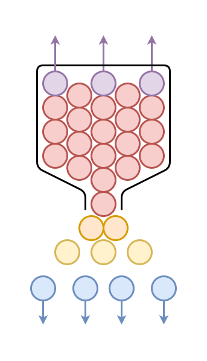

Это - текстовая расшифровка выступления на [SECON.Weekend Frontend](https://secon.ru/projects/seconweekend). Вы можете [прочитать как статью](https://github.com/nin-jin/slides/tree/master/reactivity), либо [открыть в интерфейсе проведения презентаций](https://nin-jin.github.io/slides/reactivity/).

# Человек-реактив

- 6 лет в реактивах
- Пилил на RXJS и MobX
- Несколько своих либ с уникальными фичами
- Целый фреймворк на их основе

# Виды активностей

- Интерактивность
- Реактивность

## Интерактивность

Система выполнила только то, что просили.. И ждёт дальнейших команд.

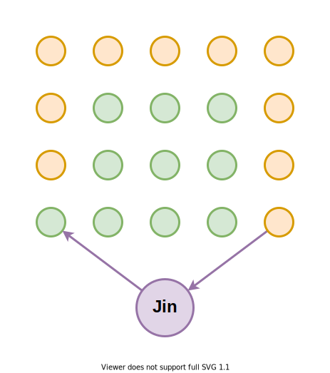

## Реактивность

Система выполнила то, что просили.. Плюс сама обновила всё приложение.

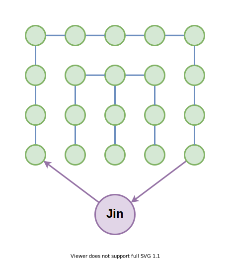

# Что нужно для реактивности?

- Состояния
- Акции
- Реакции
- Инварианты
- Каскад
- Рантайм

## Состояния

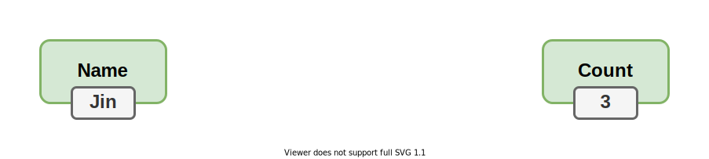

## Акции

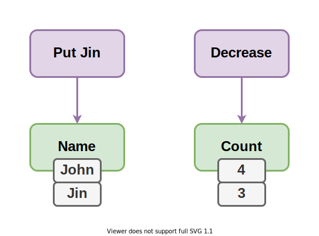

## Реакции

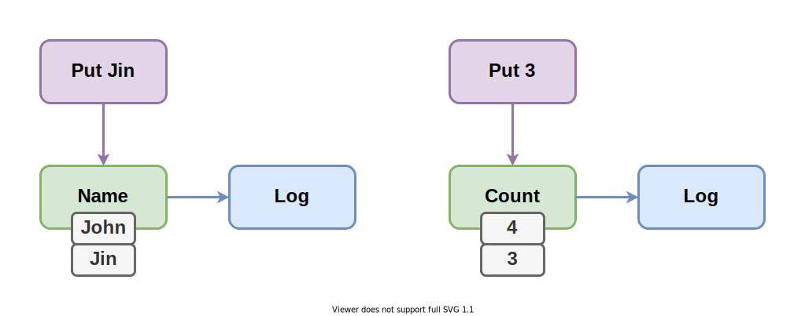

## Инварианты

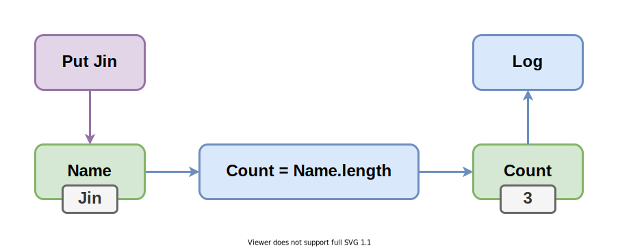

Далее речь будет идти преимущественно про этот тип реакций. Но порой будем упоминать и сайд эффекты.

## Каскад

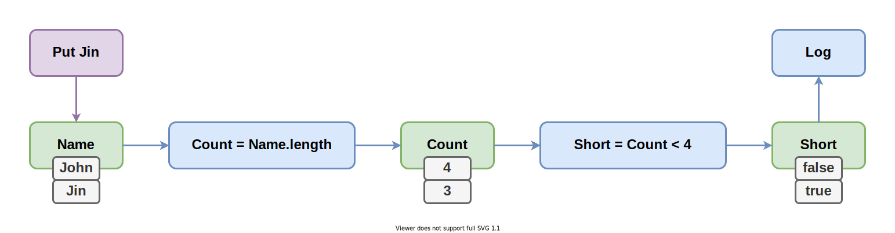

## Рантайм

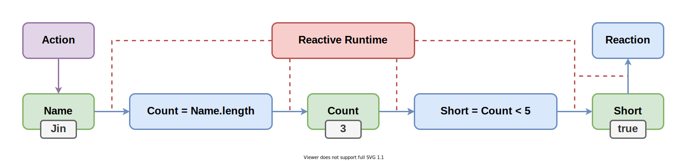

# Style: Стилистика кода

- 🧐Proc: Процедурный
- 🤓Obj: Объектный
- 🤯Func: Функциональный

## 🧐Proc: Процедурный стиль

Эпизодически запускается процедура обновления, которая что-то читает, что-то пишет. Простейшая рализация..

```javascript
let Name = 'Jin'
let Count
let Short

setInterval( ()=> { Count = Name.length } )
setInterval( ()=> { Short = Count < 4 } )
```

## 🤓Obj: Объектный стиль

Программа состоит из множества объектов, обладающих состояниями, связанных инвариантами в единый граф. Типичная реализация..

```javascript
class State {
	
	@mem get Name() { return 'Jin' }
	
	@mem get Count() { return this.Name.length }
	
	@mem get Short() { return this.Count < 4 }
	
}
```

## 🤯Func: Функциональный стиль

Инварианты описываются в виде чистых функций. Каноничная реализация..

```javascript
const Name = new BehaviorSubject( 'Jin' )

const Count = Name.pipe( map( Name => Name.length ) )

const Short = Count.pipe( map( Count => Count < 4 ) )
```

# Origin: Кто инициатор изменения состояния?

- 📮Push: Зависимость проталкивает
- 🚂Pull: Зависимый затягивает

## 📮Push: Зависимость проталкивает

При изменении зависимости срабатывают реакции, которые пишут в зависимые состояния новые значения.

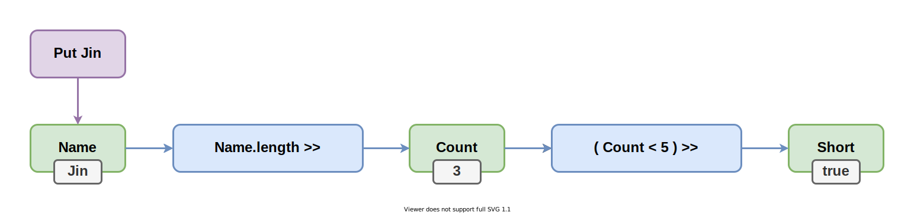

## 🚂Pull: Зависимый затягивает

При обращении зависимому состоянию срабатываются реакции, которые вытягивают из зависимостей актуальные значения.

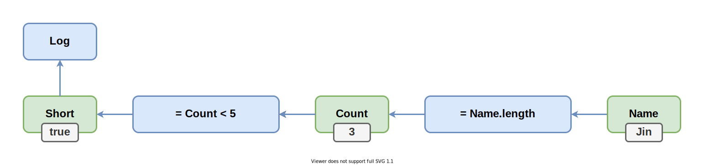

# Watch: Наблюдение за изменениями

- 🔎Polling: Периодическая сверка
- 🎇Events: Возникновение события
- 🤝Links: Список подписчиков

## 🔎Polling: Периодическая сверка

Состяния хранят лишь значения и всё. Рантайм периодически сверяет текущее значение с предыдущим. И если они отличаются - пушит в зависимые состояния новые значения. Так работает Angular.

```javascript
if( state !== state_prev ) reactions()
```

## 🎇Events: Возбуждение события

Каждое состояние хранит список функций обработчиков изменения. Больше ничего оно про другие состояния не знает.

```javascript
for( const reaction of this.reactions ) {
	reaction()
}
```

## 🤝Links: Список подписчиков

Состояния хранят прямые ссылки друг на друга, образуя глобальный граф.

```javascript
for( const slave of this.slaves ) {
	slave.obsolete()
}

for( const master of this.masters ) {
	master.finalize()
}
```

# Tonus: Энергичность реакций

- 🍔Instant: Мгновенные
- ⏰Defer: Отложенные
- 🦥Lazy: Ленивые

## 🍔Instant: Мгновенные реакции

Пересчёт зависимых состояний происходит сразу же при изменении зависимости. Приводит к лишним вычислениям и временной неконсистентности.


## ⏰Defer: Отложенные реакции

Пересчёт зависимых состояний откладывается на потом, но происходит в любом случае.


## 🦥Lazy: Ленивые реакции

Пересчёт зависимого состояния происходит лишь в момент обращения к нему.

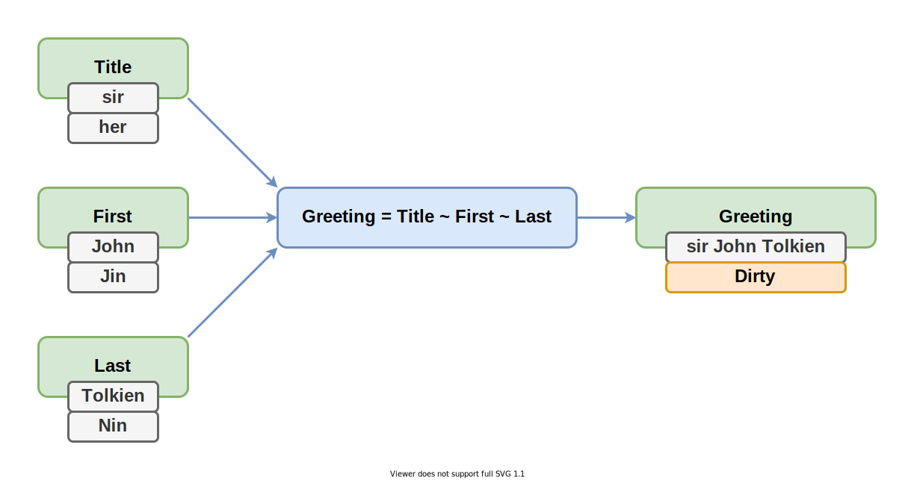

# Order: Порядок реакций

- ⌚Subscribe: По времени подписки
- 🧨Event: По времени возникновения события
- 🖇Deep: По глубине зависимости
- 👨‍💻Code: По положению в программе

## ⌚Subscribe: Реагирование по времени подписки

Какая реакция появилась раньше, та и срабатывает раньше. Получается скрытое состояние, влияющее на работу приложения через разный порядок срабатывания сайд-эффектов.

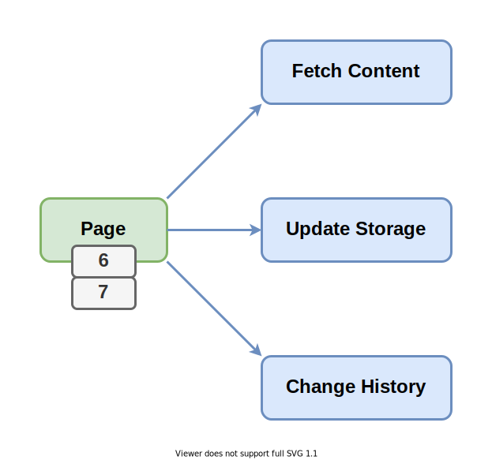

## 🧨Event: Реагирование по времени возникновения события

Чем раньше изменилось состояние, тем раньше сработают реакции на его изменение.

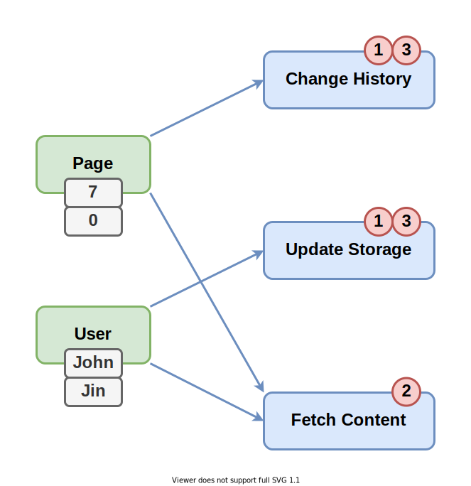

## 🖇Deep: По глубине зависимости

> *Ошибка доступа*

## 👨‍💻Code: Реагирование по положению в программе

Чем раньше в заданном кодом потоке исполнения находится реакция, тем раньше она сработает.

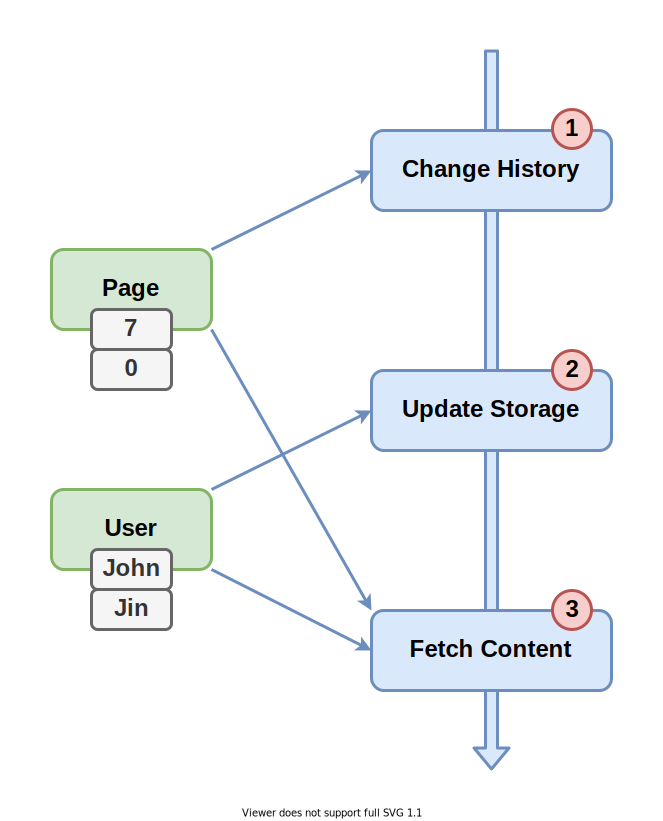

# Error: Поведение в исключительных ситуациях

- 🎲Unstable: Нестабильная работа
- ⛔Stop: Прекращение работы
- 🦺Store: Индикация ошибки и ожидание восстановления
- ⏮Revert: Откат к стабильному состоянию

## 🎲Unstable: Нестабильная работа при ошибке

Обычно следствие неконсистентного состояния.


## ⛔Stop: Прекращение работы при ошибке

Требуется перезапуск всего приложения или отдельной его части.

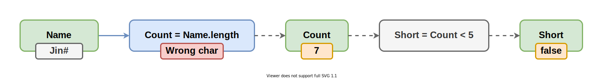

## 🦺Store: Индикация ошибки и ожидание восстановления

Приложение частично помечается невалидным. Устранение причины исключительной ситуации восстанавливает нормальную работу.

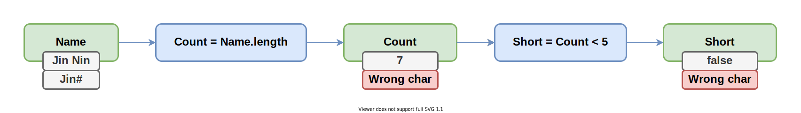

## ⏮Revert: Откат к стабильному состоянию при ошибке

Возможна ситуация, когда из-за ошибки в далёкой реакции невозможно изменить первичное состояние.


# Conform: Согласованность состояния

- 💪Strong: Гарантированнная
- 🙏Eventual: В конечном счёте
- 💩Weak: Не гарантированна

## 💪Strong: Гарантированнная согласованность

Видимые состояния в любой момент соответствуют инвариантам. Даже в процессе работы реакций. Даже если возникли исключения.


## 🙏Eventual: Согласованность в конечном счёте

Временно состояние может наблюдаться не соответствующим инвариантам. Обычно в процессе отработки реакций. Но по её завершению состояние вновь возвращается к согласованному виду.


## 💩Weak: Не гарантированная согласованность

В какой-то момент инварианты могут быть нарушены. Например, при возникновении исключительной ситуации.


# Flow: Конфигурация потоков данных

- 👷‍♂️Manual: Ручная
- 🚕Auto: Автоматическа

## 👷‍♂️Manual: Ручная конфигурация потоков данных

Движение информации по состояниям задаётся в коде и без явного указания не меняется в процессе работы программы. Забыли подписаться - неконсистентность. Забыли отписаться - лишние вычисления.

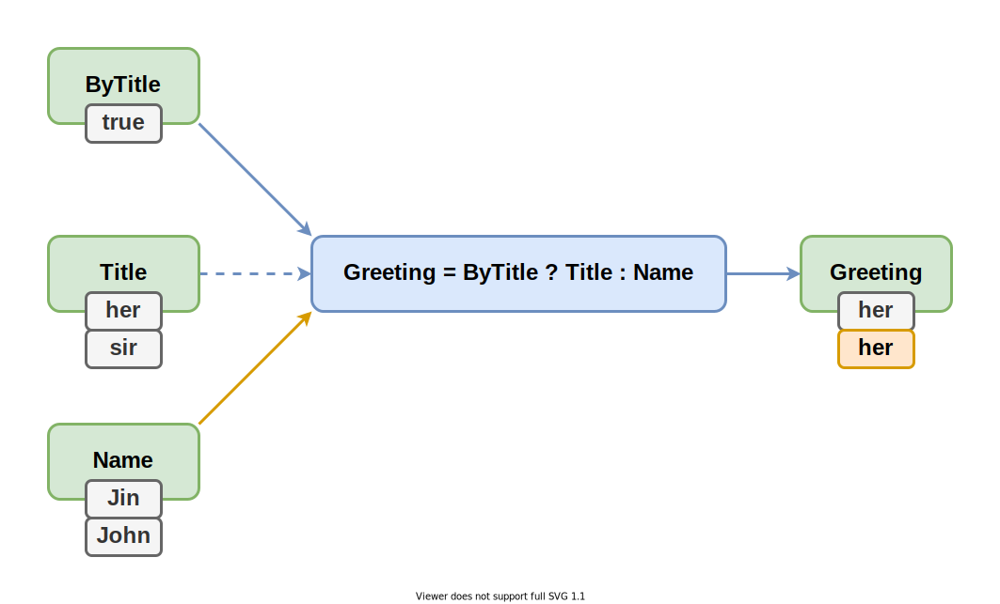

## 🚕Auto: Автоматическая конфигуация потоков данных

Движение информации происходит наиболее оптимальным образом для текущего состояния. При изменений состояния, информационные потоки перестраиваются автоматически.

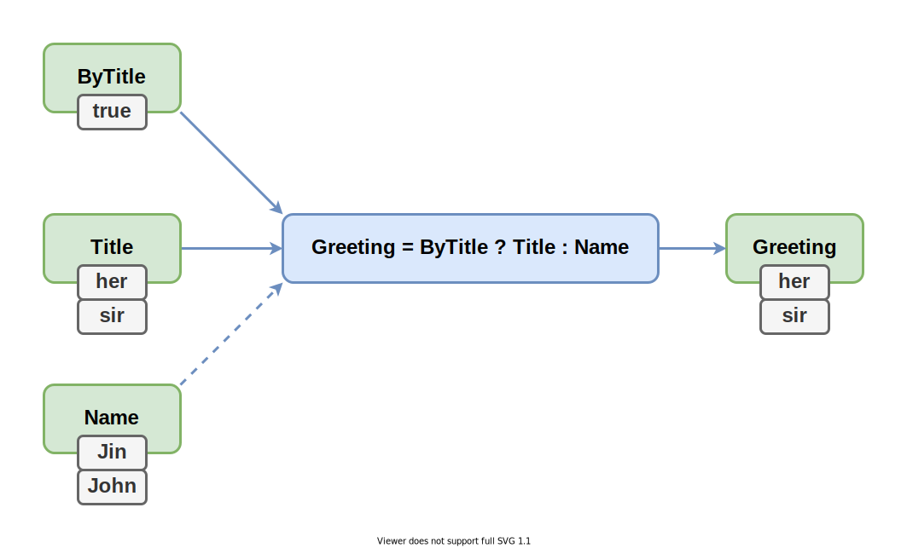

## Cycle: Циклические зависимости

- 💤Allow: Допускаются
- ⛔Fail: Приводят к ошибке
- 🚫Unreal: Невозможны

## 💤Allow: Допускаются

Позволяют просто решать некоторые задачи. Но при неосторожном обращении могут зависнуть.

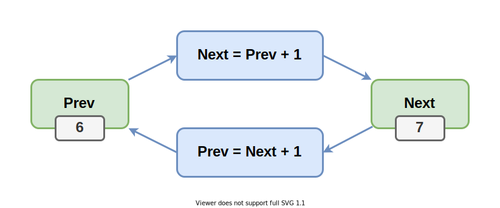

## ⛔Fail: Приводят к ошибке

Детектируются в рантайме и кидают исключение. При тестировании могут быть не выявлены, а выстрелить у пользователя.

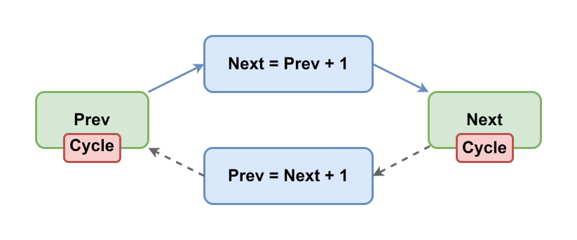

## 🚫Unreal: Невозможны

Синтаксически невозможно создать. Вроде хорошо, но накладывает сильные ограничения на прикладные возможности.


## Dupes: Игнор эквивалентных изменений

Когда значение обновляется на эквивалентное.

- 👯‍♀️Every: Реакция на каждое действие
- 🆔Identity: Сравнение по ссылке
- 🔬Equality: Структурное сравнение

## 👯‍♀️Every: Реакция на каждое действие

Даже если состояние фактически не меняется, реакции всё-равно отрабатывают.

```
777 != 777
```

## 🆔Identity: Сравнение по ссылке

Если состояние не поменялось, то реакции не срабатывают. А если поменялось, даже на эквивалентное значение, то срабатывают.

```
777 == 777
[ 1, 2, 3 ] != [ 1, 2, 3 ]
```

## 🔬Equality: Структурное сравнение

Реакции срабатывают только если состояние поменялось на неэквивалентное значение.

```
777 == 777
[ 1, 2, 3 ] == [ 1, 2, 3 ]
[ 1, 2, 3 ] != [ 3, 2, 1 ]
```

## Async: Асинхронные инварианты

Порой инвариант требует асинхронной коммуникации. Например, при тяжёлых рассчётах в отдельном воркере.

- 🏇Support: Поддерживаются
- 🏊‍♂️Unsupport: Не поддерживаются

## 🏇Support: Поддерживаются асинхронные инварианты

Согласованность состояний сохраняется автоматически.

## 🏊‍♂️Unsupport: Не поддерживаются асинхронные инварианты

Согласованность состояний на время сайд-эффекта лежит на плечах прикладника. Как правило это хрупкий интерактивный код.

## Depth: Ограничение глубины

- 🗻Stack: Ограничена стеком
- 🌌Heap: Не ограничена

## 🗻Stack: Ограничена стеком

На глубоких зависимостях (1-2к) реактивность может ломаться. Эксель на таком не построишь.

## 🌌Heap: Не ограничена

Глубина зависимостей может быть произвольной, на сколько хватит оперативки.

# Оценка практичности

Сформулируем видение идеальной системы реактивности в вакууме..

| Aspect  | ✅Usable  | ❌Unusable
|---------|-----------|---------
| Style   | 🤓Obj     | 🧐Proc 🤯Func
| Origin  | 🚂Pull    | 📮Push
| Watch   | 🤝Links   | 🔎Polling 🎇Events
| Tonus   | 🦥Lazy    | 🍔Instant ⏰Defer
| Order   | 👨‍💻Code    | ⌚Subscribe 🧨Event
| Conform | 💪Strong  | 💩Weak 🙏Eventual
| Error   | 🦺Store   | ⛔Stop ⏮Revert 🎲Unstable
| Flow    | 🚕Auto    | 🚗Half 👷‍♂️Manual 
| Cycle   | ⛔Fail    | 💤Allow 🚫Unreal
| Dupes   | 🔬Equality    | 🆔Identity 👯‍♀️Every
| Async   | 🏇Support | 🏊‍♂️Unsupport
| Depth   | 🌌Heap    | 🗻Stack

# Реактивные библиотеки

Везде рассматривается поведение по умолчанию, если человек не написал дополнительного кода для изменения поведения. 

| Lib         | Style | Origin | Watch | Tonus | Order | Conform | Error | Flow  | Cycle | Dupes | Async | Depth
|-------------|-------|--------|-------|-------|-------|---------|-------|-------|-------|-------|-------|------
| $mol_atom2  | 🤓✅ | 🚂✅  | 🤝✅ | 🦥✅ | 👨‍💻✅ | 💪✅   | 🦺✅ | 🚕✅ | ⛔✅ | 🔬✅ | 🏇✅ | 🗻❌
| MobX        | 🤓✅ | 🚂✅  | 🤝✅ | 🦥✅ | 👨‍💻✅ | 💪✅   | 🦺✅ | 🚕✅ | ⛔✅ | 🆔❌ | 🏊‍♂️❌ | 🗻❌
| CellX       | 🤓✅ | 🚂✅  | 🎇❌ | 🦥✅ |       | 💩❌   | 🎲❌ | 🚕✅ | ⛔✅ | 🆔❌ | 🏊‍♂️❌ | 🌌✅
| ChronoGraph | 🧐❌ | 🚂✅  |       |       |       |         |       |       |       |       |       | 🌌✅
| Reatom      | 🤯❌ | 🚂✅  | 🤝✅ | 🦥✅ | 🧨❌ | 💪✅   | ⏮❌ | 🚕✅ | 🚫❌ | 🆔❌ | 🏊‍♂️❌ | 🗻❌
| RxJS        | 🤯❌ | 📮❌  | 🤝✅ | 🍔❌ | ⌚❌ | 💩❌   | ⛔❌ | 👷‍♂️❌  | 🚫❌ | 👯‍♀️❌ | 🏊‍♂️❌ | 
| Effector    | 🤯❌ | 📮❌  | 🤝✅ | 🍔❌ | ⌚❌ | 💩❌   | 🎲❌ | 👷‍♂️❌  | 🚫❌ | 🆔❌ | 🏊‍♂️❌ | 

Видно два основных лагеря: Объектное Реактивное Программирование и Функциональное Реактивное Программирование. 

# Реактивные фреймворки

| Lib     | Style | Origin | Watch | Tonus | Order | Conform | Error | Flow  | Cycle | Dupes | Async | Depth
|---------|-------|--------|-------|-------|-------|---------|-------|-------|-------|-------|-------|------
| Vue     | 🤓✅ | 🚂✅  |       | 🦥✅ |       |         |       | 🚕✅ |       | 🆔❌ | 🏊‍♂️❌ | 
| React   | 🧐✅ | 📮❌  | 🔎❌ | ⏰❌ | 👨‍💻✅ |         |       | 👷‍♂️❌  |       | 🆔❌ | 🏇✅ | 
| Angular | 🧐✅ | 📮❌  | 🔎❌ | ⏰❌ |       | 💩❌   | 🎲❌ | 🚕✅ |       | 🆔❌ | 🏊‍♂️❌ | 
| Svelte  | 🧐✅ | 📮❌  | 🔎❌ | ⏰❌ |       |         |       | 🚕✅ |       | 🆔❌ | 🏊‍♂️❌ | 

Не стоит слепо доверять этой табличке, ибо составлена она вручную. Я, конечно, старался точно всё отразить, но мог и накосячить. Поэтому..

# Что ещё глянуть

Проект по классификации стейт-менеджеров с помощью тестов от автора reatom.

- [artalar/state-management-specification](https://github.com/artalar/state-management-specification)
- [kriskowal/gtor](https://github.com/kriskowal/gtor)

И иной взгляд на вопрос реактивности.