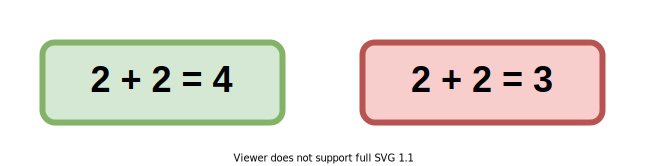
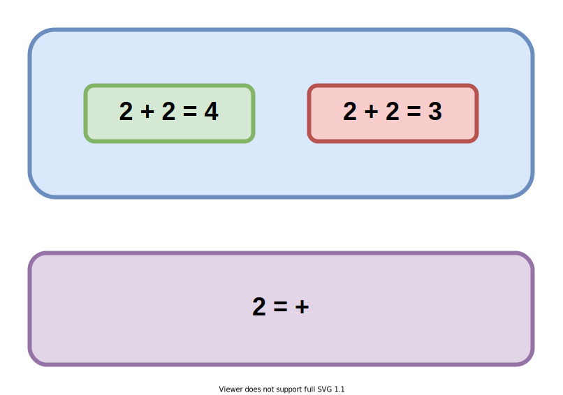
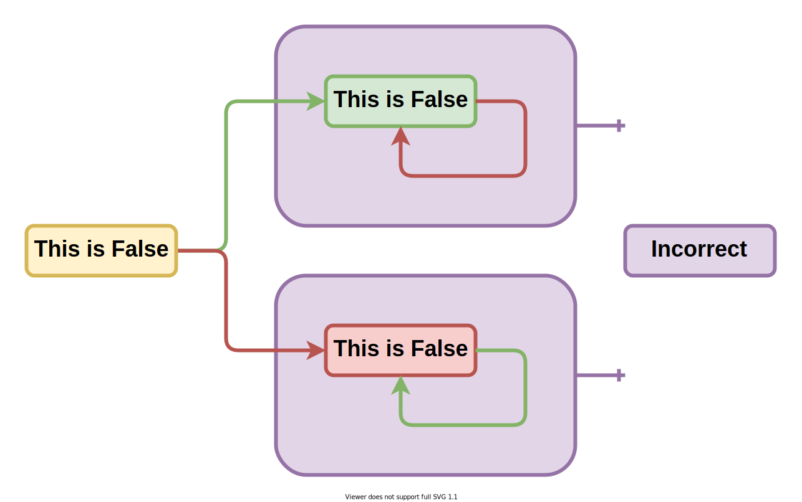
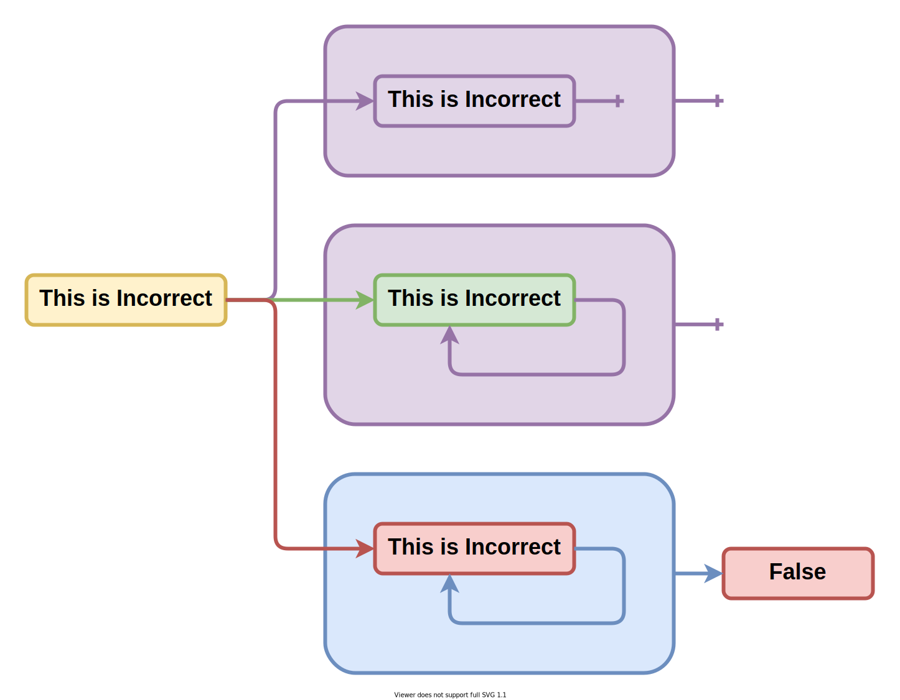
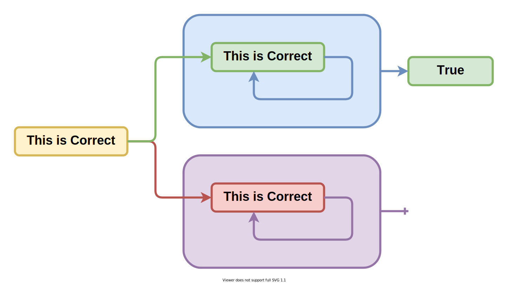
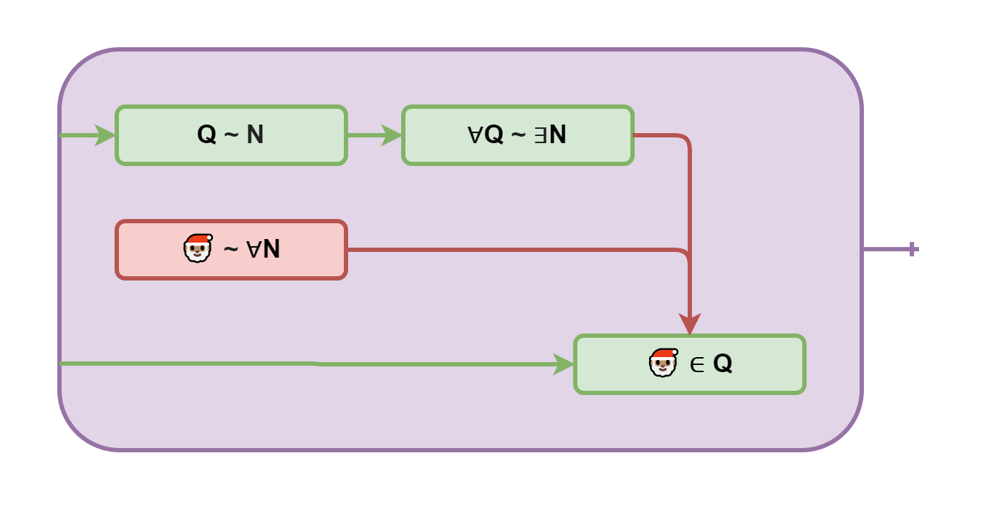

# Проблема останова лжеца Гёделя и брадобрея Кантора

Вы можете [открыть это в интерфейсе проведения презентаций](https://nin-jin.github.io/slides/self-reference/).

## Истинность

## Корректность

## Доказательство от противного

## Самоподтверждение

## Самоотрицание

Он же парадокс лжеца.

## Самоопровержение

## Самообоснование

## Разбиение множества по предикату

## Самоисключение

Парадокс брадобрея: Брадобрей бреет всех жителей, кто не бреет себя сам

## Несчётные множества

Теорема Кантора: Существует биекция натуральных на вещественные, Существует число не равное любому числу из множества

## Теорема Гёделя

> Не существует доказательства этого выражения

## Проблема остановки

> Невозможно понять остановится ли когда-нибудь процедура

## Что почитать по теме

- [Кризис оснований математики](https://ru.wikipedia.org/wiki/%D0%9A%D1%80%D0%B8%D0%B7%D0%B8%D1%81_%D0%BE%D1%81%D0%BD%D0%BE%D0%B2%D0%B0%D0%BD%D0%B8%D0%B9_%D0%BC%D0%B0%D1%82%D0%B5%D0%BC%D0%B0%D1%82%D0%B8%D0%BA%D0%B8)
- [Ошибка Георга Кантора](http://moi-vzn.narod.ru/MOI_108.PDF)
