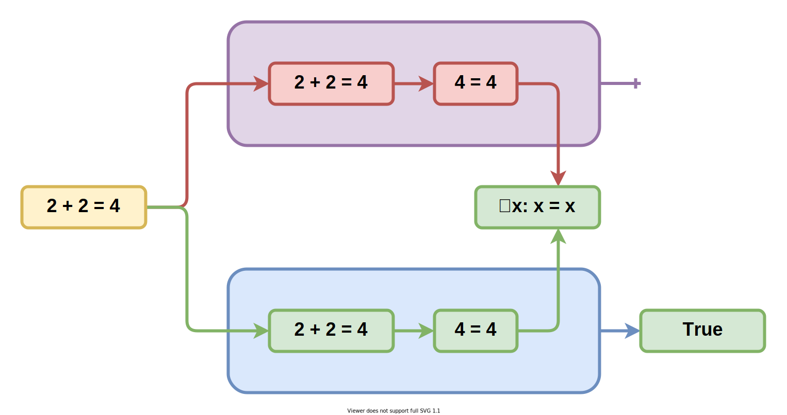
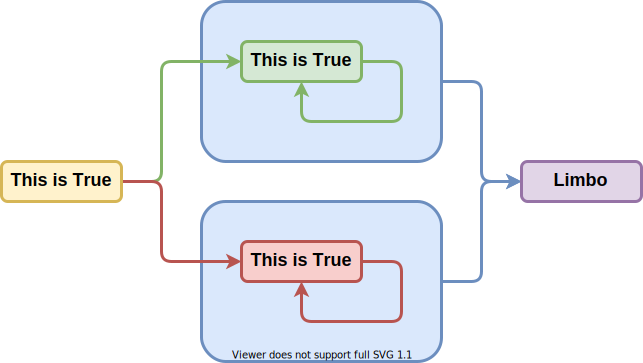

# Проблема останова лжеца Гёделя и брадобрея Канотра

Вы можете [открыть это в интерфейсе проведения презентаций](https://nin-jin.github.io/slides/self-reference/).

## Истинность

## Корректность

## Доказательство от противного

## Самоподтверждение

## Самоотрицание

Он же парадокс лжеца.

## Самоопровержение

## Самообоснование

## Парадокс брадобрея

> Брадобрей бреет всех жителей, кто не бреет себя сам

## Теорема Кантора

- Существует биекция натуральных на вещественные
- Существует число не равное любому числу из множества

## Теорема Гёделя

> Не существует доказательства этого выражения

## Проблема остановки

> Невозможно понять остановится ли когда-нибудь процедура

## Что почитать по теме

- [Кризис оснований математики](https://ru.wikipedia.org/wiki/%D0%9A%D1%80%D0%B8%D0%B7%D0%B8%D1%81_%D0%BE%D1%81%D0%BD%D0%BE%D0%B2%D0%B0%D0%BD%D0%B8%D0%B9_%D0%BC%D0%B0%D1%82%D0%B5%D0%BC%D0%B0%D1%82%D0%B8%D0%BA%D0%B8)
