# Проблема останова лжеца Гёделя и брадобрея Кантора

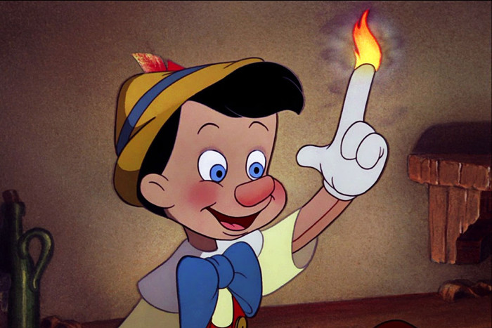

Вы можете [открыть это в интерфейсе проведения презентаций](https://nin-jin.github.io/slides/self-reference/).

## Classic Logic 2

Начнём с самых снов. Какие бывают суждения?

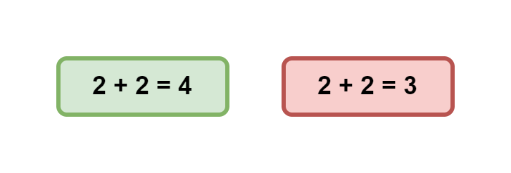

В рамках классической логики они бывают либо правдивыми, либо ложными. Обозначим их соответственно зелёным и красным цветом.

## Falsehood Logic 4

Однако, важно понимать, что понятие истинности применимо лишь для корректных суждений, то есть имеющих какой-то смысл.

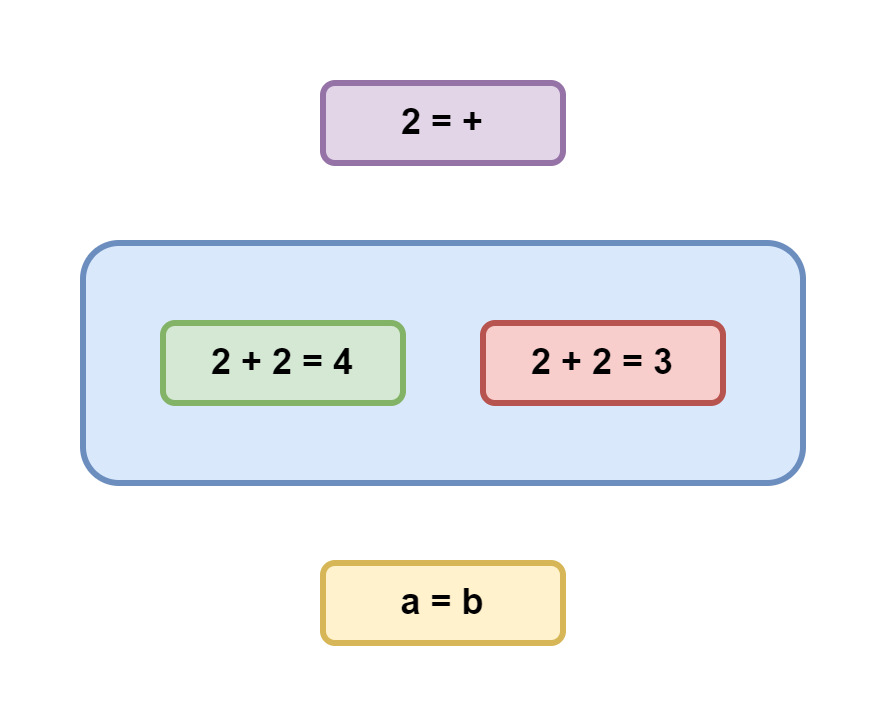

Если же суждение является не корректным, то оно не может быть ни истинным, ни ложным. Ведь это бессмыслица, не несущая в себе никакой содержательной информации. Например, можно ли сказать правдиво или ложно выражение `2 = +`? Это вообще не понятно что такое. В то же время одинокое выражение `a = b` может быть и истинным, и ложным, но без понимания, что скрывается за `a` и `b` невозможно сказать наверняка. 

Обозначим корректные суждения голубым, абсурдные - фиолетовым, а суждения, истинность которых не известна, - жёлтым. Таким образом мы получили так называемую четрырёхзначную логику, позволяющую однозначно классифицировать любые типы суждений исходя из доступной касательно них информации.

## Доказательство от противного

Давайте рассмотрим, как понятие корректности помогает нам делать логические выводы, на примере популярного в математике так называемого "доказательства от противного".

Пусть у нас есть уравнение: `2*2=2+2`. Правдиво оно или ложно?

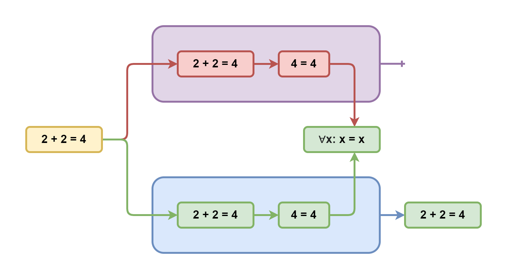

Допустим, что оно ложно. Тогда после вычисления левой и правой части мы получим, что суждение `4=4` тоже ложно. Однако, у нас есть аксиома тождества утверждающая, что любое число равно самому себе. Получаем противоречие: зелёная стрелка упирается в красный прямоугольник. То есть эта ветка рассуждений абсурдна и поэтому отбрасывается. А значит исходное уравнение не может быть ложным.

Но может ли оно быть правдивым? Что ж, рассмотрим и эту гипотезу. Из неё вытекает, что `4=4` тоже правдиво, что соответствует аксиоме тождества. И никаких противоречий не возникает. А значит эта ветка рассуждений вполне себе корректна. Таким образом мы доказали, что исходное уравнение не может быть ни чем иным, как правдой.

Может показаться, что проверка второй гипотезы уже лишняя, когда опровергнута первая. Ведь если суждение не ложное, то оно правдивое. На этот счёт в классической логике даже есть отдельная аксиома "исклюённого третьего". Однако, не стоит забывать, что произвольно взятое суждение может оказаться не только истинным или ложным, но и попросту некорректным. И в этом случае та аксиома не применима, как и вся классическая логика. Поэтому прежде чем брать такое суждение в оборот классической логики, необходимо доказать его корректность.

## Неполнота

Возьмём, для примера, выражение, утверждающее свою собственную правдивость и попробуем его проанализировать.

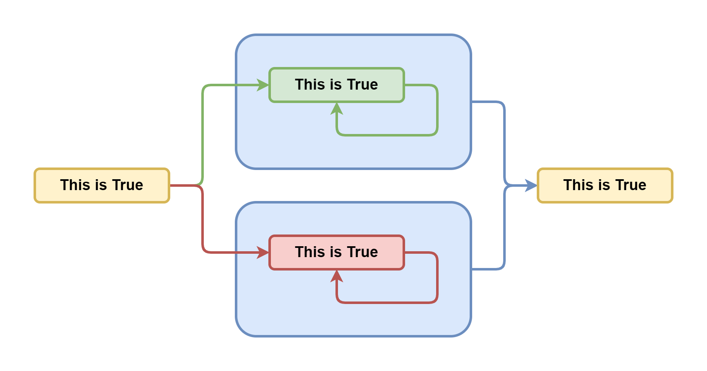

Если оно правдиво, то оно утвержает, что оно правдиво, что не противоречит исходному предположению. А если оно ложно, утверждая, что оно правдиво, значит оно ложно, что тоже подтверждает исходное предположение. Получается, что это утверждение не несёт в себе достаточно информации, чтобы определить его истинность. А значит его требуется дополнить ещё каким-то суждением, которое бы что-то говорило об истинности данного утверждения. 

## Парадокс лжеца

Но что если суждение будет утверждать свою собственную ложность?

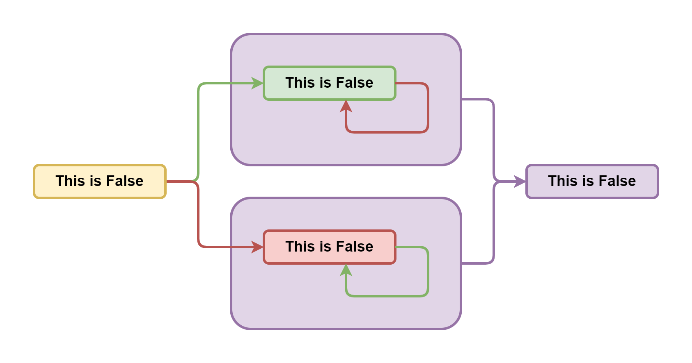

Если оно правдиво, то из её содержания следует, что оно ложно. Получаем противоречние и отбрасываем. Если же оно ложно, то из отрицания её содержания следует, что оно истинно. Опять противоречие.

Получается, что такое утверждение противоречиво само по себе, а значит некорректно. Оно не может быть ни правдой, ни ложью, независимо от любых других суждений. И, соответственно, из него тоже нельзя сделать никаких других выводов. Такое утверждение, отрицающее само себя, является семантической бессмыслицей, также известной как "парадокс лжеца". И из неё нельзя сделать никаких содержательных выводов.

## Первая Теорема Гёделя о неполноте

Тут мы подходим к первой теореме Гёделя о неполноте. Суть её сводится к тому, что в любой непротиворечивой системе суждений существует такое правдивое суждение, которое невозможно доказать. Для обоснования приводится выражение вида "это выражение невозможно доказать". Давайте проанализируем его, как мы умеем..

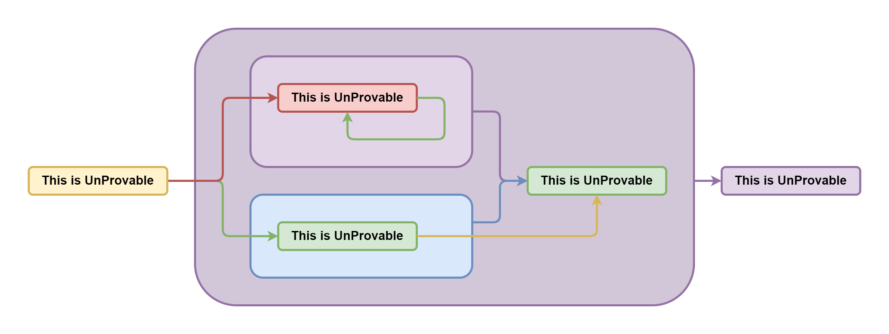

Если оно ложно, значит доказать его всё же можно. А если можно доказать, то оно правдиво. Противоречние - отбрасываем. Если же оно истинно и непротиворечиво, а ложность мы уже отвергли, то получается, что мы его доказали. А оно говорит о своей недоказуемости. Снова противоречие - отбрасываем. А так как мы только что доказали, что оно не может быть ни истинным, ни ложным, то получается, что оно абсурдно.

Тут Гёдель заявляет, что мы же не смогли доказать утверждение, которое говорит о своей собственной недоказуемости, что получается правда и теорема доказана. Однако, тут важно помнить, что понятие истинности (и как следствие доказуемости) в принципе не применимо к абсурдным утверждениям.

Это всё равно, что спрашивать "Когда вы перестали пить по утрам?" у человека, который в жизни в рот не брал. По сути, выражение Гёделя - не более чем слегка завуалированный парадок лжеца, где суждение эффективно отрицает само себя. А значит из него нельзя делать никаких выводов, в том числе и о полноте.

## Вторая Теорема Гёделя о неполноте

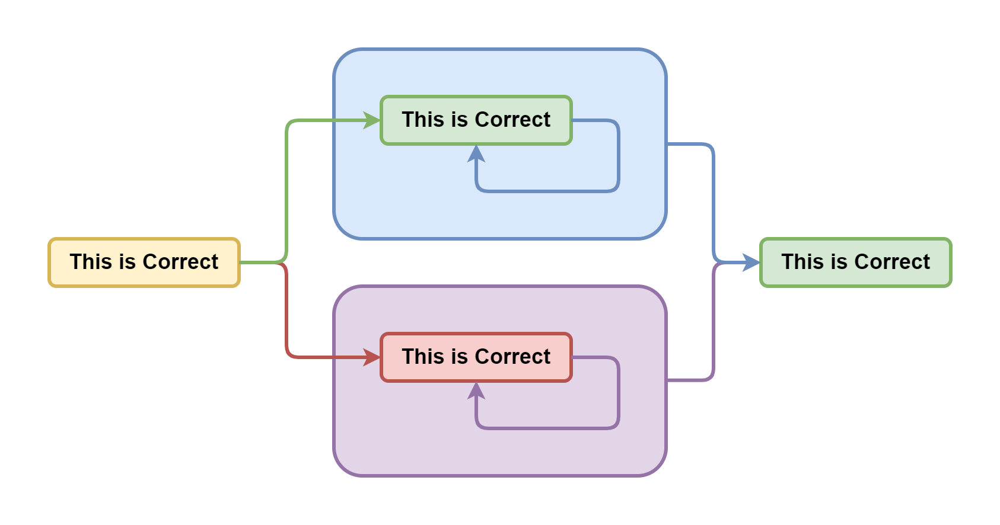

## Самоотвержение


## Разбиение множества по предикату

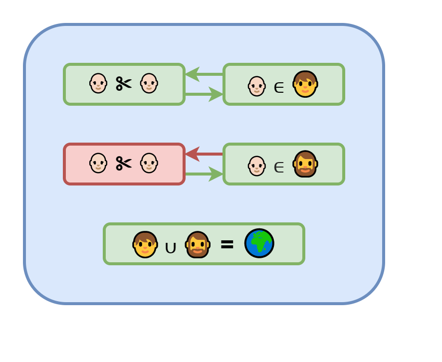

## Самоисключение

Парадокс брадобрея: Брадобрей бреет всех жителей, кто не бреет себя сам

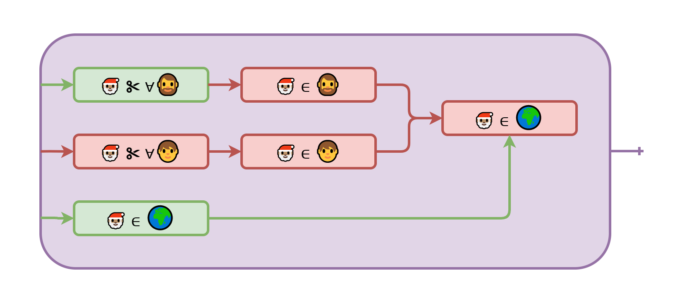

## Несчётные множества

Теорема Кантора: Существует биекция натуральных на вещественные, Существует число не равное любому числу из множества

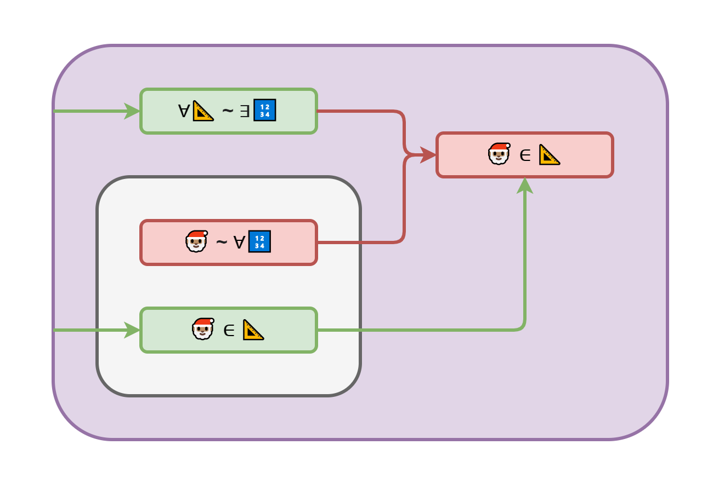

## Пересчитываем действительные числа

- X(n) = random
- Уже есть - игнорируем
- Ещё нет - добавляем в конец
- p(∀📐) → 0
- P(∀📐) = 1 

## Проблема остановки

Невозможно понять остановится ли когда-нибудь процедура

```cpp
⛔: (👩‍🦲)⇒ 🚩

🎅🏽= ()⇒ ⛔(🎅) ? 🎅() : 🚫

❓ = ⛔(🎅)
```

## Резюме

- Самоотрицание не продуктивно
- Классическая логика ограничена
- Четырёхзначная логика лишена парадоксов
- Все бесконечности равны
- Проблемы останова нет
- Математика свернула не туда

## Чтиво по теме

- [Кризис оснований математики](https://ru.wikipedia.org/wiki/%D0%9A%D1%80%D0%B8%D0%B7%D0%B8%D1%81_%D0%BE%D1%81%D0%BD%D0%BE%D0%B2%D0%B0%D0%BD%D0%B8%D0%B9_%D0%BC%D0%B0%D1%82%D0%B5%D0%BC%D0%B0%D1%82%D0%B8%D0%BA%D0%B8)
- [Ошибка Георга Кантора / Зенкин АА](http://www.ccas.ru/alexzen/papers/vf1/vf-rus.html)
- [Логика с операторами истинности и ложности / Павлов СА](https://iphras.ru/uplfile/root/biblio/2004/Pavlov_Logika.pdf)
