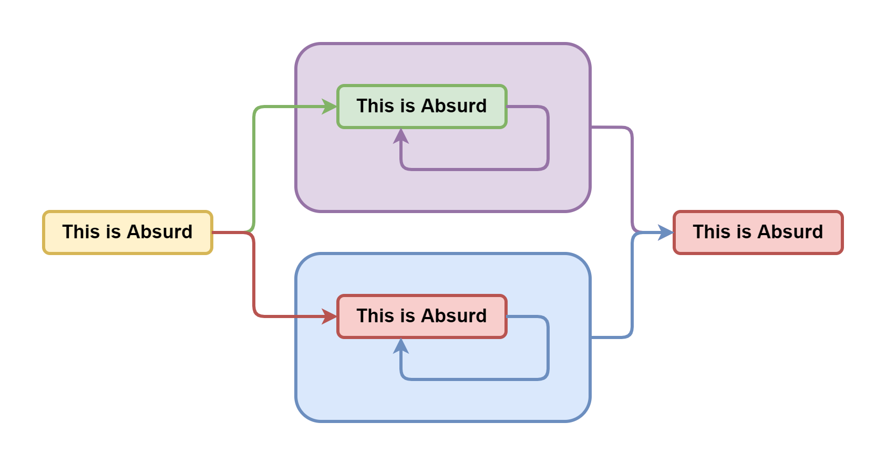
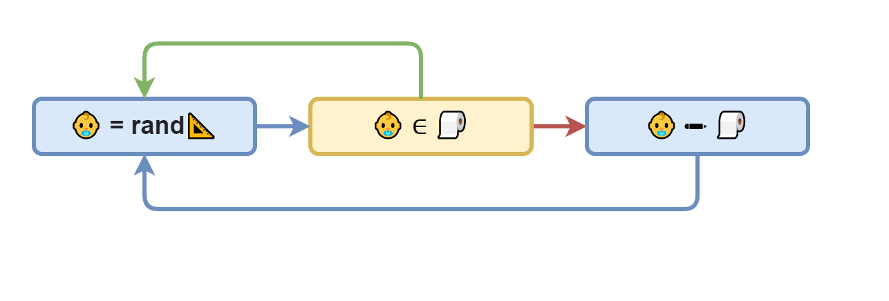

# Проблема останова лжеца Гёделя и брадобрея Кантора

Вы можете [открыть это в интерфейсе проведения презентаций](https://nin-jin.github.io/slides/self-reference/).

## Классическая логика

Начнём с самых снов. Какие бывают суждения?

В рамках классической логики они бывают либо правдивыми, либо ложными. Обозначим их соответственно зелёным и красным цветом.

## Многозначная логика

Однако, важно понимать, что понятие истинности применимо лишь для корректных суждений, то есть имеющих какой-то смысл.

Если же суждение является не корректным, то оно не может быть ни истинным, ни ложным. Ведь это бессмыслица, не несущая в себе никакой содержательной информации. Например, можно ли сказать правдиво или ложно выражение `2 = +`? Это вообще не понятно что такое. В то же время одинокое выражение `a = b` может быть и истинным, и ложным, но без понимания, что скрывается за `a` и `b` невозможно сказать наверняка. 

Обозначим корректные суждения голубым, абсурдные - фиолетовым, а суждения, истинность которых не известна, - жёлтым. Таким образом мы получили так называемую четрырёхзначную логику, позволяющую однозначно классифицировать любые типы суждений исходя из доступной касательно них информации.

## Доказательство от противного

Давайте рассмотрим, как понятие корректности помогает нам делать логические выводы, на примере популярного в математике так называемого "доказательства от противного".

Пусть у нас есть уравнение: `2*2=2+2`. Правдиво оно или ложно?

Допустим, что оно ложно. Тогда после вычисления левой и правой части мы получим, что суждение `4=4` тоже ложно. Однако, у нас есть аксиома тождества утверждающая, что любое число равно самому себе. Получаем противоречие: зелёная стрелка упирается в красный прямоугольник. То есть эта ветка рассуждений абсурдна и поэтому отбрасывается. А значит исходное уравнение не может быть ложным.

Но может ли оно быть правдивым? Что ж, рассмотрим и эту гипотезу. Из неё вытекает, что `4=4` тоже правдиво, что соответствует аксиоме тождества. И никаких противоречий не возникает. А значит эта ветка рассуждений вполне себе корректна. Таким образом мы доказали, что исходное уравнение не может быть ни чем иным, как правдой.

Может показаться, что проверка второй гипотезы уже лишняя, когда опровергнута первая. Ведь если суждение не ложное, то оно правдивое. На этот счёт в классической логике даже есть отдельная аксиома "исклюённого третьего". Однако, не стоит забывать, что произвольно взятое суждение может оказаться не только истинным или ложным, но и попросту некорректным. И в этом случае та аксиома не применима, как и вся классическая логика. Поэтому прежде чем брать такое суждение в оборот классической логики, необходимо доказать его корректность.

## Неполнота

Возьмём, для примера, выражение, утверждающее свою собственную правдивость и попробуем его проанализировать.

Если оно правдиво, то оно утвержает, что оно правдиво, что не противоречит исходному предположению. А если оно ложно, утверждая, что оно правдиво, значит оно ложно, что тоже подтверждает исходное предположение. Получается, что это утверждение не несёт в себе достаточно информации, чтобы определить его истинность. А значит его требуется дополнить ещё каким-то суждением, которое бы что-то говорило об истинности данного утверждения. 

## Парадокс лжеца

Но что если суждение будет утверждать свою собственную ложность?

Если оно правдиво, то из его содержания следует, что оно ложно. Получаем противоречие и отбрасываем. Если же оно ложно, то из отрицания её содержания следует, что оно правдиво. Опять противоречие. снова выбрасываем.

Получается, что такое утверждение противоречиво само по себе, а значит некорректно. Оно не может быть ни правдой, ни ложью, независимо от любых других суждений. Такое утверждение, отрицающее само себя, является семантической бессмыслицей, также известной как "парадокс лжеца". И из неё нельзя сделать никаких содержательных выводов, кроме того, что оно абсурдно.

## Это - абсурд

Может показаться, что мы не разрешили парадокс, а лишь убежали от него и если заменить ложность на абсурдность, то парадокс вернётся. Но давайте рассмотрим и выражение "это утверждение абсурдно".

Из его правдивости следует его же абсурдность, что является абсурдом. Однако, из его ложности следует его корректность, что не вызывает противоречий. Получается, что оно вполне корректно, но ложно.

## Первая Теорема Гёделя о неполноте

Давайте разберём что-то по сложнее. Например, первую теорему Гёделя о неполноте. Суть её сводится к тому, что в любой непротиворечивой системе суждений существует такое правдивое суждение, которое невозможно доказать. Для обоснования приводится выражение вида "это выражение невозможно доказать". Давайте проанализируем его, как мы умеем..

Если оно ложно, значит доказать его всё же можно. А если можно доказать, то оно правдиво. Противоречние - отбрасываем. Если же оно истинно и непротиворечиво, а ложность мы уже отвергли, то получается, что мы его доказали. А оно говорит о своей недоказуемости. Снова противоречие - отбрасываем. А так как мы только что доказали, что оно не может быть ни правдивым, ни ложным, значит оно абсурдно.

Тут Гёдель заявляет, что мы же не смогли доказать утверждение, которое говорит о своей собственной недоказуемости, что получается правда и теорема доказана. Однако, тут важно помнить, что понятие истинности (и как следствие доказуемости) в принципе не применимо к абсурдным утверждениям.

Это всё равно, что спрашивать "Когда вы перестали пить по утрам?" у человека, который в жизни в рот не брал. По сути, выражение Гёделя - не более чем слегка завуалированный парадокс лжеца, где суждение эффективно отрицает само себя. А значит из него нельзя делать никаких содержательных выводов, в том числе и о полноте.

Важный вывод из этих рассуждений заключается в том, что введение абсурдного утверждения в рассуждение не поможет ничего доказать или опровергуть, кроме собственно абсурдности этого утверждения.

## Вторая Теорема Гёделя о неполноте

## Разбиение множества по предикату

Поднимемся на уровень выше, к теории множеств. Где мы можем образовывать подмножества используя произвольный предикат, то есть функцию, которая возвращает правду или ложь. Возьмём, например, предикат "стрижёт" и разделим всё население Земли на тех кто стрижёт сам себя и тех, кто не стрижёт. Первых обозначим бритой рожицей так как они могут себе позволить стричься хоть каждый день. А вторых - заросшей, так как для них сходить к цирюльнику - это целая эпопея.

Так как мы разделили всё население по предикату на два подмножества, то так же верны и утверждения, что объединение этих подмножеств равно всему наседению планеты. А пересечение является пустым множеством, ибо никто не может одновременно и брить себя сам, и не брить.

## Введение определений

Теперь давайте представим себе такого персонажа, который стрижёт всех и только тех жителей, кто не стрижут себя сами. Назовём его Сантой и формализуем его определение в виде системы из 3 утверждений..

Сначала мы утверждаем, что он принадлежит множеству населения Земли. Потом, что он стрижёт любого представителя населения, что не стригут себя сами. И наконец, он не стрижёт никого из тех, кто и сам себя не прочь постричь.

Но что за дела? Почему определение завёрнуто в жёлтый прямоугольниик неопределённости?

## Парадокс брадобрея

Дело в том, прежде чем вводить в рассуждения новое определение, необходимо доказать, что оно корректно, то есть описывает то, что действительно может существовать. Давайте попробуем это сделать..

Если любого, кто не стрижёт себя сам, стрижёт Санта, то сам Санта не может входить в это множество ибо тогда Санте пришёлос бы стричь самого себя. С тдругой стороны, раз он не стрижёт никого из самостригущихся, значит сам он тоже не принадлежит к самостригущимся. Объединяя оба вывода, получаем, что.. Санта не существует. Однако, он должен существовать исходя из нашего определения.

Получается, что система из 3 суждений входящих в определение Санты противоречиво само по себе и не может использоваться для введения такой сущности в рассуждениях. Такое абсурдное определение называется "парадоксом брадобрея" и имеет множество различных вариаций. А важный вывод из него заключается в том, что не всё, что можно описать может действительно существовать. Поэтому вводя новые сущности необходимо доказывать возможность их существования.

## Несчётные множества

Давайте подумаем, что будет, если мы не будем отвергать абсурдные определения. Для этого рассмотрим теорему Кантора о несчётности вещественных чисел. Для наглядности, давайте обозначим множество вещественных чисел как линейку, а множество натуральных как циферки в квадрате.

Вкратце, доказательство Кантора выглядит так: предположим, что для любого вещественного числа существует соответствующее ему уникальное натуральное число. Теперь введём в рассмотрение Санту - некоторое вещественное число, которое по построению не соответствует ни одному натуральному. Получается, что Санта не может быть вещественным числом, иначе бы соответствие существовало исходя из исходной гипотезы. Однако, мы постулировали, что такой Санта есть среди вещественных чисел.

Получившееся противоречие означает, что невозможно одновременное существование соответствия и существование Санты. Чтобы его разрешить, можно, например, признать, что такой самоотрицающий себя Санта существовать не может, а значит множество вещественных чисел счётно и все бесконечности равны.

Ну а можно заявить, что если мы смогли Санту описать, значит он существует. А следовательно соответствия не существует и одна **без**конечность, внезапно, может быть больше другой **без**конечности. А это открывает широкие горизонты для целого математического направления с ординалами, кардиналами и прочими юниверсами. Именно так и поступил Кантор, а вслед за ним и вся формалистская школа математики.

## Пересчитываем действительные числа

## Проблема остановки

Невозможно понять остановится ли когда-нибудь процедура

## Резюме

- Самоотрицание не продуктивно
- Классическая логика ограничена
- Четырёхзначная логика лишена парадоксов
- Все бесконечности равны
- Проблемы останова нет
- Математика свернула не туда

## Чтиво по теме

- [Ошибка Георга Кантора / Зенкин АА](http://www.ccas.ru/alexzen/papers/vf1/vf-rus.html)
- [Логика с операторами истинности и ложности / Павлов СА](https://iphras.ru/uplfile/root/biblio/2004/Pavlov_Logika.pdf)
