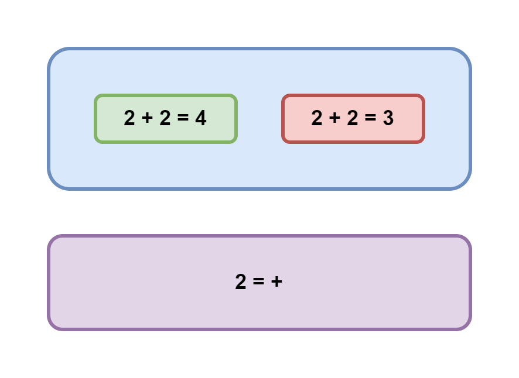
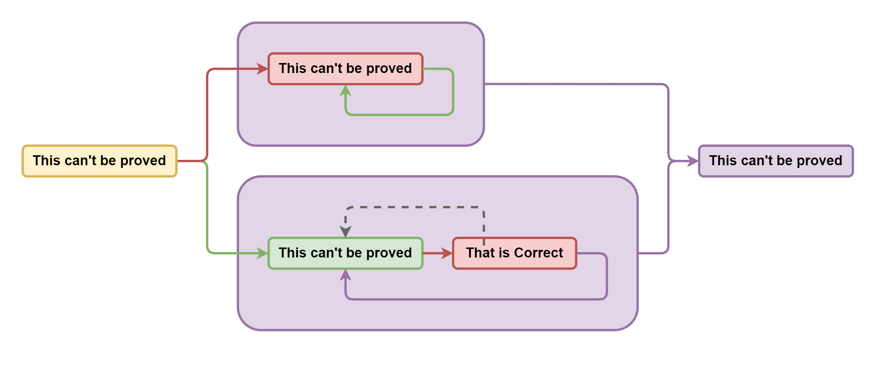
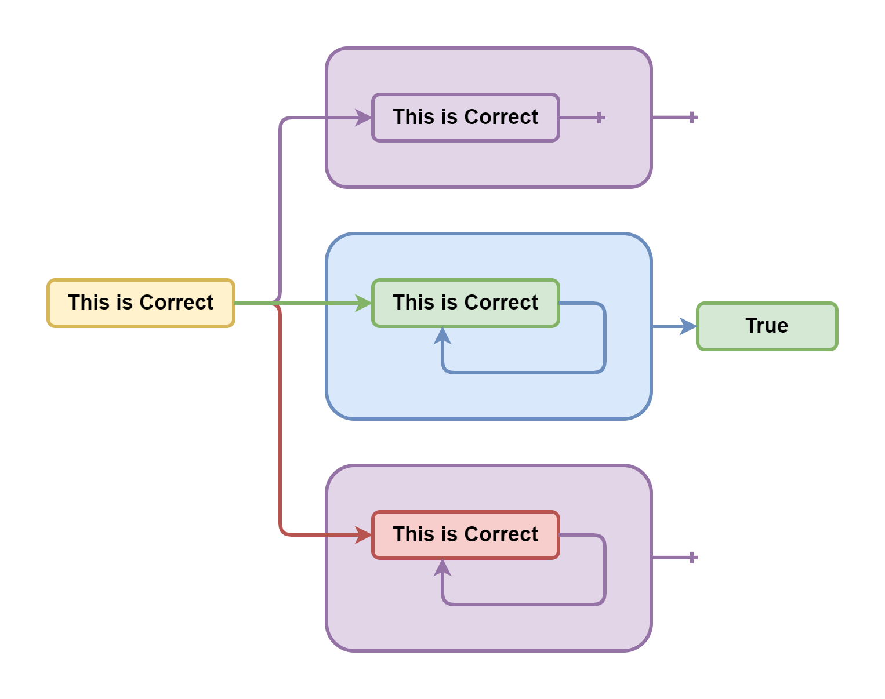

# Проблема останова лжеца Гёделя и брадобрея Кантора


Вы можете [открыть это в интерфейсе проведения презентаций](https://nin-jin.github.io/slides/self-reference/).

## Истинность

Начнём с самых снов. Какие бывают суждения?


Они бывают правдивыми и ложными. Обозначим их соответственно зелёным и красным цветом.

## Корректность

Однако, важно понимать, что понятие истинности применимо лишь для корректных суждений, то есть имеющих какой-то смысл.



Если же суждение является не корректным, то оно не может быть ни истинным, ни ложным. Ведь это бессмыслица, не несущая в себе никакой содержательной информации.

Обозначим корректные суждения голубым, а не корректные - фиолетовым.

## Доказательство от противного

Давайте рассмотрим, как понятие корректности помогает нам делать логические выводы, на примере популярного в математике так называемого "доказательства от противного".

Пусть у нас есть уравнение: `2+2=2*2`. Правдиво оно или ложно?


Допустим, оно ложно. Тогда после вычисления левой и правой части мы получим, что суждение `4=4` тоже ложно. Однако, у нас есть аксиома утверждающая, что любое число равно самому себе. Получаем противоречие: зелёна стрелка упирается в красный прямоугольник. То есть эта ветка рассуждений не корректна и поэтому отбрасывается. А значит уравнение не может быть ложным.

Но может ли оно быть правдивым? Что ж, рассмотрим и эту гипотезу. Из неё вытекает, что `4=4` тоже правдиво, что соответствует аксиоме тождества. И никаких противоречий не возникает. А значит эта ветка рассуждений вполне корректна. Таким образом мы доказали, что исходное уравнение не может быть ни чем иным, как правдой.

Может показаться, что проверка второй гипотезы уже лишняя, когда опровергнута первая. Ведь если суждение не ложное, то оно правдивое. На этот счёт даже есть отдельная аксиома "исклюённого третьего". Однако, не стоит забывать, что суждение может оказаться не только истинным или ложным, но и попросту некорректным. И в этом случае та аксиома не применима.

## Неполнота

Возьмём, для примера, выражение, утверждающее свою собственную правдивость и попробуем его проанализировать.


Если оно правдиво, то оно утвержает, что оно правдиво, что не противоречит исходному предположению. А если оно ложно, утверждая, чтот оно правдиво, значит оно ложно, что тоже подтверждает исходное предположение. Получается, что это утверждение не несёт в себе достаточно информации, чтобы определить его истинность. А значит его требуется дополнить ещё каким-то суждением, которое бы что-то говорило об истинности данного утверждения. 

# Аксиома Мюнхгаузена

Получается, что система утверждений не обладает полнотой, пока мы не введём аксиому, разрешающую эту неопределённость. Звучать такая аксиома может, например, так:

> Суждение (или система суждений), эффективно утверждающее свою собственную правдивость, является семантически некорректным.

Это такая же бессмыслица, как и попытка вытянуть себя за волосы из болота ни на что не опираясь. Поэтому назовём её "аксиомой Мюнхгаузена".

## Парадокс лжеца

Но что если суждение будет утверждать свою собственную ложность?


Если оно правдиво, то из её содержания следует, что оно ложно. Получаем противоречние и отбрасываем. Если же оно ложно, то из отрицания её содержания следует, что оно истинно. Опять противоречие. Получается, что такое утверждение противоречиво само по себе, а значит некорректно. Оно не может быть ни правдой, ни ложью, независимо от любых других суждений. И, соответственно, из него тоже нельзя сделать никаких других выводов. Такое утверждение, отрицающее само себя, является семантической бессмыслицей, также известной как "парадокс лжеца".

## Первая Теорема Гёделя о неполноте

Существует выражение, которое нельзя ни доказать, ни опровергнуть.



## Вторая Теорема Гёделя о неполноте



## Самоопровержение


## Разбиение множества по предикату


## Самоисключение

Парадокс брадобрея: Брадобрей бреет всех жителей, кто не бреет себя сам


## Несчётные множества

Теорема Кантора: Существует биекция натуральных на вещественные, Существует число не равное любому числу из множества


## Пересчитываем действительные числа

- X(n) = random
- Уже есть - игнорируем
- Ещё нет - добавляем в конец
- p(∀📐) → 0
- P(∀📐) = 1 

## Проблема остановки

Невозможно понять остановится ли когда-нибудь процедура

```cpp
⛔: (👩‍🦲)⇒ 🚩

🎅🏽= ()⇒ ⛔(🎅) ? 🎅() : 🚫

❓ = ⛔(🎅)
```

## Что почитать по теме

- [Кризис оснований математики](https://ru.wikipedia.org/wiki/%D0%9A%D1%80%D0%B8%D0%B7%D0%B8%D1%81_%D0%BE%D1%81%D0%BD%D0%BE%D0%B2%D0%B0%D0%BD%D0%B8%D0%B9_%D0%BC%D0%B0%D1%82%D0%B5%D0%BC%D0%B0%D1%82%D0%B8%D0%BA%D0%B8)
- [Ошибка Георга Кантора / Зенкин АА](http://www.ccas.ru/alexzen/papers/vf1/vf-rus.html)
- [Логика с операторами истинности и ложности (FL4) / Павлов СА](https://iphras.ru/uplfile/root/biblio/2004/Pavlov_Logika.pdf)
