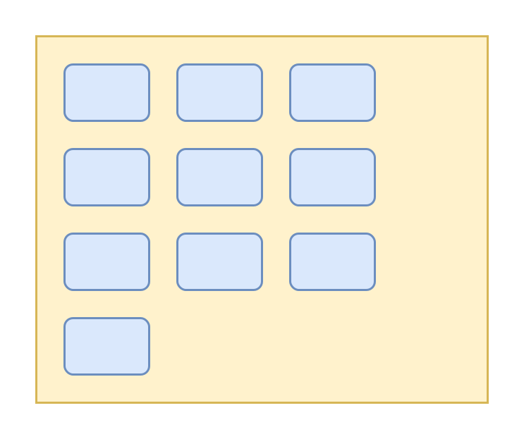
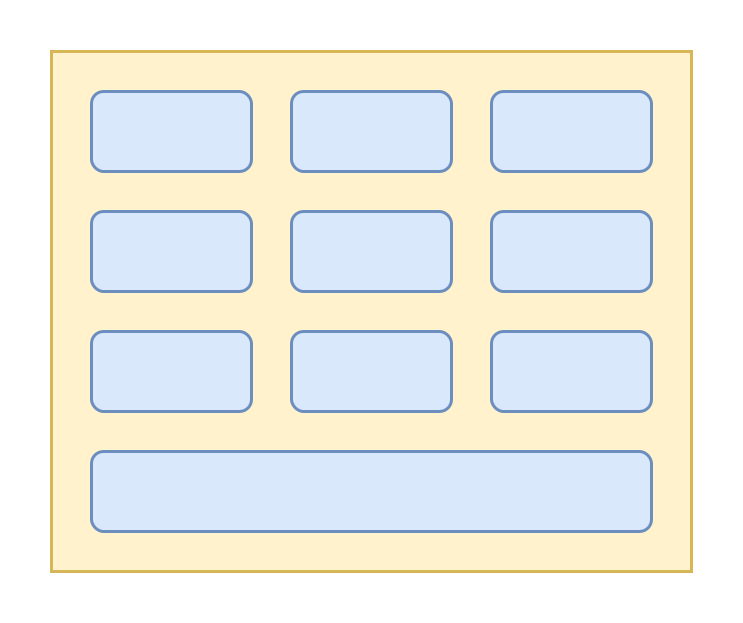
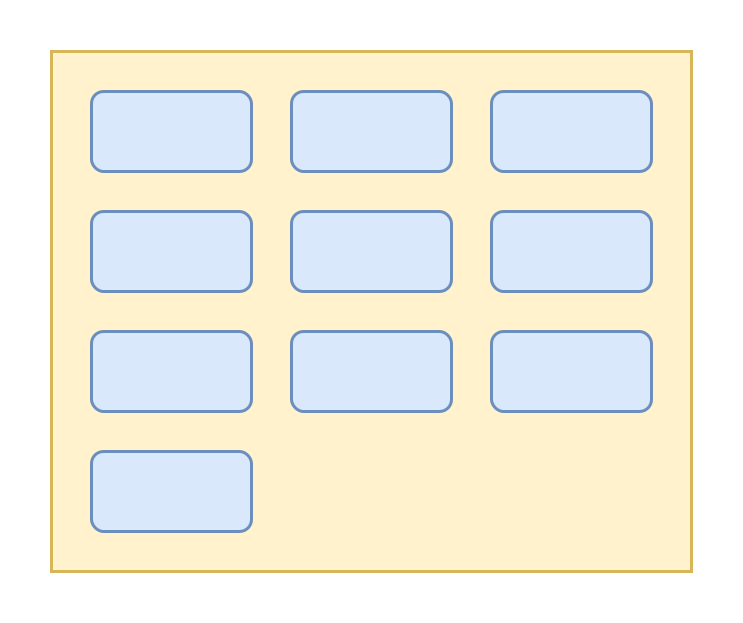
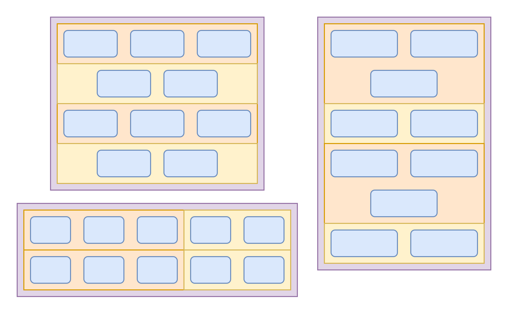
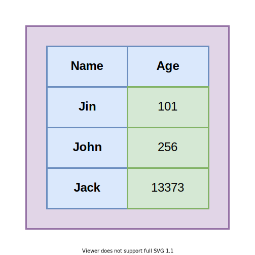
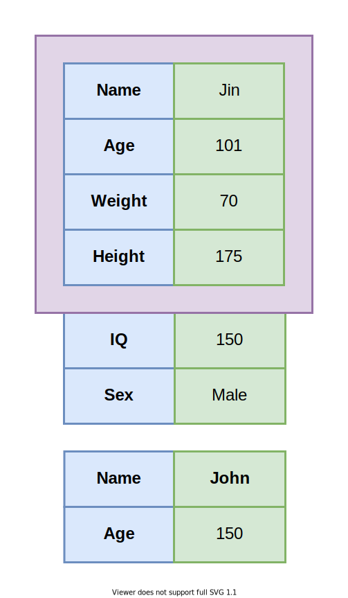
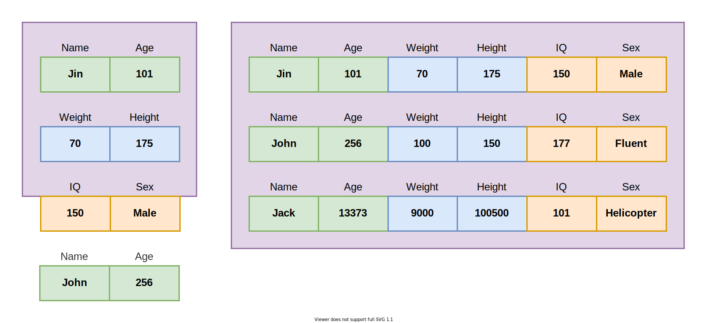
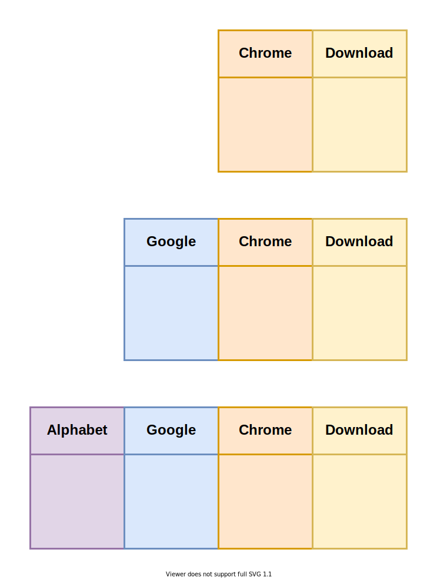

# Проектирование гиперадаптивной UI-библиотеки

Это - текстовая расшифровка выступления на [FrontendConf'21](https://frontendconf.ru/moscow/2021/abstracts/7406). Вы можете [открыть в интерфейсе проведения презентаций](https://nin-jin.github.io/slides/ui-kit/), либо [читать как статью](https://github.com/nin-jin/slides/blob/master/ui-kit/readme.md)...

# Кто я такой

- 15 разработки фронтенда
- В Яндекс, 1С, Wrike, Deutche Bank, Газпром
- Автор фреймворка $mol

# План

- Размеры
- Цвета
- Раскладка
- Навигация

# Зачем? 

- Разработать с дизайнером кубики Лего
- Пилить приложения уже без дизайнера
- Выглядеть должно опрятно и в едином стиле

# Что не так с дизайнером?

- Дизайнер рисует экранчик в 3 размерах
- Согласовывает его с заказчиком
- Разрабы в шоке - это так не заработает
- Дизайнер всё перерисовывает..

# Приручаем размеры

## Базовый размер

> `1rem` (`16px`)

## Текст

## Ширина текста

> `60rem` (`960px`)

## Межстрочный интервал

- Больше букв в строке - больше расстояние меж строк

## Визуальный ритм

> `.5rem` (`8px`)

## Дробные размеры

- Браузер рендерит пиксели
- Размеры округляются в разные стороны

## Учёт DPI

    devicePixelRatio

## Разрешение картинок

- Под размер экрана ❌
- Под плотность пикселей ❌
- Под скорость соединения ❌
- Минимум из возможных ✅

## А когда нужно гладенько?

> **Векторная графика**

## Увеличенный текст

## Уменьшенный текст

## Текстовый блок

## Динамическое расположение блоков

- Отступы со всех сторон одинаковые

## Блок

## Блок из блоков

# Приручаем цвета

## Цветовые константы

Семантика рендеринга. Задаются как константы.

- **back** - Фоновый цвет
- **text** - Цвет текста, иконок
- **line** - Цвет разделительных линий
- **shade** - Цвет приглушения текста
- **hover** - Цвет выделения фона
- **control** - Цвет интерактивного текста

Все цвета зависят от фона.

## Каскадные темы

Цвет фона зависит от семантики блока. Для каждой темы определяются все константы. Для вложенных тем они могут переопределяться.

- **normal** - Заурядный блок (по умолчанию)
- **accent** - Блок, требующий внимания
- **field** - Поле ввода

## Корневая тема

Зависит от настроек пользователя.

- Модель освещения (светлая/тёмная)
- Тип дальтонизма
- Степень контраста
- Тип экрана

## Принудительная коррекция под тему

- Картинки
- Иконки
- Карты

## Хранение темы

- Настройки браузера
- Локальное хранилище
- Ссылка

# Приручаем раскладку

- Заполнение строк
- Представление таблиц

## Брейк поинты?

- Игнорируют размер контейнера
- Игнорируют размер контента
- Сложны в поддержке

## Фиксированный размер

## Flex переносы?

## Grid переносы?

## Биноминальные переносы!

## Выравнивание биноминальных переносов

- Чётное число бьём пополам
- Нечётное делим 1:2
- `flex-grow` = число элементов

## Пример биноминальных переносов

## Маленькие таблицы..

## Большие таблицы?

## Карточки?

## Карточки с выравниванием!

# Приручаем экраны

- Эффективное заполнение больших экранов
- Единый UX для любых экранов
- Единый UX для любых способов ввода

## Что такое эффективное заполнение?

- Не захламление пустоты.
- Не скрытие релевантного.

## Сначала десктоп

## Сначала мобилки

## Где это я?

## Размеры экранов

- Их не 2
- И даже не 3
- Их континуум!

## Буклетный дизайн

## Возвращение горизонтального скролла

## Метафора погружения

## Фу! Горизонтальный скролл!

- Выпирающий текст
- Кривое пзиционирование

## Вау! Горизонтальный скролл!

- Свайпы фактически горизонтально скроллят
- Ширина окна - максимум для страницы
- Автоматическое выравнивание
- Максимальная отзывчивость
- Крайне простая реализация

## Нюансы горизонтального скролла

- Частично выглядывающая страница интригует
- Промотка нескольких страниц за раз.

## Пример с горизонтальным скроллом

## Распасовка карт

## Пример распасовки карт

## Особенности распасовки карт

- Реализация сложнее
- Нужны свайпы
- Страницы не обрезаются
- Привычный UX

## Буклетная матрёшка

# Итоги

- Grid step `0.5rem` ✅
- Font size `1rem` ✅
- Integral sizes ✅
- Fractal theming ✅
- Break points ❌
- Binominal wrap ✅
- Tables ❌
- Aligned cards ✅
- Mobile first ❌
- Booklet design ✅

# Продолжение банкета

- [slides.hyoo.ru](https://slides.hyoo.ru/) - выступления
- [Core Dump](https://www.youtube.com/channel/UC-qEImMrqSLZ9KLee1JTcuw) - видео о компьютерной науке
- [habhub.hyoo.ru](https://habhub.hyoo.ru/) - статьи
- [apps.hyoo.ru](https://apps.hyoo.ru/) - приложения
- [`_jin_nin_`](https://twitter.com/_jin_nin_) - твиты по делу

# Есть что добавить или поправить?

