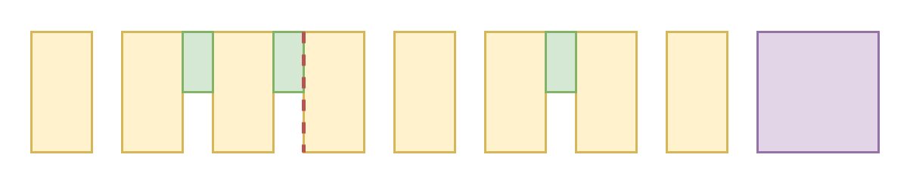
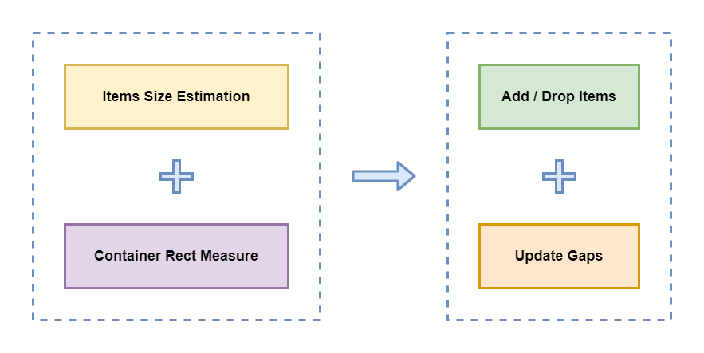
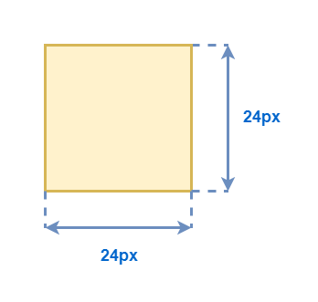
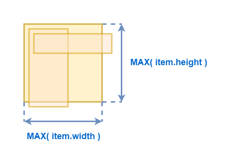
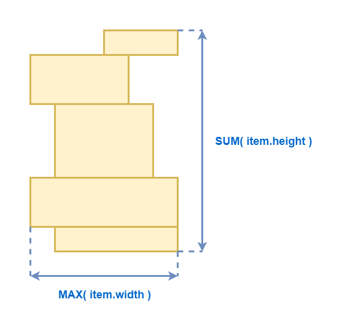
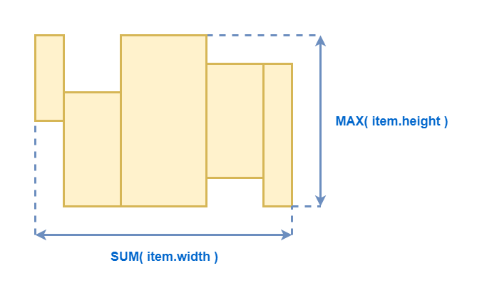
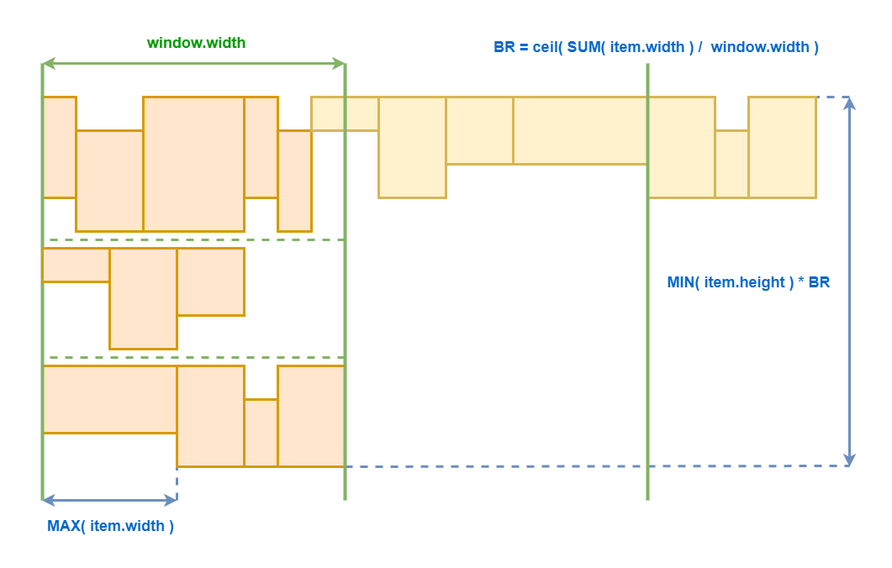
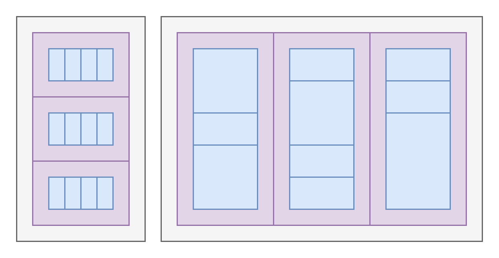
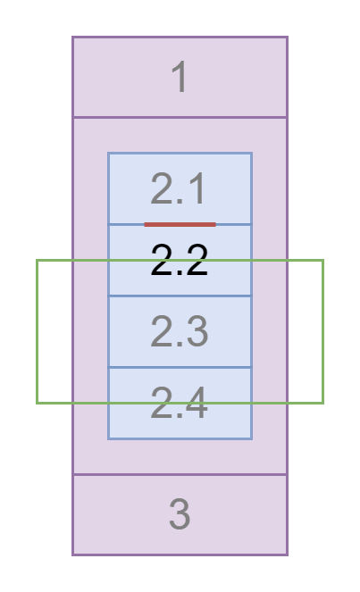
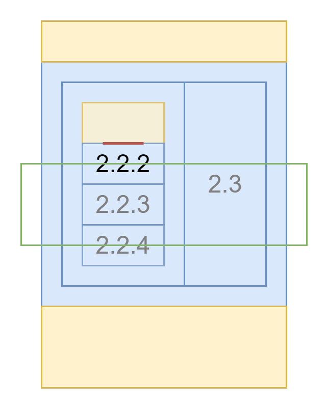

# Автоматическая виртуализация рендеринга произвольной вёрстки

Здравствуйте, меня зовут дмитрий Карловский и я.. прибыл к вам из недалёкого будущего. Недалёкого, потому что там уже всё и все тормозят. Писец подкрался к нам незаметно: сначала перестали расти моности компьютеров, потом пропускная способность сетей. А пользователи... они продолжали генерировать контент как не в себя. В итоге, за считанные годы UX интерфейсов деградировал настолько, что ими стало настолько пользоваться и многие пользователи поспешили перейти на облачный стриминг своих браузеров, которые работают на суперкомпьютерах, принадлежащих корпорациям, которые не дают людям устанавливать в них блокировщики рекламы. Поэтому я пришёл к вам именно сейчас, в этот момент, когда ещё можно всё исправить, пока не стало слишком поздно. 


[Дмитрий Карловский @ HolyJS'20 Moscow](https://holyjs-moscow.ru/)

Вы можете либо [посмотреть видео запись](), либо [открыть в интерфейсе проведения презентаций](https://nin-jin.github.io/slides/virt/), либо [читать как статью](https://github.com/nin-jin/slides/blob/master/virt/readme.md)...

# О чём это всё


Я делал иерархические списки задач на 40К штук, редактор документов на 200 страниц, и даже запилил фреймворк, где виртуализация происходит автоматически. Короче, съел я на той теме собаку, кошку, хорька, енота и даже морскую свинку. Так что далее я расскажу как эффективно предоставлять пользователю огромные объёмы данных, почему вообще возникает такая необходимость, какие технологии нам с этим могут помочь, и почему Реакт не способен избавить нас от головной боли.

# Типичный цикл разработки

- Написали код
- Проверили в типличных условиях
- Пришли пользователи и всё заспамили

# Наивный рендеринг: Скорость загрузки и Отзывчивость


# Наивный рендеринг: Потребление памяти


# Наивный рендеринг: Риск неработоспособности

- Не влезли по памяти - приложение закрывается
- Обрыв соединения - страница обрывается
- Браузер может заглючить на больших объёмах

# Наивный рендеринг: Резюме

- Медленная загрузка
- Плохая отзывчивость
- Высокое потребление памяти
- Риск неработоспособности

# Первый подопытный: Статья на Хабре

[Вырезаем SSR и ускоряем Хабр в 10 раз](https://habhub.hyoo.ru/#author=nin-jin/repo=HabHub/article=34)


# Второй подопытный: Ченьжлог на GitLab

[](https://gitlab.com/gitlab-org/gitlab-foss/-/commit/9517d0eb2ca8bde02d7fae2173e0a43b67b2b9f5#27e06e15cfe9583d733619cf7d72629b777f7757_26212_26221)

# Перенос рендеринга HTML на сервер


# Страдания Ильи Климова во GitLab-у

[](https://www.youtube.com/embed/3tdfBMRq34o)

# Оптимизации вёрстки

*быстрее, но асимптотика не меняется*

```
<div class="amount">
    <h3 class="heading ...">
        <span>
            <span class="amount__major">1 233</span>
            <div class="amount__minor-container">
                <span class="amount__separator">,</span>
                <span class="amount__minor">43</span>
            </div>
            <span class="amount__currency"> ₽</span>
        </span>
    </h3>
</div>
```

```
<h3 class="amount">
    <span class="amount__major">1 233</span>
    <span class="amount__minor">,43 ₽</span>
</h3>
```

[$mol: 4 года спустя](https://habhub.hyoo.ru/#author=nin-jin/repo=HabHub/article=23)

# Достоинства оптимизации вёрстки

- Кратное ускорение ✅
- Асимптотика не меняется ❌

# Прикладная оптимизация

- Пагинация
- Экспандеры
- Бесконечный скролл
- Виртуальный скролл

# Прикладная оптимизация: Пагинация


# Достоинства пагинации

- Много кликать ❌
- Ожидание загрузки каждой страницы ❌
- Теряется контекст ❌
- Элементы скачут между страницами ❌
- Вероятность пропустить элемент ❌
- Применимо лишь для плоских списков ❌
- Большой элемент возвращает тормоза ❌
- Слепые вас ненавидят ❌
- Работает быстрее, чем всё скопом рендерить ✅

[Популярные антипаттерны: падгинация](https://habhub.hyoo.ru/#author=nin-jin/repo=HabHub/article=13)

# Прикладная оптимизация: Экспандеры

[](https://nin-jin.github.io/my_gitlab/#collapse)

# Достоинства экспандеров

- Очень много кликать ❌
- Ожидание загрузки каждой ветки ❌
- Если не закрывать, то снова тормоза ❌
- Слепые вас проклинают ❌
- Открывается быстро ✅
- Применимо не только для плоских списков ✅

# Прикладная оптимизация: Бесконечный скролл


# Достоинства бесконечного скролла

- Применимо лишь для плоских списков ❌
- Ожидание загрузки каждой ветки ❌
- Увеличение тормозов по мере прокрутки ❌
- Быстрое появление ✅

# Прикладная оптимизация: Виртуальный скролл

[](https://bvaughn.github.io/react-virtualized/#/components/WindowScroller)

# Достоинства виртуального скролла

- Применимо лишь для плоских списков ❌
- Размеры элементов должны быть предсказуемы ❌
- Работает быстро ✅

# Прикладная оптимизация: Резюме

- Ухудшение пользовательского опыта ❌
- Не решают проблему полностью ❌
- Ограниченная применимость ❌
- Полный контроль где какую применять ✅

- Нужно не забыть ❌
- Нужно продавить ❌
- Нужно реализовать ❌
- Нужно оттестировать ❌
- Нужно поддерживать ❌

# Оптимизация инструментов

- Тайм слайсинг
- Прогрессивный рендеринг
- Ленивый рендеринг
- Виртуальный рендеринг

# Оптимизация инструментов: Тайм слайсинг

[Квантовая механика вычислений в JS](https://github.com/nin-jin/slides/blob/master/fibers)



# Достоинства тайм слайсинга

- Хорошая отзывчивость ✅
- Замедленность работы ❌
- Эмуляция файберов в JS ❌

# Оптимизация инструментов: Прогрессивный рендеринг

[catberry.github.io](https://catberry.github.io/)


# Достоинства прогрессивного рендеринга

- Хорошая отзывчивость в процессе появления ✅
- Эмуляция файберов в JS ❌
- На больших объёмах всё встаёт колом ❌

# Оптимизация инструментов: Ленивый рендеринг

[](https://nin-jin.github.io/my_gitlab/#lazy)

# Достоинства ленивого рендеринга

- Размеры элементов должны быть предсказуемы ❌
- Увеличение тормозов по мере прокрутки ❌
- Быстрое появление ✅

# Оптимизация инструментов: Виртуальный рендеринг

[](https://nin-jin.github.io/my_gitlab/)

# Достоинства виртуального рендеринга

- Размеры элементов должны быть предсказуемы ❌
- Работает быстро ✅

# Оптимизация инструментов: Резюме

- Поддерживает полтора фреймворка ❌
- Работает само по себе ✅

# Оптимизации: Резюме

| Оптимизация    | Стоит того?
|----------------|---
| Вёрстка        | ❌
| Прикладной код | ❌
| Инструментарий | ✅

# Виртуализация браузера

```css
content-visibility: auto;
contain-intrinsic-size: 1000px;
```

# Логика рендеринга



# Оценка размеров

- Точная
- Усреднённая
- Последняя
- Минимальная
- Максимальная

# Типы компонент: Атомарный



# Типы компонент: Стек наложения



# Типы компонент: Вертикальный список



# Типы компонент: Горизонтальный список



# Типы компонент: Горизонтальный список с переносами



# Типы компонент: Грид и Буклет



# Типы компонент: Резюме

- Атомарный
- Стек наложения
- Вертикальный список
- Горизонтальный список

# Отслеживание положения: onScroll

```
document.addEventListener( 'scroll', event => {
	// few times per frame
}, { capture: true } )
```

# Достоинства отслеживания onScroll

- Слишком часто ❌
- Изменения DOM ❌
- Изменения стилей ❌
- Изменения состояния элементов ❌
- Изменения состояния браузера ❌

# Отслеживание положения: IntersectionObserver

```
const observer = new IntersectionObserver(

    event => {
        // calls on change of visibility percentage
        // don't calls when visibility percentage doesn't changed
    },
    
    { root: document.body  }
    
)

observer.observe( watched_element )
```

# Достоинства отслеживания IntersectionObserver

- Облом, если степень наложения не меняется ❌

# Отслеживание положения: requestAnimationFrame

```
function tick() {

    requestAnimationFrame( tick )
    
    for( const element of watched_elements ) {
        element.getBoundingClientRect()
    }
 
    render()   
}
```

# Достоинства отслеживания IntersectionObserver

- Постоянная фоновая нагрузка ❌
- Просто и надёжно ✅

# Обновление: Резюме

- onScroll ❌
- IntersectionObserver ❌
- requestAnimationFrame ✅

# Скачки при прокрутке

[](https://nin-jin.github.io/habrcomment/#article=423889)

# Привязка скролла: Предотвращает скачки


# Привязка скролла: Выбор точки привязки



# Привязка скролла: Подавление привязки

- top, left, right, bottom
- margin, padding
- Any width or height-related properties
- transform
- overflow-anchor: none

# Привязка скролла: Распорки



# Виртуализация: Прокрутка вниз


# Виртуализация: Прокрутка вверх


# Виртуализация: Расширение


# Виртуализация: Скачок кенгуру


# Привязка скролла: Поддержка

| Браузер | overflow-anchor
|---------|---
| Chrome  | ✅
| Firefox | ✅
| Safari  | ❌

# Привязка скролла: Запасный выход

```
const anchoring_support = CSS.supports( 'overflow-anchor:auto' )


if( anchoring_support ) {
    virtual render
} else {
    lazy render
}
```

# Проблема: Долгая раскладка

[](https://nin-jin.github.io/habrcomment/#article=423889)

# Минимизация расчётов лейаута

```
contain: content // for scroller
```

# Аппаратное ускорение скролла

```
transform: translateZ(0) // for all scroller content
```

# Приколы со фреймами

[](https://nin-jin.github.io/habrcomment/#article=423889)

# Логика поиска

```
*find_path(
	check: ( view : View )=> boolean,
	path = [] as View[],
): Generator< View[] > {

	path = [ ... path, this ]
	
	if( check( view ) ) return yield path

	for( const item of this.kids ) {
		yield* item.find_path( check, path )
	}

}
```

- Рекурсивно спускаемся по компонентам.
- Отбираем соответствующие запросу.
- Рисуем интерфейс перехода между найденным.

# Логика прокрутки к компоненту

```
scroll_to_view( view: View ) {

	const path = this.find_path( v => v === view ).next().value

	this.force_render( new Set( path ) )

	defer( ()=> {
		view.dom_node.scrollIntoView({
			block: 'center',
			inline: 'center',
		})
	})

}
```

# Логика форсирование рендеринга видимого

```
force_render( path : Set< View > ): number {

	const items = this.rows
	
	const index = items.findIndex( item => path.has( item ) )

	if( index >= 0 ) {
		this.visible_range = [ index, index + 1 ]
		items[ index ].force_render( path )
	}

	return index
}
```

# Решаемые проблемы виртуализации

- Оценка будущих размеров
- Скачки контента
- Тормоза при скроллинге
- Прокрутка к элементу
- Поиск по странице

# Фундаментальные особенности

- Скачки скроллбара при неточной оценке размеров
- Scroll Anchoring может не работать в некоторых контекстах.
- Копирование выделенного текста.

# Бенчмарки: Скорость открытия и Отзывчивость


Сверху статья на Хабре. Мобильная версия. Меньше 200 комментариев без самой статьи рендерятся на VueJS. Снизу примерно то же самое на $mol. Отображается и статья, и комментарии.

# Бенчмарки: Отзывчивость

Остальные бенчмарки: [dbmon](https://mathieuancelin.github.io/js-repaint-perfs/).

[](https://mol.js.org/perf/dbmon/-/)

# Бенчмарки: Потребление памяти

| Вариант                           | Память JS                                             | Память вкладки
|-----------------------------------|-------------------------------------------------------|------------
| [VueJS: 170 комментариев](https://m.habr.com/post/522578)                                 |40 MB     | 130 MB
| $mol: 170 комментариев без виртуализации | 19 MB      | 90 MB
| [$mol: статья + 170 комментариев](https://nin-jin.github.io/habrcomment/#article=522578/) | 7 MB      | 55 MB
| [$mol: статья + 2500 комментариев](https://nin-jin.github.io/habrcomment/#article=423889) | 40 MB     | 75 MB

# ООП против ФП

- **Объект**: одно состояние - много действий.
- **Функция**: много состояний - одно действие.

# Ортогональные действия

- Узнать минимальные размеры.
- Частично отрендерить содержимое.
- Проверить соответствие поисковому запросу.

# Перспективы во фреймворках

- React ❌
- Vue ❌
- Angular ❌
- $mol ✅

# Ссылочки

- [nin-jin/my_gitlab](http://nin-jin.github.io/my_gitlab) - ченьжлог на $mol.
- [nin-jin/habrcomment](http://nin-jin.github.io/habrcomment) - хабрастатья на $mol.
- [nin-jin/slides/virt](https://github.com/nin-jin/slides/tree/master/virt) - эти слайды.
- [nin-jin/slides](https://github.com/nin-jin/slides) - другие мои выступления.
- [habhub.hyoo.ru](https://habhub.hyoo.ru/) - мои статьи.

# Обратная связь


