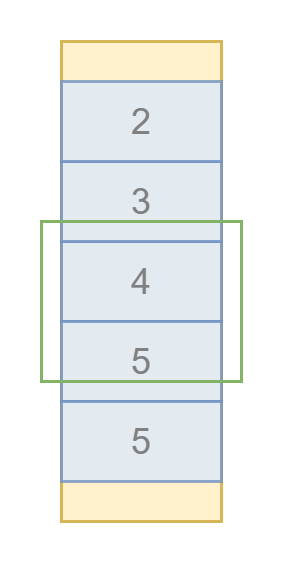

# Автоматическая виртуализация рендеринга произвольной вёрстки

Здравствуйте, меня зовут дмитрий Карловский и я.. прибыл к вам из недалёкого будущего. Недалёкого, потому что там уже всё и все тормозят. Писец подкрался к нам незаметно: сначала перестали расти моности компьютеров, потом пропускная способность сетей. А пользователи... они продолжали генерировать контент как не в себя. В итоге, за считанные годы UX интерфейсов деградировал настолько, что ими стало настолько пользоваться и многие пользователи поспешили перейти на облачный стриминг своих браузеров, которые работают на суперкомпьютерах, принадлежащих корпорациям, которые не дают людям устанавливать в них блокировщики рекламы. Поэтому я пришёл к вам именно сейчас, в этот момент, когда ещё можно всё исправить, пока не стало слишком поздно. 


[Дмитрий Карловский @ HolyJS'20 Moscow](https://holyjs-moscow.ru/)

Вы можете либо [посмотреть видео запись](), либо [открыть в интерфейсе проведения презентаций](https://nin-jin.github.io/slides/virt/), либо [читать как статью](https://github.com/nin-jin/slides/blob/master/virt/readme.md)...

# Тяжёлое прошлое: Огромные списки задач


Я делал иерархические списки задач на 40К штук, редактор документов на 200 страниц, и даже запилил фреймворк, где виртуализация происходит автоматически. Короче, съел я на той теме собаку, кошку, хорька, енота и даже морскую свинку. Так что далее я расскажу как эффективно предоставлять пользователю огромные объёмы данных, почему вообще возникает такая необходимость, какие технологии нам с этим могут помочь, и почему Реакт не способен избавить нас от головной боли.

# Рекламная пауза: Богатый редактор


# Альтернативная линия времени: $mol

[](https://mol.js.org/app/demo/-/)

# Типичный цикл разработки

- Написали код.
- Проверили в типличных условиях.
- Пришли пользователи и всё заспамили.
- Оптимизировали.
- Пользователи всё не унимаются.

# Наивный рендеринг: Скорость загрузки и Отзывчивость


# Наивный рендеринг: Потребление памяти


# Наивный рендеринг: Риск неработоспособности

- Не влезли по памяти - приложение закрывается.
- Обрыв соединения - страница обрывается.
- Браузер может заглючить на больших объёмах.

# Наивный рендеринг: Резюме

- Медленная загрузка.
- Плохая отзывчивость.
- Высокое потребление памяти.
- Риск неработоспособности.

# Первый подопытный: Статья на Хабре

[Вырезаем SSR и ускоряем Хабр в 10 раз](https://habhub.hyoo.ru/#author=nin-jin/repo=HabHub/article=34)


# Второй подопытный: Ченьжлог на GitLab

[](https://gitlab.com/gitlab-org/gitlab-foss/-/commit/9517d0eb2ca8bde02d7fae2173e0a43b67b2b9f5#27e06e15cfe9583d733619cf7d72629b777f7757_26212_26221)

# Перенос рендеринга HTML на сервер


# Страдания Ильи Климова во GitLab-у

[](https://www.youtube.com/embed/3tdfBMRq34o)

# Оптимизации вёрстки

*быстрее, но асимптотика не меняется*

```
<div class="amount">
    <h3 class="heading ...">
        <span>
            <span class="amount__major">1 233</span>
            <div class="amount__minor-container">
                <span class="amount__separator">,</span>
                <span class="amount__minor">43</span>
            </div>
            <span class="amount__currency"> ₽</span>
        </span>
    </h3>
</div>
```

```
<h3 class="amount">
    <span class="amount__major">1 233</span>
    <span class="amount__minor">,43 ₽</span>
</h3>
```

[$mol: 4 года спустя](https://habhub.hyoo.ru/#author=nin-jin/repo=HabHub/article=23)

# Достоинства оптимизации вёрстки

- Кратное ускорение ✅
- Асимптотика не меняется ❌

# Прикладная оптимизация

- Пагинация
- Экспандеры
- Бесконечный скролл
- Виртуальный скролл

# Прикладная оптимизация: Пагинация


# Достоинства пагинации

- Много кликать ❌
- Ожидание загрузки каждой страницы ❌
- Теряется контекст ❌
- Элементы скачут между страницами ❌
- Вероятность пропустить элемент ❌
- Применимо лишь для плоских списков ❌
- Большой элемент возвращает тормоза ❌
- Слепые вас ненавидят ❌
- Работает быстрее, чем всё скопом рендерить ✅

[Популярные антипаттерны: падгинация](https://habhub.hyoo.ru/#author=nin-jin/repo=HabHub/article=13)

# Прикладная оптимизация: Экспандеры

[](https://nin-jin.github.io/my_gitlab/#collapse=true)

# Достоинства экспандеров

- Очень много кликать ❌
- Ожидание загрузки каждой ветки ❌
- Если не закрывать, то снова тормоза ❌
- Слепые вас проклинают ❌
- Открывается быстро ✅
- Применимо не только для плоских списков ✅

# Прикладная оптимизация: Бесконечный скролл


# Достоинства бесконечного скролла

- Применимо лишь для плоских списков ❌
- Ожидание загрузки каждой ветки ❌
- Увеличение тормозов по мере прокрутки ❌
- Быстрое появление ✅

# Прикладная оптимизация: Виртуальный скролл

[](https://bvaughn.github.io/react-virtualized/#/components/WindowScroller)

# Достоинства виртуального скролла

- Применимо лишь для плоских списков ❌
- Размеры элементов должны быть предсказуемы ❌
- Работает быстро ✅

# Прикладная оптимизация: Резюме

- Ухудшение пользовательского опыта ❌
- Не решают проблему полностью ❌
- Ограниченная применимость ❌
- Полный контроль где какую применять ✅

- Нужно не забыть ❌
- Нужно продавить ❌
- Нужно реализовать ❌
- Нужно оттестировать ❌
- Нужно поддерживать ❌

# Оптимизация инструментов

- Тайм слайсинг
- Прогрессивный рендеринг
- Ленивый рендеринг
- Виртуальный рендеринг

# Оптимизация инструментов: Тайм слайсинг

[Квантовая механика вычислений в JS](https://github.com/nin-jin/slides/blob/master/fibers)


# Достоинства тайм слайсинга

- Хорошая отзывчивость ✅
- Замедленность работы ❌
- Эмуляция файберов в JS ❌

# Оптимизация инструментов: Прогрессивный рендеринг

[catberry.github.io](https://catberry.github.io/)


# Достоинства прогрессивного рендеринга

- Хорошая отзывчивость в процессе появления ✅
- Эмуляция файберов в JS ❌
- На больших объёмах всё встаёт колом ❌

# Оптимизация инструментов: Ленивый рендеринг

[](https://nin-jin.github.io/my_gitlab/#lazy=true)

# Достоинства ленивого рендеринга

- Размеры элементов должны быть предсказуемы ❌
- Увеличение тормозов по мере прокрутки ❌
- Быстрое появление ✅

# Оптимизация инструментов: Виртуальный рендеринг

[](https://nin-jin.github.io/my_gitlab/)

# Достоинства виртуального рендеринга

- Размеры элементов должны быть предсказуемы ❌
- Работает быстро ✅

# Оптимизация инструментов: Резюме

- Поддерживает полтора фреймворка ❌
- Работает само по себе ✅

# Оптимизации: Резюме

| Оптимизация    | Стоит того?
|----------------|---
| Вёрстка        | ❌
| Прикладной код | ❌
| Инструментарий | ✅

# Виртуализация браузера

```css
content-visibility: auto;
contain-intrinsic-size: 1000px;
```

# Логика рендеринга


# Оценка размеров

- Последняя
- Усреднённая
- Минимальная

# Типы компонент: Атомарный


# Типы компонент: Стек наложения


# Типы компонент: Вертикальный список


# Типы компонент: Горизонтальный список


# Типы компонент: Горизонтальный список с переносами


# Типы компонент: Грид и Буклет


# Типы компонент: Резюме

- Атомарный
- Стек наложения
- Вертикальный список
- Горизонтальный список

# Отслеживание положения: onScroll

```
document.addEventListener( 'scroll', event => {
	// few times per frame
}, { capture: true } )
```

# Достоинства отслеживания onScroll

- Слишком часто ❌
- Изменения DOM ❌
- Изменения стилей ❌
- Изменения состояния элементов ❌
- Изменения состояния браузера ❌

# Отслеживание положения: IntersectionObserver

```
const observer = new IntersectionObserver(

    event => {
        // calls on change of visibility percentage
        // don't calls when visibility percentage doesn't changed
    },
    
    { root: document.body  }
    
)

observer.observe( watched_element )
```

# Достоинства отслеживания IntersectionObserver

- Облом, если степень наложения не меняется ❌

# Отслеживание положения: requestAnimationFrame

```
function tick() {

    requestAnimationFrame( tick )
    
    for( const element of watched_elements ) {
        element.getBoundingClientRect()
    }
 
    render()   
}
```

# Достоинства отслеживания requestAnimationFrame

- Постоянная фоновая нагрузка ❌
- Просто и надёжно ✅

# Обновление: Резюме

- onScroll ❌
- IntersectionObserver ❌
- requestAnimationFrame ✅

# Скачки при прокрутке

[](https://nin-jin.github.io/my_gitlab/#anchoring=false)

# Привязка скролла: Предотвращает скачки


# Привязка скролла: Выбор точки привязки


# Привязка скролла: Подавление привязки

- top, left, right, bottom
- margin, padding
- Any width or height-related properties
- transform
- overflow-anchor: none

# Виртуализация: Распорки


# Виртуализация: Прокрутка вниз


# Виртуализация: Прокрутка вверх


# Виртуализация: Расширение


# Виртуализация: Превышение



# Виртуализация: Скачок кенгуру


# Привязка скролла в действии

[](https://nin-jin.github.io/my_gitlab/)

# Привязка скролла: Поддержка

| Браузер | overflow-anchor
|---------|---
| Chrome  | ✅
| Firefox | ✅
| Safari  | ❌

# Привязка скролла: Запасный выход

```
const anchoring_support = CSS.supports( 'overflow-anchor:auto' )


if( anchoring_support ) {
    virtual render
} else {
    lazy render
}
```

# Проблема: Долгая раскладка

[](https://nin-jin.github.io/habrcomment/#article=423889)

# Минимизация расчётов лейаута

```
contain: content // for scroller
```

# Аппаратное ускорение скролла

```
transform: translateZ(0) // for all scroller content
```

# Плавная прокрутка (или нет)

[](https://nin-jin.github.io/habrcomment/#article=423889)

# Логика поиска

```
*find_path(
	check: ( view : View )=> boolean,
	path = [] as View[],
): Generator< View[] > {

	path = [ ... path, this ]
	
	if( check( view ) ) return yield path

	for( const item of this.kids ) {
		yield* item.find_path( check, path )
	}

}
```

- Рекурсивно спускаемся по компонентам.
- Отбираем соответствующие запросу.
- Рисуем интерфейс перехода между найденным.

# Логика прокрутки к компоненту

```
scroll_to_view( view: View ) {

	const path = this.find_path( v => v === view ).next().value

	this.force_render( new Set( path ) )

	view.dom_node.scrollIntoView()

}
```

# Логика форсирование рендеринга видимого

```
force_render( path : Set< View > ): number {

	const items = this.rows
	
	const index = items.findIndex( item => path.has( item ) )

	if( index >= 0 ) {
		this.visible_range = [ index, index + 1 ]
		items[ index ].force_render( path )
	}

	return index
}
```

# Работающий поиск

[](https://nin-jin.github.io/habrcomment/#article=423889)

# Доступность

[](https://nin-jin.github.io/my_gitlab/)

# Решаемые проблемы виртуализации

- Оценка будущих размеров.
- Скачки контента.
- Тормоза при скроллинге.
- Прокрутка к элементу.
- Поиск по странице.
- Доступность.

# Фундаментальные особенности

- Скачки скроллбара при неточной оценке размеров.
- Scroll Anchoring может не работать в некоторых контекстах.
- Копирование выделенного текста.

# Бенчмарки: Скорость открытия и Отзывчивость


Сверху статья на Хабре. Мобильная версия. Меньше 200 комментариев без самой статьи рендерятся на VueJS. Снизу примерно то же самое на $mol. Отображается и статья, и комментарии.

# Бенчмарки: Отзывчивость

Остальные бенчмарки: [dbmon](https://mathieuancelin.github.io/js-repaint-perfs/).

[](https://mol.js.org/perf/dbmon/-/)

# Бенчмарки: Потребление памяти

| Вариант                           | Память JS                                             | Память вкладки
|-----------------------------------|-------------------------------------------------------|-------------------
| [VueJS: **170** комментариев](https://m.habr.com/post/522578)                                 |40 MB     | 150 MB
| [$mol: **статья + 2500** комментариев](https://nin-jin.github.io/habrcomment/#article=423889) | 40 MB     | 90 MB

# Бенчмарки: Гулять так гулять!

[](https://showcase.hyoo.ru/)

# ООП против ФП

- **Объект**: одно состояние - много действий.
- **Функция**: много состояний - одно действие.

# Ортогональные действия

- Узнать минимальные размеры.
- Частично отрендерить содержимое.
- Проверить соответствие поисковому запросу.

# Композиция против вёрстки

```tree
Column
	Row
		Search
		Icon
	Scroll
		Column
			Task
			Task
			Task
```

```html
<main class="panel">
	<div class="header">
		<input class="search" />
		
	</div>
	<div class="scroll">
		<div class="card" />
		<div class="card" />
		<div class="card" />
	</div>
</main>
```

# Перспективы во фреймворках

| Инструмент | ООП | КОП
|------------|-----|----
| React | ❌ | ❌
| React Native | ❌ | ✅
| Vue | ✅ | ❌
| Angular | ✅ | ❌
| Svelte | ✅ | ❌
| $mol | ✅ | ✅

# Выбери виртуализацию


# Ссылочки

- [nin-jin/slides/virt](https://github.com/nin-jin/slides/tree/master/virt) - эти слайды.
- [nin-jin/slides](https://github.com/nin-jin/slides) - другие мои выступления.
- [habhub.hyoo.ru](https://habhub.hyoo.ru/) - мои статьи.
- [`_jin_nin_`](https://twitter.com/_jin_nin_) - моё ворчание.

- [nin-jin/my_gitlab](http://nin-jin.github.io/my_gitlab) - ченьжлог на $mol.
- [nin-jin/habrcomment](http://nin-jin.github.io/habrcomment) - хабрастатья на $mol.
- [mol_news](https://t.me/mol_news) - $mol новости.

# Обратная связь


# Расшифровка

ну чтож саша привет расскажи пару слов
осе как твое настроение
привет настроение прекрасная это же
среда с нетерпением жду 5 на свои
выходных чтобы расслабиться и посмотреть
последний день колледже с без отвлечений
на работу ну что меня зовут саша многие
из вас меня знают некоторые не знают я
frontend инженер с многолетним опытом
опыт source contributor in an influence
of two и торрент сегодня буду помогать
дмитрию знак
спасибо sage дима теперь ты как по ее
настроение пару слов о себе тоже
расскажи пожалуйста строение как обычно
отличная 15 лет по fontaine de
наверное 25 вообще программирования
разработал фреймворк мол организатор
один из организаторов петер джесс и
иногда выступает прикольно 25 лет
разработки это прям серьезный стаж есть
какие-то вот я начинал на компьютере
который был не просто x86 а 086 сама
сама серьезность раз на так что я могу
продать кому-то надо а дима вот ты
говоришь что ты больше 15 лет вы
фронтэнда может немножко для наших
слушателей рассказать о каких
фреймворков ты начинал и вообще с чего
началась твоя карьера в фронтэнда
начинал конечно ничего срок
потом всякие джек мере angular 1 потом
все остальные регуляры xds пробовал
это цифра горки с которым я и не на
плотно работал на так смотрел футбол
как-то раз прошел ним стороны
смотри с высоты своих лет давали такие
христов с вопросы топ-5 самых лучших
библиотек для рендеринга дома в 2020
году
ну во-первых этом молко на втором месте
наверное какой быть интерны который
самый быстрый его дом рендер
на третьем месте наверное я бы поставил
какой-нить angular овский айви который
incremental он может быть даже его на
второе место поставил просто выдумка
сама концепция мне не очень нравится
потому что мы создаем сначала одно
дерево потому преобразуем другое дерево
зачем если можно сразу почителе целевой
дерево вот это можно
создание место не знаю на последнее
место поместим всех остальных следующий
топ 5 расскажи
5 лучших java script этот тип script
framework of для 2012
на первом месте очевидно мол потому что
это первый урок на втором месте наверное
я выделил бы view
потому что это наиболее практичный нему
претензии но их меньше чем ко всем
остальным на третьем месте наверно съел
потому что он очень компактный несмотря
на то что там изобретает свою семантику
для виски
он архитектурно получше вот
но на последнем месте все остальные
расам заходим последнего места google а
я должна идти оторвать заметил да что ты
говоришь javascript и сразу видно что ты
очень давно в программировании потому
что раньше так называли java script java
скриптов как москве java-script да
собственно
еще вопросы совсем а что тебя pad
копились аят отдать ему подловил что что
такое мол все таки расскажи нашим
слушателям это библиотека или framework
потому что обрыв орках это набор
библиотек not ближайшие аналогии то
какой не сифоне для покопаем вы можете
взять любую части используйте сюда если
вы фанат несколько частей соответственно
вы получаете синергетический здорово
круто насколько я понимаю ты будешь
показывать презентацию с помощью
приложения которое написано тоже на море
да и я даже однажды выступал на питер
джонс рассказывать тоже а там много чего
умеет
голосовое управление печать pdf
и прочие видел в чем остановиться уже
даже есть эта запись .
чат видео до могу скинуть но а перед тем
как мы будем начинать ребята внизу есть
ссылочки начать подключайтесь к этому
чатик у и задавайте там свои вопросы я
уверен что у вас будет много вопросов и
всех вы сможете задать а в конце дима
постарается на все ответить вопросы уста
остались ли у нас еще вопросы или мы
можем начинаем у меня есть один вопрос
про функциональные языки
программирования в современном фронтэнда
дим что ты думаешь про а к малхаз киль и
так далее действительно фронтэнда
я их не пробовал но у меня такое не
очень позитивное отношение к
функциональным языкам что они
накладывают слишком сильные ограничения
и плохо ложатся в голову человека
я больше сторонник о появится такое окно
гранж раз пользование то есть lp вместе
с реактивным программированием дает
вообще синергический эффект у нас как я
понимаю сейчас ты нам расскажешь про йод
все это магия ну не совсем ну вот там
будет хорошо у меня закончились вопросы
ну что ж давайте тогда будем начинать
наш праздник доклада java скрипта и
виртуального рендера и так давайте
начнем здравствуйте меня зовут дмитрий
карловский я прибыл к вам из недалекого
будущего недалекого потому что там все
тормозит
песец подкрался к нам незаметно сначала
у нас перестали расти мощности
компьютера потом пропуск способной сети
в итоге пользователь и они продолжали
генерировать контент все больше и больше
в итоге юзер экспириенс стал настолько
ужасным что
пользоваться браузером стало невозможно
и пользователям пришлось перейти на
облачный стриминг браузеров в итоге
браузер ему же и стали принадлежать
и они стали принадлежать глобальный
корпорациям которые не дают
остались расширение которое блокирует
рекламу короче
я прибыл к вам именно сейчас в этот
момент когда проблема уже видно но когда
еще не поздно все исправить и сегодня я
расскажу как сделать но немного о своем
опыте я имея тяжелое прошлое по
разработке
огромных task list of то есть нас там
было порядка нескольких десятков тысяч
задач при этом задачи могли образовывать
иерархию как вот сейчас на картинке с
причудливым дизайном поэтому виртуальный
scroll сюда ручался очень с большим
скрипом и таких task list of на экране
могло быть до десяти штук
кроме того я разрабатывал редактор
богатый редактор
текста который имел собственный курсу за
между реальном времени между разные
пользователи и
позволял редактировать 200 страничные
документы в реальном времени
если кому то интересно он сейчас
пал жертвой коронавирусом если кто-то
хочет поднять знамя то пишите мне я со
сложными людей
про
того я разработчик фреймворка мол в
альтернативной линии времени он всех за
доминировал и там у нас все хорошо но я
из другого времени где все плохо поэтому
вот
попытаюсь сейчас вас направить и не
русло но хватит обо мне давайте
поговорим о том что сейчас происходит
типичный цикл разработки выглядит так мы
уже взрослые ребята мы не пишем тяп-ляп
и production
мы теперь пишем под проверяем его на
тестовых данных если все хорошо
выкладываю продакшен но тут приходят
пользователи генерирует кучу контента у
нас все начинает поэтому мы закатываем
рукава и начинаем оптимизировать к
сожалению пользователи приходят
генерирует еще больше контента и это
порочный
приводит к таким вот последствия
сейчас вот вы видите timeline загрузки и
андре тан
две с половиной тысячи комментариев
делается это 50 секунд после чего это
только янской после чего еще 5 секунд
нужно браузер для того чтобы считать
стиле считать лайалл от и дерево слоев
это не картинка из будущего это самая
натуральная наша текущая настоящая то
есть ссылка на экране вы можете пойти
посмотреть как исходит и это замечу
мобильная версия на десктопе
на мобилки все еще если мы заглянем на
вкладку память это заметив что
такая страница потребляется гигабайт
памяти на моем телефоне меньше 3
гигабайт и я думаю не надо объяснять
откроется она или нет и тут мы плавно
переходим к следующей проблеме это риск
не не работал во первых если мы не
влезаем по памяти приложение может
закрыться от у и не только она еще
какие-то соседние что пользователи не
понравится если мы попытаемся открыть
что-то очень большое то это требует
долгую загрузку и в процессе может
[музыка]
просто оборваться соединения и нам
придется либо заново загружать либо
пользователь получит не и все данные и
наконец на объемах данных на которых
browse не рассчитан он может включить
каждый браузер по слухам имеет свои пику
другом если мы продолжим разрабатывать
наш интерфейс а также как делаем сейчас
то неизбежно возникают проблемы с
медленной загрузкой плохой отзывчивостью
глянем памяти а то и вообще наше
приложение
работать недавно я опубликовал статью
где рассказывал как можно ускорить
хабр раз в десять и при этом отказавшись
от сервис яндекс и там я собственно
разбираю
пример переписывание странице хабра нато
на виртуализация но раз сегодня мы будем
разбирать
какой-нибудь новый кейс например чем же
окна гид лобби странице примера
затем откроем
страница примера выводится порядка пяти
тысяч строк
это странично немного но как видите
загрузка происходит очень медленного
сначала сервер был
из-за сервер сайта рендеринга генерирует
огромный хтмл потом этот огромный хтмл
выдается браузеров и пока не идет полная
загрузка для пользователя все это
достаточно бесполезна не видят подсветку
синтаксиса не может комментировать
нечего почему приходится сидеть и ждать
пока будет завершена загрузка мы пока не
будем ждать пойдем дальше и посмотрим на
prime line то увидим следующую картину
27 секунд хтмл выдается браузеру а если
вы обратите внимание то она все
фиолетовым цветом это значит что каждый
раз когда браузер получает очередной
чулках это мало он подкрепил в дом дом
меняется соответственно браузер нужно
переводческих стиле
way out и дерево слоев все это не
быстрый процесс который без конца
постарается
потом наконец подключается скрипты они
отрабатывают относительно быстро и
добавим подсветку синди и наконец самом
конце
браузера требуется целых 3 секунды в
рассчитать слои для вот этого огромного
дома
вот
наконец-то он закончил загрузку
ну и как видите отзывчивость интерфейса
очень не быстрая
ну давай рендеринг вам мы будем ждать
аллен дальше
почему я решил взять кейс с гекла бы год
назад илья климов
рассказывал свою борьбу с легаси лобби и
тома знаю проблема была в том что
разработчики сначала взяли одну такую
себе технологию которая плохо
масштабируется написали на эту
технологию очень много кода и теперь
чтобы там даже банально вкрутить spinner
требуется при месяца разработки
вот и он там рассказывал про страшную
историю
[музыка]
накид лобби
есть возможность сворачивать файл и вот
как видите часов клик
где-то секунду-две пока она закрылась
год назад это была вообще 10 секунд
сейчас немного оптимизирована все равно
язык юзер экспириенс довольно таки
слабый
эти посмотрим еще что-нибудь например
вот я вожу в ссора мыши график
срабатывает очень медленно попробовал
оставить комментарий я нажал клавишу
ничего не происходит опустил
ждем ждем ну короче я думаю понятно что
работать с таким интерфейсам крайне
некомфортно эту проблему мы сейчас
попробуем решить какие существуют методы
оптимизации опять можно оптимизировать
вёрст
то есть там вместо 8 тегов
написать то же самое но тремя ты такой
пример и я приводил своей статье где
рассказывал помола и про текущую
ситуацию это знаки из альфа банка
них
этот компонент выводит просто число
рублей это очень частый используемые
компоненты в банковской сфере
тем не менее он почему-то оказался не
оптимизирован
но сейчас они уже этапа провели там уже
не 8 штук пять элементов но тем не менее
то есть мы оптимизировал можем получить
кратное ускорение .
ускорить загрузку страницы поразить
отзывчивость два раза это классно с
одной стороны с другой стороны
асимптотика не меняется если у вас
страница грузилась 30 секунд по ее
оптимизированные она стала garden
грузится 10 секунд но потом пришли
пользователи сгенерировали в 3 раза
больше контента и станет снова грузится
ну и соответственно отзывчивость
теряется
поэтому давайте посмотрим на другие
методы оптимизации которые имеют лучшая
синтетику начнем с прикладной
оптимизации то есть это оптимизация
вашего кода который вы пишите там ход
вашего компонент ваших компонент вашего
приложения
вот код который вы пишете первое что
приходит на ум это
и нация буду объяснять что это такое все
прекрасное и видели везде расскажу лишь
и про ее достоинства во-первых
пользователь приходит много кликай
переключаясь между страницами это
тренирует его
мелкую моторику кроме того поезд
приходится ждать загрузки
ну или хотя бы рендеринга очередной
странице соответственно есть время
подумать о высоком о том что он здесь
делает зачем и возможно
решить что она ему не нужна кроме того
теряется контекст то есть ему нужно
помнить чтобы адам на предыдущей
странице чтобы читать следующим вопросом
тренируется его память также есть такой
эффект как и скачивания элементов между
страницами
процессе подключения по странице
например если у вас использовать
приходился счас трети страницы на
четвертую а в это время элемент
перескочил с 4 на третью то получается
что пользователь этот элемент не увидит
если это был какой-то негативный
комментарий
heights beach то соответственно душевное
состояние пользуйте оставить сам
хорошим ну и наоборот если комментарий
подскочил с трети страницы на четверг то
есть пользователь увидит его снова но
получается у него есть уникальная
возможность прочитать его опять
и лучше вникнуть в его суть
а
pagination к сожалению применима лишь
для плоских списков для деревьев его
применить в принципе можно но до
пользовать это будет крайне не понятно
если среди элементов на странице
окажется какой-то особо крупный элемент
то соответственно нас опять же вернулся
тормоза
но в любом случае это будет всяко
быстрее чем рендерить вообще все
элементы на одной странице
ну и наконец нельзя забывать про
пользователь screen or i drove не было
вас будет вспоминать теплым словом
каждый раз когда им придется при
привлечении на очередную страницу снова
стрелочками клавиатуры навигировать от
корня страницы до того контента который
им интересен
следующий подход этой экспандеры
суть его в том чтобы показать полный
список свернутым видим и по клику на
разворачивать и
показывайте уже собственно содержимое
тут опять же приходится много кликать
ждать загрузки очередной ветки
соответственно мы
тренирую мелкую моторику и позволяем
пользователю подумать а если открыто и
экспандер и не закрывать пользователь
может на на открывать их очень много и
получить снова тормоза в интерфейсе
опять же слепые пользователи будут
которые пользуются скрина вёдрами
будут вас жарко ли пить за то что им
приходится еще и искать вот эти
экспандера и нажимать на них что крайне
неудобно когда пользуются клавиатуры
зато открывается такая страница гораздо
быстрее потому что покажем только список
но не все но не все содержимое
нашей странице ну и наконец самое
главное преимущество в том что экспандер
можно применять для или иерархических
структур не только для поиска
но что если мы не хотим тренировать
мелкую моторику наших пользователей
когда можно применить например
бесконечно вы очень популярен в
интерфейсах яндекса например и сейчас вы
видите скриншот яндекс диска у меня есть
на яндекс диске директория состоящий из
пяти тысяч файлов
вот и когда ее открываем не нужно
намотать до самого низа это занимает три
с половиной секунды почему потому что
изначально показывается 1 тран и по мере
скролла внизу горы нравится еще еще еще
еще
при этом поскольку дом растет добавление
каждого очередного гуска становится все
медленнее и медленнее мены в итоге
добавления последнего куска занимает
если секунд
бесконечный scroll применим только для
плоских списков приходится ожидать
загрузки очередного кусочка информации
что не очень удобно для пользователя
зато мы получаем быстрое появление то
есть нам нужно показать только первый
экран они все
страница открывается разве это не их
развитие там живет по mysql например
можно взять какой быть компонент rect
перча лазер который не только внизу
даррен дрыгает брака и сверху убирает
элементы таким образом иди на момент нам
в доме у нас
примерно постоянное количество дом
элементов рис
не лагает
но применим виртуальных скромных для
плоских списков для иерархических его
применять зачастую больно в зависимости
от дизайна и тут еще есть дополнительное
ограничение что нам должны быть известны
примерные размеры элементов мы
рассчитали какие элементы попадают видим
область и точно не попадают
и того если подвести итог он прикладной
оптимизации то есть передаться прошу
кода можно выделить следующие
характеристики
во-первых зачастую ухудшается
пользовательский опыт
закликать кнопками на ретироваться во
вторых они зачастую не решают проблемы
полностью то есть вы например можете
получить быструю загрузку но дальнейшем
все равно будет тормоза при работе с
интерфейсом
есть ограничение на применимость
некоторые оптимизации применимы лишь для
плоского списка не которые применимы для
произвольного
иерархи зато вы получаете полный
контроль бы точно указывайте какой
способ оптимизации поменяется но тут
есть и обратная сторона медали например
нужно во-первых не забыть примените
нужно оптимизацию нужно месте иначе
пользователь получит раза во вторых
нужно продавить то есть ваших коллег что
нужно потратить время а потом собственно
реализовать потратить время и усилия
протестировать и потом еще жизнь сетап
отдела поддерживать
чтобы таким каждый раз не заниматься в
каждом приложении можно пойти с другим
путем и оптимизировать ваш
инструментарий есть ваших разборки
библиотеки там подобное вот есть разные
алгоритмы
во-первых можно попробовать так
называемый time слайсинг
на одной из прошлых о ли я рассказывал
про технику квантование вычислений где
вы берете
долгое вычисления разбивает его на
кванты по 16 миллисекунд и между этими
квантами вот в зеленом показано что
браузер может обрабатывать какие-то
события делать плавную анимацию и так
далее то есть вы не блокируете поток на
долгое время
звучит вроде неплохо
то есть вы сначала делаете долго
вычислений и потом у вас в аренду
обозначена казаками то таким образом у
нас работает последняя версия
однако тут есть проблемы общее время
выполнение такой задачи увеличивается то
есть если я просто взять и выполнить это
полсекунды допустим но если мы и он
постоянно прерываете делать какую такую
работу в процессе выполнения
ну и второй аспект заключается в том что
javascript не поддерживает файбер и то
есть такие цены и функции которые можно
останавливать его и возобновлять
исполнению их приходится эмулировать тем
или иным способом и это всегда костыли и
какие-то ограничения на как оно все
будет работать
в общем все плохо
того фаза коми то она может быть само по
себе дом вам нужно сгенерировать
огромный дом в этом случае может помочь
прогрет даррен который реализован
например во фромборке кэдбери справа вы
видите что у вас контент появляется по
чуть-чуть а слева как вот если был бы
таймс losing вас начал долго что-то
готовили потом слабый казань
однако
тут есть проблемы но во первых нам опять
же нужно как это эмулировать файбер и
чтобы у нас генерация доллара
происходило
по кусочкам и браузер move to the
рендерить но тут есть более сложные
проблемы когда у нас действительно много
данных
то добавление каждого маленького кусочка
но становится все медленнее и медленнее
медник какой-то момент
профит от прогрессивного рендеринга
становится скорее
анти профитом и у вас все начинает жутко
тормозить я экспериментировала с
прогрессивным рендерингом в молле но в
итоге решил отказаться в пользу
виртуализации она показывает себя
гораздо лучше
следующий шаг это то что у нас в моле
был изначально это ленивый рэндами
суть его в том что мы сначала рендерим
первый экран и память и при мы добавляем
контент снизу
аренда крутим наверх а кто этот контент
снизу prime
опять же у нас есть ограничение
требование что мы должны знать примерно
размер элементов чтобы знать сколько
нужно элементов от рендерить чтобы
накрыть видим область и мы опять же
получаем проблему тормозов по мере
прокрутки то есть когда мы прокручиваем
до самого низа
давайте сейчас попробуем
но не до самого низа далеко короче
прокрутим нам все равно придется от
рендерить весь этот кусок дома от начала
до
текущего положения шквал бара
что медленно увеличивать дом
соответственно увеличивается
появляется такая страница гораздо
быстрее нам нужно а затем к верхнюю
часть
дальнейшее развитие это не только
добавлять снизу но и удалять сверху при
этом как можете заметить у нас горстка
достаточно сложно раз список файлов ту
и внутри файлов у нас идут список строк
девушка может быть какой угодно сложной
и на свет виртуализировать сейчас вы
видите что у меня все про mozet
трансляции но на самом деле оно все они
опять же у нас есть требования мы должны
знать размеры элементов
но зато мы получаем гораздо более
быстрое зачем
из он забирается быстро работать и того
режиме по оптимизации инструментов
поддерживает его лишь полтора фреймворка
туляк поддержит time слайсинг теперь и
прогрессивный рендеринг но поддерживать
ленивые виртуальной ренты зато
преимущество в том что но работает само
по себе бы один раз это реализовали во
фреймворке и дальше все остальные
приложения у вас автоматически
используют мне нужно тратить
дополнительное время поэтому именно на
оптимизации инструментария и предлагаю
сейчас сконцентрирован
значит первый самое простое что можно
сделать это воспользоваться браузерной
оптимизацией
которая появилась сравнительно недавно
давайте возьмем
with love вот видите
он сейчас усиленно рассчитывает layout
сейчас он почитает way out
пока
это не наделает ничего не работает так
он перечитал layout
теперь мы возьмем и для всех файлов
добавим наше волшебное два свойства
а как можете заметить теперь пересчет
лайалл то становится гораздо быстрее и
соответственно редактирование текстов не
то чтобы сильно бы со мной часы за
тормозов подлагивает но гораздо быстрее
чем я изначально показывал таким образом
мы
устанавливаете свойства мы говорим
браузеру что он может пересчитывать
layout только для видимой части а для не
видимо он будет брать нашу оценку нашем
случае но тут есть конечно же
ограничение на прямо вот видите у нас
обрезало сь иконка добавление
комментариев
но в принципе это решаемая проблема
проблемы которые не решаемые в этом
случае это то что нам все равно придется
сгенерировать огромный кусок дома и как
я раньше показывал сама генерация
огромного дома это тоже достаточно
большая операция который занимает
времени гораздо больше вот браузеру
пересчитать спел
поэтому мы пойдем реализовывать
актуализацию именно на стране джейсон
для этого для каждого компонента нам
нужно получить следующие данные во
первых нужно пройтись по всем вложенным
компонентом и узнать их оценку размеров
кроме того нам нужно спросить у браузера
вот
текущий компонент он как расположен
относительно импорта
какой позиции и какого он размера
использую эту информацию мы можем
рассчитать какие элементы нашего
контейнера
попадают ведем область какие не попадают
соответственно добавить удалить нужные
элементы
обновить
отступ и чтобы наш контент был правильно
смещенный попадал действительно видимо
область
и вся эта операция повторяется
рекурсивно для всех компонентов
теперь пройдемся по этим шагам
начнем с оценки размеров мы можем брать
в качестве оценки например последние
вычисленные последние вычисленный размер
то есть от рендере запомни какой размер
запиши рвали и так далее но тут такая
проблема что он на тех элементов для
которых мы еще не
которые мы еще не рендер мы не можем
ничего знать про их размер а даже если
мы что то запиши ruim не факт что после
рендеринга
размер будет именно таким же потому что
размер и положение элемента зависит от
очень многих факторов которые все очень
сложно учесть поэтому такой кэш может
быть не актуален и пользователь может
увидеть юбки торрент
которые которых быть не должно можно
попробовать брать усредненное значение
то есть мы от рендер или пять элементов
посчитали среднее или считаем что все
остальные тоже
в среднем такие же но это средняя
температура по больнице потому что
некоторые менты могут тематике а
некоторые в сотни тысяч раз больше
если мы будем считать усредненно то
ничего ничем хорошим не закончится это
годится для ручного применения
виртуального скроллинга
но мы тут пытаемся сделать оптимизацию
на уровне фреймворка и приборку
совершенно неизвестных размеры элементов
поэтому самые оптимальные это
минимальная оценка то есть сколько
элемент точно занимает место может быть
больше но точно не меньше это позволяет
для заданной видимой области точно
рассчитать сколько нам нужно элемента
чтобы точно накопить видим область мы
можем тренды чуть больше но главное что
в далёком видим области не будет
пользователь не увидит что мы немного
сэкономили на рендеринг теперь о том как
рассчитать размеры
во первых мы можем просто напрямую
задать эти размеры на полицию нас есть
иконка мы задаем для нее размер 24 на 24
пикселей собственно в целом для многих
компоненты тоже послать но если
компонент составной то нам скорее всего
хочется чтобы его оценка его размера и
сходить исходила из того что мы
поместили внутреннего например если мы
возьмем компонент стек наложения этот
компонент который содержит другие
компоненты которые идут накладываются
друг на друга и его размер определяется
максимальными габаритами среди всех его
элемент
соответственно мы берем просто
максимальное значение минимальное
значение его элемент усоппа если у нас
вертикальный список то по горизонтали мы
берем точно также максимальное значение
а по вертикали мы суммировать все
минимальные высоты получаем минимальную
высоту всему то том что горизонтальным
списком все аналогично
а вот горизонтальным списком с
переносами все несколько сложнее
во первых нам нужно зафиксировать
какой-то максимальный максимальную
ширину
нашего контейнера ну грубая оценка это
например ширина окна больше ширина
обычно и компонента не бывает если у вас
есть более точная оценка то это
замечательно
далее мы берем все компоненты все
вложенные компоненты и рассчитываем
суммарную их ширину
поделив одно значение на друга и мы
получаем количество строк строк которых
которые точно будут
нашим companies то есть данном случае у
нас будет два переноса гарантированно а
это значит что будет не менее трёх суток
далее нам нужно рассчитать минимальную
высоту строки это просто минимальное
значение среди всех минимальных высот
всех элементов умножая
высоту строки на количество строк мы
получаем минимально высоту всего
компонента к сожалению полную
виртуализацию такого компонента сделать
скорее невозможно потому что не знаю в
каких местах происходит в местах
происходит перенос и
мы не можем точно располагать элементы
если мгу
виртуализировать в обе стороны то у нас
элементы будут скакать это сюда это
будет почти поэтому для таких компонент
применим только ленивый рендеринг то
есть мы сверху ничего не меняем а снизу
darin dream чтобы накрывать веки
молодость
но такие компоненты как гряды буклеты
это просто они просто составляются из
бренд охранник нет grid вертикальные
список из горизонтальных списков а букет
горизонтальный список вертикаль
итого мы получаем 4 вида лайалл это
которые позволяют нам построить
интерфейс любой сложности
но тут важное замечание в том что любой
наш компонент должен реализовывать один
из этих четырех типов way out
иначе мы не сможем правильно оценивать
размер
теперь передем к вопросу о том как я
производить обновление дома но самое
очевидное это месяца на события скролла
и при
возникновение этого события обновлять
дом у него есть 2 проблемы во первых она
возникает слишком часто несколько раз и
сохраним и автор их координаты и размер
элемента зависит от многих вещей не
только от скролла они могут меняться от
различных изменений дома изменение
стилей
изменение состояния элементов или даже
просто самого браузера учитывать все это
принципе можно
но очень легко что-то пропустить и
соответственно нас будет включить как
произойти может показаться что интерсекс
он observer решит все наши проблемы в
чем его суть он позволяет детектировать
когда несколько элементов начинают
визуально пересекаться или перестоит
пачкаться
точнее изменяется процент их пересечения
но к сожалению это не работает когда
у нас например элемент выходит за
границы видимой области сверху снизу он
перемещается вверх-вниз
но при этом процент наложения у них
остается один и тот же
то есть в этом случае интерсекс
анонсирование вызывается а нам все равно
нужно отслеживать изменение положение
чтобы понимать что теперь нужно
рендерить не с 5 по 10 раз 5
пояса 10 по 15 мин
поэтому самый простой и надежный способ
это request они мишин фрейм вызывать его
можно так у нас есть функция тег которая
тикает 60 раз в секунду и первое что она
делает это подписывает себя на следующие
request и не меньшим фрейд чтобы оно
было вызвано самый-самый первый для чего
это нужно для того чтобы первое что она
сделала это прошлась по всем элементам
которые мы за которым мы наблюдаем
и спросила какие у тебя там размера и
положения
поскольку браузер поскольку дом и еще
никак не поменяли брал браузер есть и
кашированные значение
всех этих данных поэтому вернуть это
первая операция
недостатком такого подхода является
постоянная фоновая загрузка то есть мы
тратим где-то одну две миллисекунды на
каждый фрейм это
это примерно 5 процентная загрузка
процессора но моем случае
это не очень много для интерфейс которым
пользователи постоянно взаимодействовать
для фона вкладок request они меньше of
rain не вызывается соответственно можно
откопать сколько угодно вкладок не будет
приводить к неконтролируемому росту
потребление ресурсов и того можно
сказать что request понимаешь фреймы
какой разумный компромисс который
продает простое и надежное решение и
накладывает минимум ограничений
вот если мы все это аккуратно реализуем
то у нас получится
вертай там полностью виртуальный
рендеринг произвольный мирским то есть
мы можем макнуть куда-нибудь и у нас все
это быстро происходит
но сейчас у меня тормозит но тут есть
одна проблема
давайте попробуем
очень медленно коллировать
и мы засечем проблем вот проблема
у нас контент немного скачет
когда мы по перемещаем и это тут еще
такой пример
скакать он может на очень большие они
этим почитали почему это происходит и то
есть классический пример демонстрирующий
проблему вот справа у нас есть какой-то
контент и после того как раз кролем
сверху будет добавлено куча
дополнительных боков смотрим чтоб
petcube
добавились блоки они сместились вниз
вроде бы логичным к пользователям
особенно когда она возникает каждый раз
когда
слева уже применяется новая бро новая
браузерная apes к которая привязывает
scrollbar к видимому контентом давайте
посмотрим как работает
можете заметить что контент остался на
месте а
улетел наоборот scrollbar то есть те
элементы были добавлены сверху то есть
браузер автоматически a scroll
нашу строящийся область таким образом
чтобы контент не скакал
как браузер выбирает какому элементу
привязываться
он идет по дому самого начала
то есть он не по этим элементом идет
именно по дому том порядке в котором они
там расположен в данном случае идет
первый элемент
а он невидимый пропускаем второй элемент
она он и видимый заходим в него внутрь
внутри два элемента 2223 22 виде мы
заходим внутрь
221 невидимый пропускаем 2 2 2
видимо отлично берем его обработал но и
тут есть один нюанс
он берёт его в работу и привязывается к
нему только если для него не запрещено
привязка если запрещено то он переходит
к следующему и так далее таких случаях
привязка может быть запрещено если мы в
процессе рендеринга изменили свойство
влияющие на его положение отступы
размеры трансформацию или вручную
запретили привязку
скролл а то такой элемент будет
игнорироваться вот поэтому мы не можем
просто взять и наш контент очень одного
из этих свойств сместить в нужную
позицию чтобы она была в нужной вместе с
кроющейся области для того чтобы
сместить контент нам необходимо вставить
распорку то есть тут они показаны желтым
цветом
это специальные девчки пустые которые мы
задаем размер и они таким образом
защищают наш контент на вашем контенте
мы не меняем эти свойства соответственно
пляска сохраняется
браузер запоминает расстоянием между
верхней границей элемента привязки она
показана красным c и верхней границы из
кроличьей областью
про показано зеленым и старается
сохранить вот это расстояние он стал
копать и посмотрим несколько сценариев
как мы можем это использовать
допустим возьмем компонент вертикальный
список у нас там определенные элементы
345 сверху снизу распорки и браузер
немного скроет его вниз
зеленая фаза это использовать листы
тут мы рассекаем что
а третий элемент вышел из видим область
его надо было ударить
а после 5 у нас появилась дырка туда
надо добавить еще один элемент
орудие
соответственно мы рен дремлет синий
фазан и оказывается что наша распорка
стало меньше чем было то есть нас
контенту ехал чуть вверх браузер с такой
смотрит а расстояние от верхней границы
да видимо области изменилась и поэтому
делает от scroll немного назад так чтобы
вот если вы сравните второй и четвертый
кадр то заметите что контент
относительно видимо области никак не
изменился
аналогичный процесс происходит и когда
мы скроем наверх например в данном
случае мы добавили элемент 3 над
четвертым что сместила 4 вниз браузер
взял 4 в качестве элемента привязки и
сместил скал баллов оборот вниз
также есть кейс
когда у нас есть какой-то контент внутри
и дырки сверху снизу мы добавляем
контент браузер смещает вслед за тем
контентом который нас был
также есть хочу возможная ситуация когда
у нас контент уже полностью накрывает
видим области сверху снизу есть лишние
элементы но удалять их нет никакого
смысла если можно делать какую-то работу
по улучшению и если бы пользуете тут
немного крутит scroll баром то можно но
если пользователь бу-ум а то и ту же
таким образом что появится дырка с одной
стороны с другой стороны вполне себе
можно поудалять лишние элементы чтобы
когда мы добавляем элемент у нас не было
неконтролируемого роста размеров дома ну
и наконец если мой лодка ту логику в
таком наивном виде реализуем
то если пользователь возьмется scrollbar
утащив к другой конец момента по вам
придется от рендерить куча элементов
чтобы накрыть нижнюю границу видимая
область
при этом больше их часть будет невидима
то есть мы получается сделали работу зря
она занимает очень много времени чтобы
такого не происходило
нужно просекать что
какие то элементы ой точнее что все
элементы нашего контента вышли из
видимой области
полностью их удалять и начинать
рендеринг грубо риос есть мы смотрим
какое смещение видим области
относительно нашего контейнера
делаем пропускаем сверху столько
элементов чтобы
чтобы размер распорки был чуть чуть
меньше чем верхняя граница ведь мы
область если мы пропустим еще один
элементом и точно распорка точно пойдет
и могут что неприемлемо
ну и дальше мы арендуем столько контента
чтобы точно открыть нижнюю границу
видимой области
вот если вот эту логику мы реализуем все
правильно
тогда у нас не будет никаких скачков
сейчас видите никаких скачок не
наблюдается даже несмотря на то что
какие-то строки у нас
рендерилось
не той высоты что мы рассчитываем
например вот эта строка она перенеслась
поэтому она не 24 пикселей
оказалось 48
ладно
своим
я случайно пришел по сути так но тут
есть проблема с интернет эксплорер у
нашего времени при не поддерживает
привязку с пола
чтобы это побороть необходимо
детектировать что есть поддержка или нет
если ее нет пол бычить
рендеринг да собственно ленивый
выключать изменения контента сверху
отопить области
вот но тут есть еще такая проблема
сейчас я выключу несколько оптимизации
чтобы показать
ее суть
так
душ
и вот так мы выключили несколько
оптимизации и теперь можем увидеть
проблему
вот я сейчас крови и можете заметить ну
или не заметить что скроется но не
всегда 60fps сами иногда фпс проседает и
видно какие затыки скроллинге происходит
это потому что браузера в данном случае
производит рендеринг синхронно то есть
если мы сейчас быстро про скролим то мы
не увидим снизу белой области
который мы бы наблюдали если бы браузер
оптимизировал скроллинг чтобы
[музыка]
все работало быстро нам нужно следующий
оптимизация во первых для самого
сокровище области необходимо добавить
контент контент который скажет браузера
что все что мы там кроме меня внутри
сколь ищите области а мы это дело
постоянно
она не влияет на стиль и layout всего
что находится в несколько чисел
то есть браузер не нужно пересчитывать я
вот вообще всей страницы кроме того что
более важно необходимо добавить как
который форсирует вы нас всего контента
скроле щийся области в отдельный слой
только тогда browsers может
активизировать это дело и делать
анимацию скролла в отдельном трейдинг
то есть мы в основном трети можем
сколько угодно генерировать обновлять
дом
но это не будет влиять на плавность
анимации сколько она будет водяным треде
предсказать вот и с этими оптимизация my
соответственно у нас все будет 1 до
плане
так
android
портмоне из за того что у меня не
успевает дар нравится появляется белая
область низу вот и плавно но все
работает ровно до тех пор пока мы
используем палец для того чтобы
коллировать или авто прокрутку через
лень и club лучше но если мы используем
[музыка]
тачпад или колечко мыши то мы получаем
снова какие очки землю у нас все куда-то
я когда готовил это выступление это
выяснил внезапно
оказалось если у вас приложение
открывается в храме в другом приложении
эти приложения находятся на разных
доменах но почему то вот рассказ крыло
открыться для кого-то это может быть не
критично но если вам это критично то
нужно просто добавить фон back
доля него рендеринга так
еще одна проблема которая у нас осталась
нерешенной а это поиск пример мы хотим
поискать страницы
ой
ничего не нашли потому что у нас от
рендере на только маленькая часть
страницы
давайте попробуем реализовать
собственную логику поиском для этого нам
нужно пройтись по всему дереву
рекурсивно пройтись по дереву компонент
и поспрашивать у компоненты
соответствуешь ты
поиск или не соответствуешь и собрать
все пути до всех таких элементов после
чего можно построить
интерфейс где там будет вывод количество
найденных элементов кнопочки
вперед-назад и так далее по клике на
кнопочки вперед назад хорошо бы
фокусировать пользователь на том
элементе на котором
ну на следующем на 10 иметь и но
поскольку он еще не на неё тренды в дом
то мы не можем просто выполнить для
этого нам нужно сначала форсировать
рендеринг всех элементов по пути до
нужного нам его родители родителей когда
и только по столу когда он фактически
окажется в доме в нужном месте когда уже
делать с крылом тулью то есть
браузер будет про скромен и у нас от
работает логика виртуализации будут
добавлены элементы сверху снизу
ну и наконец
логика форсирования рендеринга она
достаточно простая в данном случае метод
вертикального списка он среди своих
элементов ищет тот элемент который
находится в пути которые мы хотим
форсировать рендеринг и он перемещается
одно окно рендеринга таким образом чтобы
в него попадал нужны нам элемент и
производит эту операцию рекурсивно чтобы
времен тоже внутри себя все эндрю вот
если мы все это реализуем аккуратно
тогда у нас будет работать поиск
так
винт вот видите мы нашли четыре варианта
не можем переключаться между найденный
вариант
замечательно но есть проблема с
доступностью
я показывать не буду но в общем суть в
том что
читалки они
чтоб
читалки они
читают текст последовательно по строчкам
то есть каждый раз когда они читают
очередной строку они фокусируют
[музыка]
фокусируют браузер на этой строке если
мы читаем сейчас последнюю строку а
следующая строка находится за пределами
видимой области
то ну мы как бы ее не от рендер ли
потому что она невидима и читалка скажет
что типа все конец приехали чтобы такого
не происходило рендерить надо чуть чуть
больше следующая строка тоже от
рендерилось
и таким образом когда читалка перейдёт к
следующей строки она сфокусирует браузер
чуть-чуть от скроллер и
у нас работает виртуализации добавится
еще строить таким образом даже через
screen breeder все это будет достаточно
доступно youtube и какие проблемы мы
решили
мы научились оценивать размеры любых
компонентов мы побороли скачки контента
тормоза при скроллинге научились и
искать по виртуализированные странице
откручивать нужному нам элементу и
обеспечили хорошая доступность удобства
людей
пользующихся screen ридерами тем не
менее у нас остались некоторые
фундаментальные особенности такие как
скорость скачки scrollbar из-за того что
наш расчетный размер не совпадает с тем
как он будет фактически это будет
немного скакать это свойство вообще
любых детализированных интересов
кроме того привязка скролла может не
работать некоторых текстах это нужно
быть готовым и особенно внимательным
кроме того есть проблема с копированием
и выделением текста поскольку в доме его
не тот он нужно все это как-то хандрить
вручную это тема отдельного исследования
потом я пока еще не знаю ну ладно
давайте погоняем бенчмаркинг
возьмём какую страницу хабра на а также
мобильного открываем комментарии
допустим комментариев у нас 170 х брюс
для этого требуется три с половиной
секунды чтобы преодолеть дом и еще пол
секунды чтобы браузеру моя реализация на
море
требует 0 3 секунды чтобы обработать
статью а потом браузеру нужно 0 2
секунды чтобы показать то что мы от
рендер или видим области и потом
подгружаются комментарии
еще требуется 0 3 секунды чтобы
обработать комментарии ну там
сформировать дерево компонент вычислить
минимальные размеры все такое прочее и
как видите браузер и вообще ничего не
потребовалось для
визуализации потому что мы в доме не
фактически они поменяли комментарии
попадают видим область мы просто
изменили размер раскопки то есть мы
потратили меньше секунды для того чтобы
показать страницу которая сейчас охапкой
рендерится 4 секунд
можем погонять всякие бенчмарки
синтетические напряги монитор
вот сейчас он показывает и нас vps но
когда у меня система не так загружено он
показывает стабильность все остальные
который rendered все они показывают
гораздо меньше там 30 40
если посмотреть по памяти то реализация
хабаровска которая навеют же с рендере
170 комментариях отжирает 40 мегабайт
памяти но если посмотреть понять вкладке
то это в 3 раза больше на самом потому
что браузеру нужно весь этот дом и
обрабатывать
если же мы откроем реализацию на море
где которая показывает искать у еще без
плане тысяч комментах кто получил что
памяти мы забираем столько же
опали вкладке еще меньше то есть поли
зация она дает весьма такой честный
погиб мы можем оказывать на порядок
большой информации тратя кратно меньше
ресурсов
это и это не значит что но какой то
супер быстрый компактный все такое
прочее
если во вью какой-нибудь в 5 версии
прикрутят
виртуализация он тоже сможет показывать
такие крутые результаты ну и тут я хотел
вам показать как все быстро грузится
новой системы сейчас один работает что
боюсь
впечатление будет крутое но когда у меня
система не загружена эта страница
грузится за 6 секунд
тут сейчас открывается 25 реальных
морских приложениях если сравнивать с
вариантом гид лобо который грузится
полминуты это всего одно положение
то есть небо и земля король
актуализации то вообще классная тема и
давайте посмотрим какие у нас есть
перспективы того что оно появится в
текущих инструментов
но сперва определимся с вопросом
чем объект отличается от функции объект
это одно состояние и много действий
которые можно с ним совершить то есть
методы а функция это некоторое одно
действие но она может работать с разным
состоянием какой быть angular использует
концепцию объектов
каждый компонент объект а в реакция
популярна тема функциональный компонент
и компонент имеет дело только одно
действие тип тренда это все свое
содержимое однако при виртуализации нам
необходимо иметь разные действий во
первых
мы должны уметь спрашивать у компонента
какие у тебя минимальные размеры причем
сделать это нужно как можно быстрее не
делая полный рендеринг со всеми деталями
всего содержимого во вторых нам нужно
возможность от рендерить только часть
содержимого компонента вкуснее все
десять тысяч адамс 5 50 и наконец
нам нужна дополнительная ручка что
проверить соответствует
компонент поисковому запросу ганизации
ведь нам нужно много действий и на
функциональный подход это ложится
большим трудом кроме того стоит
упомянуть
различные подходы к композиции то есть
это может быть либо композиций компонент
как слева то есть мы собираем прошу
положение и за
каких-то компонент и нам и рендерер
может спросить колонка какие у тебя
минимальные размеры она знает про
кончится
числе своим внимания разгар но более
популярный подход с оживлением готовые
верстки
нас есть какие-то html5 какие-то классы
там но render.ru вообще не понятно что
себя все
не проанализировать ссс теоретически
можно написать свой
тесс везло который все это вычислить но
это будет большой объем кода это будет
медленно работать и в конечном счете это
будет не очень надежно потому что если
мы накосячим 1 организация становится
другой если сравнить
разные существующие инструменты то можно
заметить что моряк например идет вообще
куда-то совсем не в ту сторону и к нему
прикрутить можно ли
и скорее всего не будет никто и отметив
чуть чуть ближе потому что там нет
никакого сырого хтмл с я счас а вы все
строить из компонент там будет опять же
нужно будет прикручивать чтобы была
возможность выполнять с компонентом
разные действия в angular съел то там
каждый компонент это объект но они
заточены на то что они оживляют уже
существующую doors произвольно
но в молле виртуализация уже давно
работает так что домов опять всех
победил
но я не предлагаю вам
использовать мол потому что знаете
использовать потребительское стране
я вам предлагаю присоединиться к
разработке мола и тем самым получить
максимальный профит
либо вы можете разработать свой какой-то
инструмент
основанный на виртуализации любом случае
какой бы вариант вы не выбрали
обращайтесь ко мне и я помогу чат ну и
наконец ссылочки ссылка на эти слайды
другие мои выступления их там или больше
можно почитать мои статьи мое ворчание в
твиттере и наконец 2 дымке очень блок
div лобов ский молли и
хабра комментарии и в конце собственно
можете подписаться на новости мола у нас
наполеоновские планы
на этом пока что все и я готов к обратно
большое спасибо за доклад дмитрий было
интересно послушать его даже не первый
раз все равно открывать что-то новое
более чем у нас есть вопрос от
слушателей и предлагаю наверное
начать вопрос от слушателей артем пишет
половину проблем связана с расчетами для
правильного отображения scrolls
scrollbar от его размера позиции так
может поменять сам scrollbar
например заменить ползунок качелькой
которую там чем сильнее тянешь тем она
там больше скроллер и
и наоборот то есть что-то похожее на
работу трекбола например сделать
что ты думаешь по этому поводу
да и такое пытались сделать
google и ну прям в пика сито 5 и это
было очень неудобно на самом деле потому
что тебе приходится регулировать не
координату а скорость изменения
координаты это пользователю сайт гораздо
сложнее делать
вот и не проходит кровь парк может
показывает конкретное положение на
странице то есть не по нельзя понять
мы вначале там в конце
и широко плеча
когда
вопросах где та грань и в который может
вмешиваться в фреймворк где мы должны
использовать стандартный браузер на япе
а что из этого можем менять то есть
условно
вас коробка вся говоришь лучше не
вмешиваться но мы вмешиваемся в
композицию листов до длинных
как ты думаешь ждет проходит вот эта
незримая грань за который лучше не
заступать тут единственный критерий
практичность то есть если это дает
больше профита чем ограничение так
studios
понятно хорошо следующий вопрос у меня
тут их много есть смотри я по поводу
расчета размеров позиции ты не
экспериментировал со screen канваса мож
немножко рассказать вот что он нам могут
дать в условный в worker еда что в них
сейчас не хватает
что уже сейчас может туда перенести для
расчета размеров элементов да я
разумеется использовал холст для
рендеринга собственных документы ан-30
именно через холст
чтобы добиться pixel perfect как раз и
тут как раз виртуализация просто
необходимо потому что вам уже никто не
помогает вам нужно в картинку
отрендерится только текущие видимое
пользователю если вы будете все 200
страниц документа рендерится это будет
крайне медленно вот скрин канва сам я не
работал потому что когда реализовывал
спинка носа поддержки еще не
вот но выглядит перспективно самом деле
что мы можем какое-то вычисление делать
в отдельном потоке с другой стороны
пользователь взаимодействует с
вашей конвой в основном потоке поэтому
то что вы отрыв будете долго рендерить в
отдельном потоке это все равно не даст
вам хороший отзывчивости
понял тебя смотрели ещё один вопрос по
поводу мола и того как он рендерит
именно списке перри используется ли дом
моды компонентов списка или при скроле
постоянно создаются новые элементы
я эксплуатировался be my вариантами в
итоге пришел к тому что
создать новый элемент не так уж и дорого
вот а вот бороться с тем что у старого
элемента осталось старое состоянии с
этим могут быть проблемы
очистить
она сама распространен например которое
видел это если мы видим равен dream
список аватарок и у нас из-за того что и
мышь этой синхронный так он может
отображать что старое значение когда мы
уже раскрыли играет очень неприятный
смотри такой вопрос по поводу
производительности не пробовали ты
рендерит списке и именно вы фрейм этом
текущего домена
например чтобы попытаться рангу пидары
синхронизировать и логику рендеринга или
проще всего это именно через css решать
или просто не могу смотреть фреймы это
такая довольно тяжеловесная штука то
есть фактически
целый вкладку открываете себя внутри
другой вкладке и сама добавление фреймы
это очень долго то есть у меня там есть
где-то benchmark где добавляются
различные элементы
и там девочек добавить за считанные
миллисекунды добавление фреймов это прям
все стоят колом и
да и кроме того фрейма кушаю куча памяти
очень вы их надо использовать очень
точечно
смотри на накладывает ли такой подход к
рендеринга ограничения на отображение
или на конфигурацию отображения
изображений остановку поясню вопрос то
есть предположим что нам нужно отобрать
показать галерею в скроле да но мы не
знаем высоты картинки до сих пор пока не
загрузится вот какие то видишь эту
проблемы и возможные варианты решения
основная проблема в том что мы не знаем
размеров картинки надо знать и картинки
есть она получается но не получится
вообще это заставит работать или это
будет работать с проблемами на мой
взгляд не нужно пытаться заставлять это
работать потому что вообще отдавать
ссылку на картинку с размеров этой
картинке потому что во многих случаях
нам нужно резервировать какое-то место
для этой картинке у нас него там качков
поэтому
банально там прелоадер как нарисовать в
размер картинки не
другого мира поэтому просто всегда
давайте вместе со ссылкой на картинку
ещё и я размеры это несложно в принципе
и вы получаете хороший юзер экспириенс
насколько я понял основная мысль этого
доклада заключается в том что есть ну по
факту такая проблема есть wehbe
и есть два способа условного решения
первый способ это через откладывания
проблемы то есть мы там на пользу этот
тренд dream еще попозже попозже и второй
способ
когда мы не пытаемся увеличить
количество дом но туда идем именно в
логику вычислений и все операции с этим
связаны то есть получается что как бы
если мы пытаемся просто медленнее
добавлять элементов в dom дерева но как
бы это просто в руки раунда временно
которые на самом деле проблему не решает
ну это я перечислил 2 способ оптимизации
не но я будет виртуально 130
фундаментально на мой взгляд если можно
что-то не делать и пользователь не
заметил что вы это не сделали то лучше
так оделась
каунас доклад время доклада подходит
концу если же в чатике ссылочка на зон
хорошо продолжаем еще один вопрос как
быть с универсальным scroll им то есть
разные пользователи всяких мобильных
устройств привыкли к тому что дается ты
уж сильно там не знаю почему scroll у
тебя есть разная скорость этого
скалирования и хочется узнать у тебя не
мере не имею не мерил ли ты
производительность на мобильных
устройствах и действительно ли так
плавно работает то есть может ли
работать инерциальные scroll вместе с
виртуальным получается рендерингом
списков
да безусловно может и более того когда и
вот я экспериментировал у меня на
мобилках браузерная оптимизация оно
включалось всегда the browser всегда
выносил это на отдельный слой и
соответственно плавно не миру а вот на
десктопе как раз необходимо вот это вот
ручная вы нас в отдельный слой иначе
браузер пытается сэкономить на слоях
что свои они тоже не бесплатны и он
старается поменьше слоев выделять но из
за этого получается скал начинает тупить
из-за того что мы постоянно меняем дом
понял тебя нашего вопроса слушателей что
по поводу стики позиции позиционирования
то есть можно ли это когда применить в
рамках виртуального ского
да там собственно в дымке вы можете
посмотреть в дымке kettle оба там как
раскрывается стеки и там все работает и
местный момент что когда вы ищете идет
фокусировка на элемент этот элемент
наказывается самом верху и
паскаль кости кита же самом верху они
накладываются друг на друга браузер от
не учитывает
вот поэтому мне пришлось сделать такой
полупрозрачный чтобы пользователю хотя
бы было понятно что один элемент
там находится вот можно было бы
фокусировать так чтобы элемент находился
в середине но тут уже на как раз
появляются проблемы с виртуализацией
потому что мы сверху начинаем добавлять
или какой-то контент яд контроль можно
казаться больше
и соответственно
наш элемент уедет за видим область и
такой тыкай следующий ничего не видит в
общем такие компромисс
дим смотри на сколько я понимаю вот
минимальная работа виртуального scroll
она так или иначе но загружает процессор
до но на какую-то величину условную ты
показывал в демках вот может ты знаешь
вот где та грань когда нам имеет смысл
действительно уже переходить к
виртуальному скролла где мы можем
воспользоваться стандартным scroll am
браузера да ну потому что условно там на
размерах там да там 2000 дом элементов
то наверно там особо нечего тормозить не
будет может быть примерил смотрел то
есть когда браузер scroll нативный да по
производительности он еще выигрывает
виртуальный scroll
браузерные scroll он всегда выигрывает
виртуально браузер это дело ясное .
они играют в лол песка
да виртуальный выигрывают в случае когда
у нас действительно много контента
вот что такое много
он за все войско что ситуация
вот я показывал там пример с абрам там
всего 170 комментариев
и мы можем их показать за секунду а
можем показывать
сами решайте насколько
[музыка]
насколько вы готовы сделать так что
пользователь ждали
ну там проблема в том что
создатели хабра например они же не знают
сколько будет конкретно контента от
конкретно под каждой статьей
вот то есть по данной статьи там два
комментария под другой 2000
когда не знаешь сколько будет контента
тогда лучше заблаговременно меняясь
какую-то актуализацию пользоваться
понял тебя смотри вот если мы получается
начинаем вручную контролировать
количество дом элементов то следующие
проблемы которые у нас возникнет при
условном большом количестве данных да
это потребление памяти и может быть ты
узнал или там сталкивался с техниками
того когда нам нужно выгружать данные
там из памяти условно говоря то есть
текущие примеры берем кидание основаны
на том что у нас уже есть какие-то
комментарии которые но загружены в
память на условный там 300 штук а мы их
показываем
а если вдруг это что-то там около
биржевое там какие-то солодки и так
далее так далее нам надо показывать вам
стрим этих комментариев когда ли так
далее как это все сделать учетом того
что там надо если мы не будем ничего из
памяти выгружать вам просто
упадем браузер ну что ж ребят я вас
прерву на секундочку
1 этот вопрос уже ответ будет в
дискуссионной зоне до под нашим стрима
вы можете найти ссылочку на
дискуссионную зону на дискуссионную зону
в зуме александр дмитрий большое спасибо
вам за доклад за отличные вопросы это
было круто ребят поблагодарите парней в
чатике с маленьком что было все классно
там но может кому-то не понравился может
сказать что они классно но по мне так
доклад вышел отличный еще раз вам
большое спасибо за доклад
надеюсь увидеть вас на нашей платформе
там сегодня вечером может быть завтра и
пообщаться уже виртуальном пространстве
с вами хорошей вам дискуссии ребят
