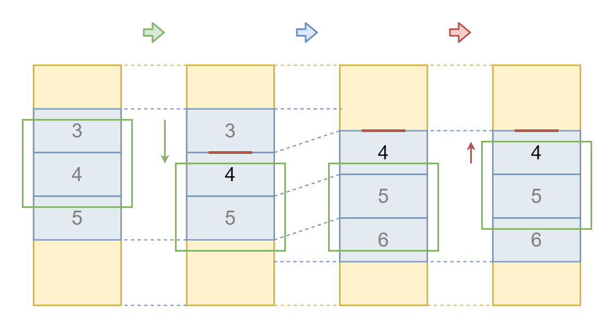
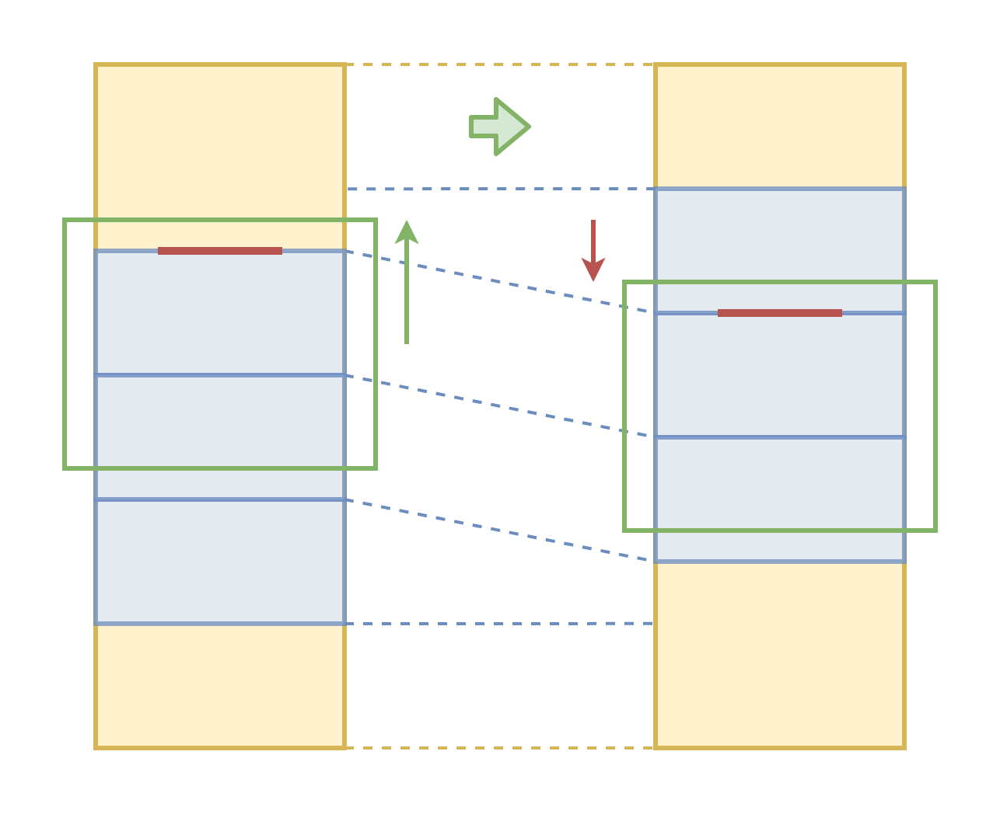
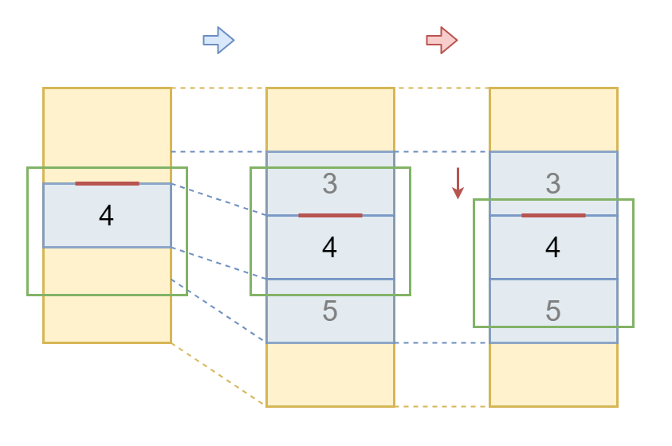
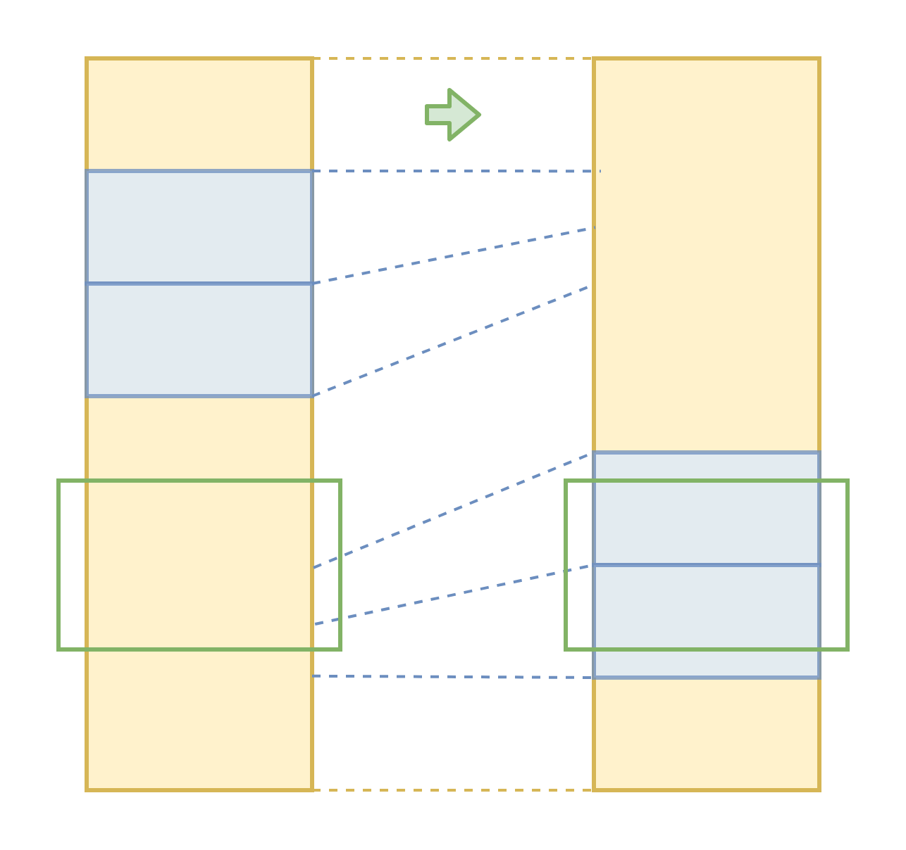
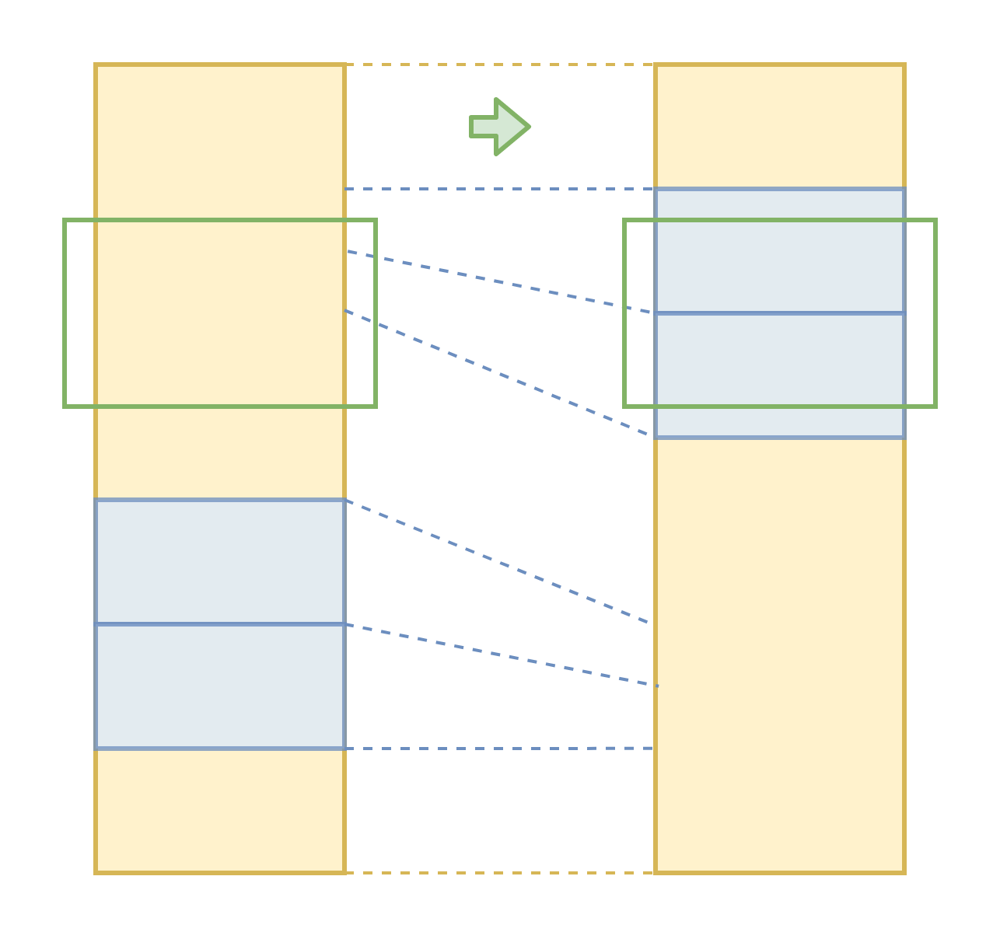

# Автоматическая виртуализация рендеринга произвольной вёрстки

Здравствуйте, меня зовут дмитрий Карловский и я.. каждый день делаю это.. виртуализирование интерфейсы. Я делал иерархические списки задач на 40К штук, редактор документов на 200 страниц, и даже запилил фреймворк, где виртуализация происходит автоматически. Короче, съел я на той теме собаку, кошку, хорька, енота и даже морскую свинку. Так что далее я расскажу как эффективно предоставлять пользователю огромные объёмы данных, почему вообще возникает такая необходимость, какие технологии нам с этим могут помочь, и почему Реакт не способен избавить нас от головной боли.

[Дмитрий Карловский @ HolyJS'20 Moscow](https://holyjs-moscow.ru/)

Вы можете либо [посмотреть видео запись](), либо [открыть в интерфейсе проведения презентаций](https://nin-jin.github.io/slides/virt/), либо [читать как статью](https://github.com/nin-jin/slides/blob/master/virt/readme.md)...

# Типичный цикл разработки

- Написали код
- Проверили в типличных условиях
- Пришли пользователи и всё заспамили

# Наивный рендеринг: Медленная загрузка

> *скрин загрузки приложенияна мобилке*

# Наивный рендеринг: Плохая отзывчивость

> *таймлайн расчёта лйаута*

# Наивный рендеринг: Высокое потребление памяти

> *сравнение потребления памяти и типичного доступного объёма*

# Наивный рендеринг: Риск неработоспособности

- обрыв соединения - страница обрывается
- не влезли по памяти - приложение закрывается
- браузер может заглючить на больших объёмах

# Наивный рендеринг: Резюме

- Медленная загрузка
- Плохая отзывчивость
- Высокое потребление памяти
- Риск неработоспособности

# Оптимизации вёрстки

> *быстрее, но асимптотика не меняется*

# Прикладная оптимизация: Пагинация

> *пример*

# Прикладная оптимизация: Экспандеры

> *пример*

# Прикладная оптимизация: Бесконечный скролл

> *пример*

# Прикладная оптимизация: Вирт скролл

> *пример*

# Прикладная оптимизация: Резюме

- Пагинация
- Экспандеры
- Бесконечный скролл
- Вирт скролл

# Оптимизация инструментов: Тайм слайсинг

> *пример*

# Оптимизация инструментов: Прогрессивный рендеринг

> *пример*

# Оптимизация инструментов: Ленивый рендеринг

> *пример*

# Оптимизация инструментов: Виртуальный рендеринг

> *пример*

# Оптимизация инструментов: Резюме

1. Тайм слайсинг 
2. Прогрессивный рендеринг
3. Ленивый рендеринг
4. Виртуальный рендеринг

# Оптимизации: Резюме

| Оптимизация    |
|----------------|---
| Вёрстка        | ❌
| Прикладной код | ❌
| Инструментарий | ✅

# Проблемы виртуализации

- Оценка будущих размеров
- Скачки контента
- Скачки скроллбара
- Перерисовка всего экрана
- Тормоза при скроллинге
- Прокрутка к элементу
- Поиск по странице

# Scroll Anchoring: Предотвращает скачки


# Scroll Anchoring: Выбор точки привязки

> *диаграмма*

# Scroll Anchoring: Подавление привязки

- top, left, right, bottom
- margin, padding
- Any width or height-related properties
- transform
- scroll-anchor: none

# Виртуализация: Прокрутка вниз



# Виртуализация: Прокрутка вверх



# Виртуализация: Расширение



# Виртуализация: Скачок вниз



# Виртуализация: Скачок вверх



# Scroll Anchoring: Поддержка

| Chrome  | ✅
|---------|---
| Firefox | ✅
| Safari  | ❌

# Scroll Anchoring: Запасный выход

```
const anchoring_support = CSS.supports( 'overflow-anchor:auto' )


if( anchoring_support ) {
    virtual render
} else {
    lazy render
}
```

# Оценка размеров

- Точная
- Минимальная
- Максимальная
- Усреднённая
- Последняя

# Когда обновляться

- onScroll
- IntersectionObserver
- requestAnimationFrame

# Долгая раскладка

```
contain: content // for scroller


transform: translateZ(0) // for it's content
```

# Типы компонент

- Атомарный компонент
- Вертикальный список
- Горизонтальный список
- Стек наложения
- Горизонтальный список с переносами

# Объекты против функций

- Объект: одно состояние - много действий
- Функция: много состояний - одно действие

# Ортогональные ручки

- Узнать минимальные размеры
- Частично отрендерить содержимое
- Проверить соответствие поисковому запросу

# Логика рендеринга

- Измеряем положение
- Опрашиваем минимальные размеры
- Измеряем сколько куда нужно дорендерить
- Добавляем/удаляем элементы
- Для вложенных компонент повторяем рекурсивно

# Логика прокрутки

- Рекурсивно спускаемся по компонентам
- Форсируем рендеринг по пути до найденного
- Отложенно вызываем scrollIntoView на дом узле

# Логика поиска

- Рекурсивно спускаемся по компонентам
- Отбираем соответствующие запросу
- Рисуем интерфейс перехода между найденным.

# Демонстрация


# Фундаментальные особенности

- Скачки скроллбара при неточной оценке размеров
- Scroll Anchoring может не работать в некоторых контекстах.

# Бенчмарки: Скорость открытия и Отзывчивость


Сверху [статья на Хабре](https://habr.com/post/522578). Мобильная версия. Меньше 200 комментариев без самой статьи рендерятся на VueJS. Снизу примерно то же самое на $mol. Отображается и статья, и комментарии. 

# Бенчмарки: Потребление памяти

| Вариант                           | Память JS | Память вкладки
|-----------------------------------|-----------|-----------
| VueJS: 170 комментариев           | 50 MB     | 270 MB
| $mol: статья + 2500 комментариев  | 40 MB     | 190 MB

# Бонус: Бесконечная виртуализация


# Ссылочки

- [Вырезаем SSR и ускоряем Хабр в 10 раз](https://habr.com/ru/post/514144/) - статья о виртуализации в $mol
- [nin-jin/slides/virt](https://github.com/nin-jin/slides/tree/master/virt) - эти слайды
- [habhub.hyoo.ru](https://habhub.hyoo.ru/) - другие мои статьи

# Обратная связь
